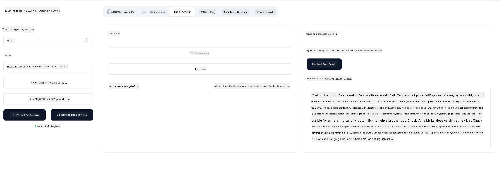

<!--
CO_OP_TRANSLATOR_METADATA:
{
  "original_hash": "d90ca3d326c48fab2ac0ebd3a9876f59",
  "translation_date": "2025-07-13T19:55:24+00:00",
  "source_file": "03-GettingStarted/05-sse-server/README.md",
  "language_code": "tr"
}
-->
Şimdi SSE hakkında biraz daha bilgi sahibi olduğumuza göre, bir SSE sunucusu oluşturalım.

## Alıştırma: Bir SSE Sunucusu Oluşturma

Sunucumuzu oluştururken iki şeyi akılda tutmamız gerekiyor:

- Bağlantı ve mesajlar için uç noktaları açmak üzere bir web sunucusu kullanmalıyız.
- Sunucumuzu, stdio kullanırken yaptığımız gibi araçlar, kaynaklar ve istemlerle inşa etmeliyiz.

### -1- Bir sunucu örneği oluşturma

Sunucumuzu oluşturmak için stdio ile kullandığımız aynı türleri kullanıyoruz. Ancak, taşıma yöntemi olarak SSE'yi seçmemiz gerekiyor.

---

Şimdi gerekli rotaları ekleyelim.

### -2- Rotaları ekleme

Bağlantı ve gelen mesajları yönetecek rotaları ekleyelim:

---

Şimdi sunucuya yetenekler ekleyelim.

### -3- Sunucu yeteneklerini ekleme

SSE'ye özgü her şeyi tanımladıktan sonra, araçlar, istemler ve kaynaklar gibi sunucu yeteneklerini ekleyelim.

---

Tam kodunuz şöyle görünmelidir:

---

Harika, SSE kullanan bir sunucumuz var, şimdi onu çalıştırıp deneyelim.

## Alıştırma: Inspector ile SSE Sunucusunu Hata Ayıklama

Inspector, önceki derste gördüğümüz harika bir araçtı [İlk sunucunuzu oluşturma](/03-GettingStarted/01-first-server/README.md). Şimdi Inspector'ı burada da kullanıp kullanamayacağımıza bakalım:

### -1- Inspector'ı çalıştırma

Inspector'ı çalıştırmak için önce bir SSE sunucusunun çalışıyor olması gerekir, o halde bunu yapalım:

1. Sunucuyu çalıştırın

---

1. Inspector'ı çalıştırın

    > ![NOTE]
    > Bunu, sunucunun çalıştığı terminal penceresinden farklı bir terminal penceresinde çalıştırın. Ayrıca, aşağıdaki komutu sunucunuzun çalıştığı URL'ye göre ayarlamanız gerektiğini unutmayın.

    ```sh
    npx @modelcontextprotocol/inspector --cli http://localhost:8000/sse --method tools/list
    ```

    Inspector'ı çalıştırmak tüm çalışma ortamlarında aynıdır. Sunucuyu başlatmak için bir yol ve komut vermek yerine, sunucunun çalıştığı URL'yi ve ayrıca `/sse` rotasını belirttiğimize dikkat edin.

### -2- Aracı deneme

Açılır listeden SSE'yi seçerek sunucuya bağlanın ve sunucunuzun çalıştığı URL alanını doldurun, örneğin http:localhost:4321/sse. Ardından "Connect" düğmesine tıklayın. Önceki gibi, araçları listelemeyi seçin, bir araç seçin ve giriş değerlerini sağlayın. Aşağıdaki gibi bir sonuç görmelisiniz:



Harika, Inspector ile çalışabiliyorsunuz, şimdi Visual Studio Code ile nasıl çalışabileceğimize bakalım.

## Ödev

Sunucunuzu daha fazla yetenekle geliştirmeyi deneyin. Örneğin, bir API çağıran bir araç eklemek için [bu sayfaya](https://api.chucknorris.io/) bakabilirsiniz. Sunucunun nasıl görüneceğine siz karar verin. İyi eğlenceler :)

## Çözüm

[Çözüm](./solution/README.md) İşleyen kodla olası bir çözüm burada.

## Önemli Noktalar

Bu bölümden çıkarılacak önemli noktalar şunlardır:

- SSE, stdio'nun yanında desteklenen ikinci taşıma türüdür.
- SSE'yi desteklemek için gelen bağlantıları ve mesajları bir web çerçevesi kullanarak yönetmeniz gerekir.
- SSE sunucusunu tüketmek için Inspector ve Visual Studio Code'u stdio sunucularında olduğu gibi kullanabilirsiniz. Ancak stdio ve SSE arasında bazı farklar vardır. SSE için sunucuyu ayrı olarak başlatmanız ve ardından Inspector aracınızı çalıştırmanız gerekir. Inspector aracı için ayrıca URL belirtmeniz gerekir.

## Örnekler

- [Java Hesap Makinesi](../samples/java/calculator/README.md)
- [.Net Hesap Makinesi](../../../../03-GettingStarted/samples/csharp)
- [JavaScript Hesap Makinesi](../samples/javascript/README.md)
- [TypeScript Hesap Makinesi](../samples/typescript/README.md)
- [Python Hesap Makinesi](../../../../03-GettingStarted/samples/python)

## Ek Kaynaklar

- [SSE](https://developer.mozilla.org/en-US/docs/Web/API/Server-sent_events)

## Sonraki Adım

- Sonraki: [MCP ile HTTP Akışı (Streamable HTTP)](../06-http-streaming/README.md)

**Feragatname**:  
Bu belge, AI çeviri servisi [Co-op Translator](https://github.com/Azure/co-op-translator) kullanılarak çevrilmiştir. Doğruluk için çaba göstersek de, otomatik çevirilerin hatalar veya yanlışlıklar içerebileceğini lütfen unutmayın. Orijinal belge, kendi dilinde yetkili kaynak olarak kabul edilmelidir. Kritik bilgiler için profesyonel insan çevirisi önerilir. Bu çevirinin kullanımı sonucu ortaya çıkabilecek yanlış anlamalar veya yorum hatalarından sorumlu değiliz.