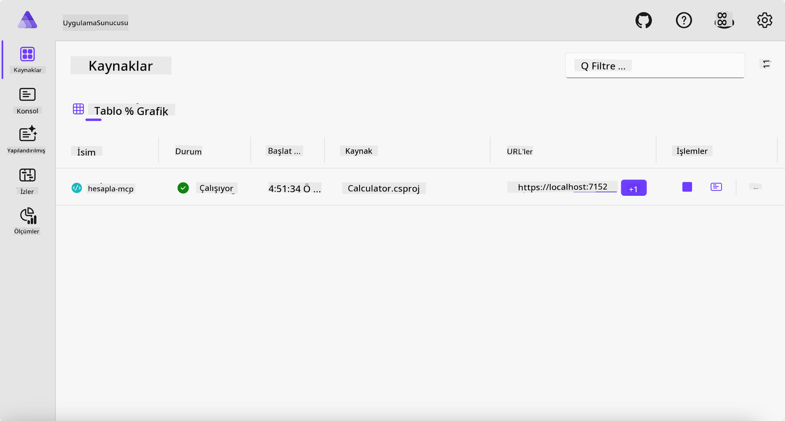
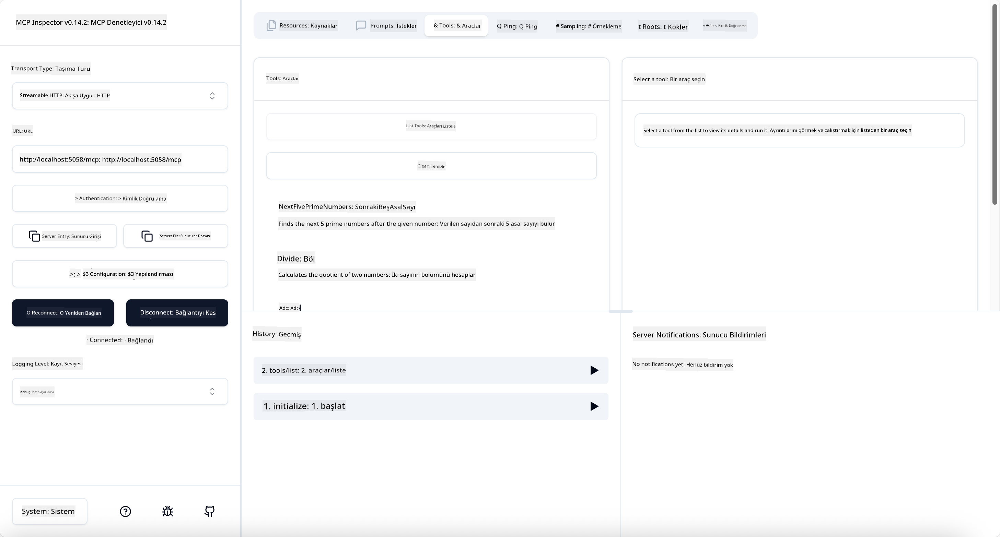

<!--
CO_OP_TRANSLATOR_METADATA:
{
  "original_hash": "0bc7bd48f55f1565f1d95ccb2c16f728",
  "translation_date": "2025-06-18T07:50:02+00:00",
  "source_file": "04-PracticalImplementation/samples/csharp/README.md",
  "language_code": "tr"
}
-->
# Örnek

Önceki örnek, `stdio` türü ile yerel bir .NET projesinin nasıl kullanılacağını ve sunucunun yerel olarak bir konteyner içinde nasıl çalıştırılacağını gösteriyor. Bu birçok durumda iyi bir çözümdür. Ancak, sunucunun uzaktan, örneğin bulut ortamında çalışması da faydalı olabilir. İşte burada `http` türü devreye girer.

`04-PracticalImplementation` klasöründeki çözüme bakıldığında, önceki örnekten çok daha karmaşık görünebilir. Ama aslında öyle değil. `src/Calculator` projesine dikkatlice bakarsanız, çoğunlukla önceki örnekle aynı kod olduğunu görürsünüz. Tek fark, HTTP isteklerini yönetmek için farklı bir kütüphane olan `ModelContextProtocol.AspNetCore` kullanmamızdır. Ayrıca, kodunuzda özel metotlar olabileceğini göstermek için `IsPrime` metodunu private yaptık. Kodun geri kalanı öncekiyle aynı.

Diğer projeler [.NET Aspire](https://learn.microsoft.com/dotnet/aspire/get-started/aspire-overview) içindendir. Çözüme .NET Aspire eklemek, geliştirici deneyimini geliştirecek, geliştirme ve test sürecini kolaylaştıracak ve gözlemlenebilirliği artıracaktır. Sunucuyu çalıştırmak için zorunlu değildir, ancak çözüme eklemek iyi bir uygulamadır.

## Sunucuyu yerel olarak başlatma

1. VS Code’dan (C# DevKit uzantısı ile) `04-PracticalImplementation/samples/csharp` dizinine gidin.
1. Sunucuyu başlatmak için aşağıdaki komutu çalıştırın:

   ```bash
    dotnet watch run --project ./src/AppHost
   ```

1. Bir web tarayıcısı .NET Aspire kontrol panelini açtığında, `http` URL’sine dikkat edin. Şöyle bir şey olmalı: `http://localhost:5058/`.

   

## MCP Inspector ile Streamable HTTP testi

Node.js 22.7.5 ve üzeri sürümlere sahipseniz, MCP Inspector ile sunucunuzu test edebilirsiniz.

Sunucuyu başlatın ve bir terminalde aşağıdaki komutu çalıştırın:

```bash
npx @modelcontextprotocol/inspector http://localhost:5058
```



- `Streamable HTTP` as the Transport type.
- In the Url field, enter the URL of the server noted earlier, and append `/mcp` seçin. Bu, daha önce oluşturulan `https`) something like `http://localhost:5058/mcp`.
- select the Connect button.

A nice thing about the Inspector is that it provide a nice visibility on what is happening.

- Try listing the available tools
- Try some of them, it should works just like before.

## Test MCP Server with GitHub Copilot Chat in VS Code

To use the Streamable HTTP transport with GitHub Copilot Chat, change the configuration of the `calc-mcp` sunucusu değil, `http` olmalıdır.

```jsonc
// .vscode/mcp.json
{
  "servers": {
    "calc-mcp": {
      "type": "http",
      "url": "http://localhost:5058/mcp"
    }
  }
}
```

Bazı testler yapın:

- "6780’den sonraki 3 asal sayı" isteyin. Copilot’un yeni araçları `NextFivePrimeNumbers` kullanıp sadece ilk 3 asal sayıyı döndürdüğünü gözlemleyin.
- "111’den sonraki 7 asal sayı" isteyin ve sonucu görün.
- "John’un 24 şekeri var ve bunları 3 çocuğuna eşit dağıtmak istiyor. Her çocuk kaç şeker alır?" diye sorun ve sonucu görün.

## Sunucuyu Azure’a dağıtma

Sunucuyu Azure’a dağıtalım ki daha fazla kişi kullanabilsin.

Bir terminalden `04-PracticalImplementation/samples/csharp` klasörüne gidin ve aşağıdaki komutu çalıştırın:

```bash
azd up
```

Dağıtım tamamlandığında şöyle bir mesaj görmelisiniz:


URL’yi alın ve MCP Inspector ile GitHub Copilot Chat’te kullanın.

```jsonc
// .vscode/mcp.json
{
  "servers": {
    "calc-mcp": {
      "type": "http",
      "url": "https://calc-mcp.gentleriver-3977fbcf.australiaeast.azurecontainerapps.io/mcp"
    }
  }
}
```

## Sonraki adım nedir?

Farklı taşıma türlerini ve test araçlarını deniyoruz. MCP sunucunuzu Azure’a dağıtıyoruz. Peki ya sunucumuzun özel kaynaklara erişmesi gerekirse? Örneğin, bir veritabanı veya özel bir API? Bir sonraki bölümde, sunucumuzun güvenliğini nasıl artırabileceğimizi göreceğiz.

**Feragatname**:  
Bu belge, AI çeviri servisi [Co-op Translator](https://github.com/Azure/co-op-translator) kullanılarak çevrilmiştir. Doğruluk için çaba gösterilse de, otomatik çevirilerin hatalar veya yanlışlıklar içerebileceğini lütfen unutmayınız. Orijinal belge, kendi dilinde yetkili kaynak olarak kabul edilmelidir. Kritik bilgiler için profesyonel insan çevirisi önerilir. Bu çevirinin kullanımı sonucu oluşabilecek yanlış anlamalar veya yorum farklılıklarından sorumlu değiliz.