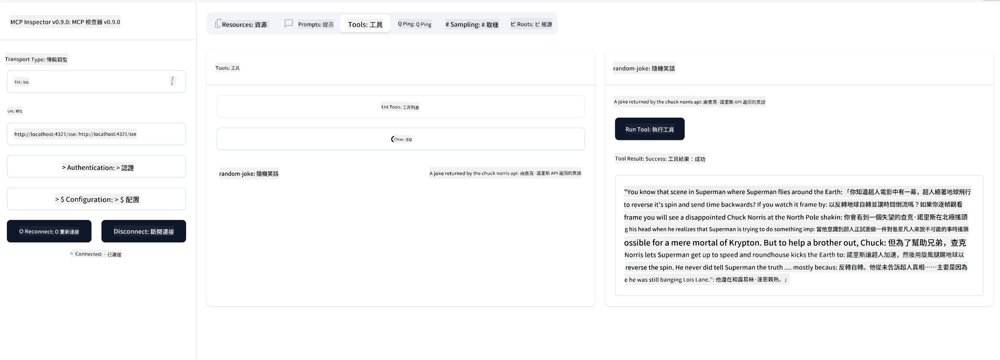

<!--
CO_OP_TRANSLATOR_METADATA:
{
  "original_hash": "64645691bf0985f1760b948123edf269",
  "translation_date": "2025-06-13T10:44:18+00:00",
  "source_file": "03-GettingStarted/05-sse-server/README.md",
  "language_code": "tw"
}
-->
現在我們對 SSE 有更多了解了，接下來來建立一個 SSE 伺服器。

## 練習：建立 SSE 伺服器

要建立伺服器，我們需要記住兩件事：

- 我們需要使用網頁伺服器來開放連線和訊息的端點。
- 建立伺服器時，像使用 stdio 一樣使用工具、資源和提示。

### -1- 建立伺服器實例

建立伺服器時，我們使用和 stdio 相同的類型，但傳輸方式需選擇 SSE。

接著我們來新增必要的路由。

### -2- 新增路由

接著新增處理連線和接收訊息的路由：

然後我們來為伺服器新增功能。

### -3- 新增伺服器功能

既然已定義好 SSE 相關內容，接著新增工具、提示和資源等伺服器功能。

你的完整程式碼應該長這樣：

太棒了，我們有一個使用 SSE 的伺服器，接下來來試試看。

## 練習：用 Inspector 偵錯 SSE 伺服器

Inspector 是個很棒的工具，我們在前面課程[建立你的第一個伺服器](/03-GettingStarted/01-first-server/README.md)也用過。來看看這裡是否也能用 Inspector：

### -1- 執行 Inspector

要執行 Inspector，首先必須先啟動 SSE 伺服器，接著：

1. 啟動伺服器

1. 啟動 Inspector

    > ![NOTE]
    > 請在與伺服器不同的終端機視窗執行此命令。也請注意，需要調整以下指令以符合你伺服器運行的 URL。

    ```sh
    npx @modelcontextprotocol/inspector --cli http://localhost:8000/sse --method tools/list
    ```

    在所有執行環境中執行 Inspector 的方式都一樣。注意，我們不是傳入伺服器路徑和啟動指令，而是直接傳入伺服器運行的 URL，並指定 `/sse` 路由。

### -2- 試用工具

在下拉選單選擇 SSE，並填入伺服器運行的 URL，例如 http://localhost:4321/sse，然後點擊「Connect」按鈕。接著像之前一樣選擇列出工具、選擇工具並輸入參數。你會看到像下面這樣的結果：



太棒了，你已能使用 Inspector，接著來看看如何用 Visual Studio Code 來操作。

## 作業

試著為你的伺服器加入更多功能。參考[這個網站](https://api.chucknorris.io/)來新增呼叫 API 的工具，伺服器的樣貌由你決定。玩得開心 :)

## 解答

[解答](./solution/README.md) 這裡有一個可運作的範例程式碼。

## 重要重點

本章重點如下：

- SSE 是繼 stdio 之後支援的第二種傳輸方式。
- 支援 SSE 需透過網頁框架管理連線與訊息。
- 你可以用 Inspector 和 Visual Studio Code 來使用 SSE 伺服器，就像 stdio 伺服器一樣。注意 stdio 與 SSE 之間有些差異。使用 SSE 時，需先啟動伺服器，再執行 Inspector 工具。使用 Inspector 時，也要指定 URL。

## 範例

- [Java 計算機](../samples/java/calculator/README.md)
- [.Net 計算機](../../../../03-GettingStarted/samples/csharp)
- [JavaScript 計算機](../samples/javascript/README.md)
- [TypeScript 計算機](../samples/typescript/README.md)
- [Python 計算機](../../../../03-GettingStarted/samples/python)

## 其他資源

- [SSE](https://developer.mozilla.org/en-US/docs/Web/API/Server-sent_events)

## 接下來

- 下一課：[使用 MCP 的 HTTP 串流 (Streamable HTTP)](/03-GettingStarted/06-http-streaming/README.md)

**免責聲明**：  
本文件係使用 AI 翻譯服務 [Co-op Translator](https://github.com/Azure/co-op-translator) 所翻譯。雖然我們努力追求準確性，但請注意，自動翻譯可能包含錯誤或不準確之處。原始文件的母語版本應視為權威資料來源。對於重要資訊，建議採用專業人工翻譯。我們不對因使用本翻譯所引起的任何誤解或誤釋負責。