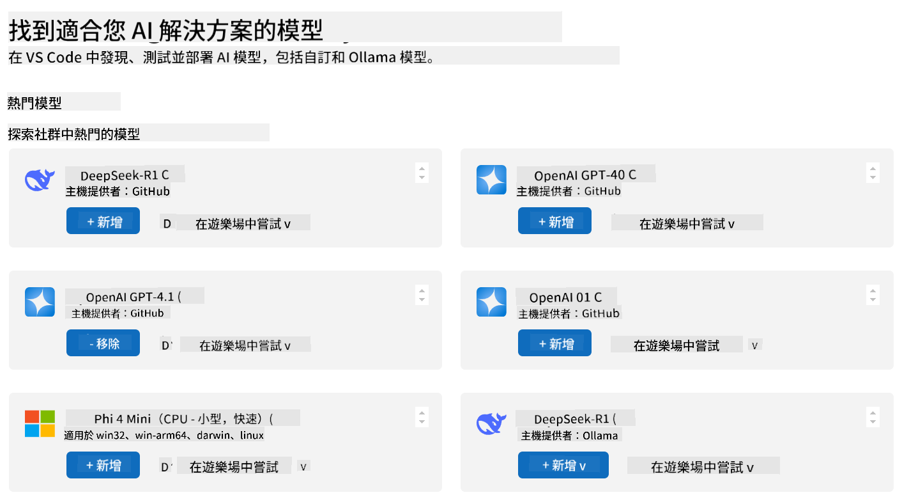

<!--
CO_OP_TRANSLATOR_METADATA:
{
  "original_hash": "8248e3491f5245ee6ab48ef724a4f65a",
  "translation_date": "2025-07-04T16:11:11+00:00",
  "source_file": "03-GettingStarted/07-aitk/README.md",
  "language_code": "tw"
}
-->
# 從 Visual Studio Code 的 AI Toolkit 擴充功能使用伺服器

當你在建立 AI 代理時，不只是要產生聰明的回應，更重要的是讓代理能夠採取行動。這時候就會用到 Model Context Protocol (MCP)。MCP 讓代理能以一致的方式存取外部工具和服務。可以把它想像成把你的代理接上了一個真正能用的工具箱。

假設你將代理連接到計算機 MCP 伺服器，代理就能透過像「47 乘以 89 是多少？」這樣的提示來執行數學運算，而不需要硬編碼邏輯或建立自訂 API。

## 概覽

本課程說明如何使用 Visual Studio Code 中的 [AI Toolkit](https://aka.ms/AIToolkit) 擴充功能，將計算機 MCP 伺服器連接到代理，讓代理能透過自然語言執行加、減、乘、除等數學運算。

AI Toolkit 是 Visual Studio Code 的強大擴充功能，簡化了代理開發流程。AI 工程師可以輕鬆地開發和測試生成式 AI 模型，無論是在本地或雲端。此擴充功能支援目前大多數主流的生成式模型。

*注意*：AI Toolkit 目前支援 Python 和 TypeScript。

## 學習目標

完成本課程後，你將能夠：

- 透過 AI Toolkit 使用 MCP 伺服器。
- 配置代理設定，使其能發現並使用 MCP 伺服器提供的工具。
- 透過自然語言使用 MCP 工具。

## 方法

我們需要從高層次來看這個流程：

- 建立代理並定義其系統提示。
- 建立帶有計算工具的 MCP 伺服器。
- 將 Agent Builder 連接到 MCP 伺服器。
- 透過自然語言測試代理的工具調用。

很好，了解流程後，讓我們開始配置 AI 代理，透過 MCP 利用外部工具，提升代理的功能！

## 先決條件

- [Visual Studio Code](https://code.visualstudio.com/)
- [Visual Studio Code 的 AI Toolkit](https://aka.ms/AIToolkit)

## 練習：使用伺服器

在本練習中，你將使用 AI Toolkit 在 Visual Studio Code 內建立、執行並強化一個帶有 MCP 伺服器工具的 AI 代理。

### -0- 預備步驟，將 OpenAI GPT-4o 模型加入「我的模型」

本練習使用 **GPT-4o** 模型。請在建立代理前，先將此模型加入「我的模型」。



1. 從 **活動列** 開啟 **AI Toolkit** 擴充功能。
2. 在 **目錄** 區段選擇 **Models**，打開 **模型目錄**。選擇 **Models** 會在新的編輯器分頁中開啟模型目錄。
3. 在模型目錄的搜尋欄輸入 **OpenAI GPT-4o**。
4. 點擊 **+ Add** 將模型加入你的「我的模型」清單。請確認你選擇的是 **GitHub 托管** 的模型。
5. 在 **活動列** 確認 **OpenAI GPT-4o** 模型已出現在清單中。

### -1- 建立代理

**Agent (Prompt) Builder** 讓你建立並自訂自己的 AI 代理。在本節中，你將建立一個新代理並指定模型來驅動對話。


1. 從 **活動列** 開啟 **AI Toolkit** 擴充功能。
2. 在 **工具** 區段選擇 **Agent (Prompt) Builder**，會在新的編輯器分頁中開啟。
3. 點擊 **+ New Agent** 按鈕。擴充功能會透過 **命令面板** 啟動設定精靈。
4. 輸入名稱 **Calculator Agent**，按下 **Enter**。
5. 在 **Agent (Prompt) Builder** 的 **Model** 欄位，選擇 **OpenAI GPT-4o (via GitHub)** 模型。

### -2- 為代理建立系統提示

代理架構完成後，接著定義其個性與目的。本節將使用 **Generate system prompt** 功能，描述代理的預期行為（此處為計算機代理），並由模型幫你撰寫系統提示。


1. 在 **Prompts** 區段，點擊 **Generate system prompt** 按鈕。此按鈕會開啟提示建構器，利用 AI 產生系統提示。
2. 在 **Generate a prompt** 視窗中，輸入：`You are a helpful and efficient math assistant. When given a problem involving basic arithmetic, you respond with the correct result.`
3. 點擊 **Generate** 按鈕。右下角會出現通知，確認系統提示正在產生。完成後，提示會顯示在 **Agent (Prompt) Builder** 的 **System prompt** 欄位。
4. 檢視系統提示，必要時可進行修改。

### -3- 建立 MCP 伺服器

既然已定義代理的系統提示，指引其行為與回應，接下來要為代理配備實用功能。本節將建立一個計算機 MCP 伺服器，內含加、減、乘、除運算工具。此伺服器能讓代理根據自然語言提示即時執行數學運算。


AI Toolkit 提供範本，方便你建立自己的 MCP 伺服器。我們將使用 Python 範本來建立計算機 MCP 伺服器。

*注意*：AI Toolkit 目前支援 Python 和 TypeScript。

1. 在 **Agent (Prompt) Builder)** 的 **Tools** 區段，點擊 **+ MCP Server** 按鈕。擴充功能會透過 **命令面板** 啟動設定精靈。
2. 選擇 **+ Add Server**。
3. 選擇 **Create a New MCP Server**。
4. 選擇 **python-weather** 範本。
5. 選擇 **Default folder** 來儲存 MCP 伺服器範本。
6. 輸入伺服器名稱：**Calculator**
7. 會開啟一個新的 Visual Studio Code 視窗。選擇 **Yes, I trust the authors**。
8. 使用終端機（**Terminal** > **New Terminal**）建立虛擬環境：`python -m venv .venv`
9. 啟動虛擬環境：
    1. Windows - `.venv\Scripts\activate`
    2. macOS/Linux - `source venv/bin/activate`
10. 安裝相依套件：`pip install -e .[dev]`
11. 在 **活動列** 的 **Explorer** 視圖中，展開 **src** 目錄並開啟 **server.py**。
12. 將 **server.py** 中的程式碼替換為以下內容並儲存：

    ```python
    """
    Sample MCP Calculator Server implementation in Python.

    
    This module demonstrates how to create a simple MCP server with calculator tools
    that can perform basic arithmetic operations (add, subtract, multiply, divide).
    """
    
    from mcp.server.fastmcp import FastMCP
    
    server = FastMCP("calculator")
    
    @server.tool()
    def add(a: float, b: float) -> float:
        """Add two numbers together and return the result."""
        return a + b
    
    @server.tool()
    def subtract(a: float, b: float) -> float:
        """Subtract b from a and return the result."""
        return a - b
    
    @server.tool()
    def multiply(a: float, b: float) -> float:
        """Multiply two numbers together and return the result."""
        return a * b
    
    @server.tool()
    def divide(a: float, b: float) -> float:
        """
        Divide a by b and return the result.
        
        Raises:
            ValueError: If b is zero
        """
        if b == 0:
            raise ValueError("Cannot divide by zero")
        return a / b
    ```

### -4- 使用計算機 MCP 伺服器執行代理

現在代理已具備工具，該開始使用它們了！本節將提交提示給代理，測試並驗證代理是否能使用計算機 MCP 伺服器的適當工具。


你將在本地開發機器上以 MCP 用戶端身份，透過 **Agent Builder** 執行計算機 MCP 伺服器。

1. 按下 `F5` 開始除錯 MCP 伺服器。**Agent (Prompt) Builder** 會在新編輯器分頁中開啟。終端機中可看到伺服器狀態。
2. 在 **Agent (Prompt) Builder** 的 **User prompt** 欄位輸入：`I bought 3 items priced at $25 each, and then used a $20 discount. How much did I pay?`
3. 點擊 **Run** 按鈕產生代理回應。
4. 檢視代理輸出。模型應該會得出你付了 **55 美元**。
5. 以下是應該發生的流程：
    - 代理選擇使用 **multiply** 和 **subtract** 工具協助計算。
    - 為 **multiply** 工具分配相應的 `a` 和 `b` 值。
    - 為 **subtract** 工具分配相應的 `a` 和 `b` 值。
    - 各工具的回應會顯示在相應的 **Tool Response**。
    - 模型的最終輸出會顯示在 **Model Response**。
6. 可提交更多提示以進一步測試代理。點擊 **User prompt** 欄位，修改現有提示後再執行。
7. 測試完成後，可在終端機輸入 **CTRL/CMD+C** 停止伺服器。

## 作業

嘗試在你的 **server.py** 檔案中新增一個工具（例如：回傳數字的平方根）。提交需要代理使用你新增工具（或現有工具）的提示。記得重新啟動伺服器以載入新工具。

## 解答

[解答](./solution/README.md)

## 重要重點

本章節的重點如下：

- AI Toolkit 擴充功能是很棒的用戶端，讓你能使用 MCP 伺服器及其工具。
- 你可以為 MCP 伺服器新增工具，擴充代理的功能以符合不斷變化的需求。
- AI Toolkit 包含範本（例如 Python MCP 伺服器範本），簡化自訂工具的建立。

## 其他資源

- [AI Toolkit 文件](https://aka.ms/AIToolkit/doc)

## 接下來

- 下一步：[測試與除錯](../08-testing/README.md)

**免責聲明**：  
本文件係使用 AI 翻譯服務 [Co-op Translator](https://github.com/Azure/co-op-translator) 進行翻譯。雖然我們致力於確保翻譯的準確性，但請注意，自動翻譯可能包含錯誤或不準確之處。原始文件的母語版本應視為權威來源。對於重要資訊，建議採用專業人工翻譯。我們不對因使用本翻譯而產生的任何誤解或誤釋負責。