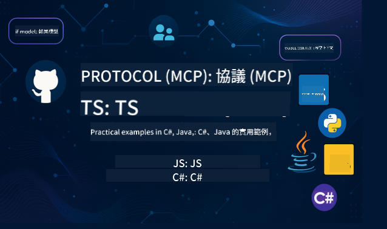

<!--
CO_OP_TRANSLATOR_METADATA:
{
  "original_hash": "9a14017adf28f7440f20c2d5e7f1d0f8",
  "translation_date": "2025-06-17T15:22:29+00:00",
  "source_file": "README.md",
  "language_code": "tw"
}
-->
 

請依照以下步驟開始使用這些資源：
1. **Fork 這個儲存庫**：點擊 
2. **Clone 這個儲存庫**：   `git clone https://github.com/microsoft/mcp-for-beginners.git`
3. [**加入 Azure AI Foundry Discord，與專家和其他開發者交流**](https://discord.com/invite/ByRwuEEgH4)

### 🌐 多語言支援

#### 透過 GitHub Action 支援（自動化且隨時更新）

# 🚀 Model Context Protocol (MCP) 初學者課程

## **透過 C#、Java、JavaScript、Python 和 TypeScript 的實作範例學習 MCP**

## 🧠 Model Context Protocol 課程概覽

**Model Context Protocol (MCP)** 是一個前沿框架，旨在標準化 AI 模型與客戶端應用程式之間的互動。這套開源課程提供結構化的學習路徑，包含實務程式範例與真實案例，涵蓋熱門程式語言如 C#、Java、JavaScript、TypeScript 與 Python。

無論你是 AI 開發者、系統架構師或軟體工程師，本指南都是你掌握 MCP 基礎與實作策略的全面資源。

## 🔗 官方 MCP 資源

- 📘 [MCP 文件](https://modelcontextprotocol.io/) – 詳盡的教學與使用指南  
- 📜 [MCP 規範](https://spec.modelcontextprotocol.io/) – 協議架構與技術參考  
- 🧑‍💻 [MCP GitHub 倉庫](https://github.com/modelcontextprotocol) – 開源 SDK、工具與程式範例  

## 🧭 完整 MCP 課程架構

| 章節 | 標題 | 說明 | 連結 |
|--|--|--|--|
| 00 | **MCP 簡介** | 介紹 Model Context Protocol 及其在 AI 流程中的重要性，包括 MCP 是什麼、標準化的意義，以及實際應用案例與優勢 | [簡介](./00-Introduction/README.md) |
| 01 | **核心概念解析** | 深入探討 MCP 的核心概念，包括客戶端-伺服器架構、主要協議元件與訊息模式 | [核心概念](./01-CoreConcepts/README.md) |
| 02 | **MCP 的安全性** | 辨識 MCP 系統中的安全威脅，並介紹保護實作的技術與最佳實踐 | [安全性](./02-Security/README.md) |
| 03 | **MCP 入門指南** | 環境設定與配置，建立基本 MCP 伺服器與客戶端，整合 MCP 至現有應用程式 | [入門指南](./03-GettingStarted/README.md) |
| 3.1 | **第一個伺服器** | 使用 MCP 協議建立基本伺服器，了解伺服器與客戶端的互動，並進行測試 | [第一個伺服器](./03-GettingStarted/01-first-server/README.md) |
| 3.2 | **第一個客戶端** | 使用 MCP 協議建立基本客戶端，了解客戶端與伺服器的互動，並進行測試 | [第一個客戶端](./03-GettingStarted/02-client/README.md) |
| 3.3 | **搭配大型語言模型的客戶端** | 建立使用 MCP 協議並整合大型語言模型（LLM）的客戶端 | [搭配大型語言模型的客戶端](./03-GettingStarted/03-llm-client/README.md) |
| 3.4 | **使用 Visual Studio Code 消費伺服器** | 設定 Visual Studio Code 以使用 MCP 協議連接伺服器 | [使用 Visual Studio Code 消費伺服器](./03-GettingStarted/04-vscode/README.md) |
| 3.5 | **使用 SSE 建立伺服器** | SSE 幫助我們將伺服器暴露於網際網路，本節將教你如何利用 SSE 建立伺服器 | [使用 SSE 建立伺服器](./03-GettingStarted/05-sse-server/README.md) |
| 3.6 | **HTTP 串流** | 學習如何實作 HTTP 串流以在客戶端與 MCP 伺服器間進行即時資料傳輸 | [HTTP 串流](./03-GettingStarted/06-http-streaming/README.md) |
| 3.7 | **使用 AI 工具包** | AI 工具包是管理 AI 與 MCP 工作流程的強大工具 | [使用 AI 工具包](./03-GettingStarted/07-aitk/README.md) |
| 3.8 | **測試你的伺服器** | 測試是開發流程的重要環節，本節將介紹多種測試工具的使用方法 | [測試你的伺服器](./03-GettingStarted/08-testing/README.md) |
| 3.9 | **部署你的伺服器** | 從本地開發到正式上線的流程，本節將協助你開發並部署伺服器 | [部署你的伺服器](./03-GettingStarted/09-deployment/README.md) |
| 04 | **實務應用** | 跨語言 SDK 使用、除錯、測試與驗證，打造可重用的提示範本與工作流程 | [實務應用](./04-PracticalImplementation/README.md) |
| 05 | **MCP 進階主題** | 多模態 AI 工作流程與擴充性、安全擴展策略、企業生態系中的 MCP | [進階主題](./05-AdvancedTopics/README.md) |
| 5.1 | **MCP 與 Azure 整合** | 展示 MCP 與 Azure 的整合方式 | [MCP Azure 整合](./05-AdvancedTopics/mcp-integration/README.md) |
| 5.2 | **多模態應用** | 示範如何處理不同模態，如圖片等 | [多模態應用](./05-AdvancedTopics/mcp-multi-modality/README.md) |
| 5.3 | **MCP OAuth2 示範** | 簡易 Spring Boot 應用展示 MCP OAuth2，涵蓋授權與資源伺服器，演示安全的令牌發行、保護端點、Azure Container Apps 部署及 API 管理整合 | [MCP OAuth2 示範](./05-AdvancedTopics/mcp-oauth2-demo/README.md) |
| 5.4 | **Root Contexts** | 深入了解 root context 及其實作方式 | [Root Contexts](./05-AdvancedTopics/mcp-root-contexts/README.md) |
| 5.5 | **Routing** | 學習不同類型的路由 | [Routing](./05-AdvancedTopics/mcp-routing/README.md) |
| 5.6 | **Sampling** | 學習如何使用取樣技術 | [Sampling](./05-AdvancedTopics/mcp-sampling/README.md) |
| 5.7 | **Scaling** | 探討 MCP 伺服器的擴展，包括水平與垂直擴展策略、資源優化與效能調校 | [Scaling](./05-AdvancedTopics/mcp-scaling/README.md) |
| 5.8 | **Security** | 保護你的 MCP 伺服器，包括認證、授權與資料保護策略 | [Security](./05-AdvancedTopics/mcp-security/README.md) |
| 5.9 | **Web Search MCP** | Python MCP 伺服器與客戶端整合 SerpAPI，實現即時網頁、新聞、商品搜尋與問答，展示多工具協調、外部 API 整合與強健錯誤處理 | [Web Search MCP](./05-AdvancedTopics/web-search-mcp/README.md) |
| 5.10 | **即時串流** | 即時資料串流在現今資料驅動的世界中已成為關鍵，幫助企業與應用程式即時取得資訊並作出迅速決策 | [即時串流](./05-AdvancedTopics/mcp-realtimestreaming/README.md) |
| 5.11 | **即時網頁搜尋** | MCP 如何透過標準化的上下文管理，改變 AI 模型、搜尋引擎與應用程式間的即時網頁搜尋 | [即時網頁搜尋](./05-AdvancedTopics/mcp-realtimesearch/README.md) |
| 06 | **社群貢獻** | 如何貢獻程式碼與文件，透過 GitHub 協作，以及社群驅動的改進與回饋 | [社群貢獻](./06-CommunityContributions/README.md) |
| 07 | **早期採用的見解** | 實際應用案例與成功經驗，基於 MCP 的解決方案構建與部署，趨勢與未來路線圖 | [Insights](./07-LessonsFromEarlyAdoption/README.md) |
| 08 | **MCP 的最佳實踐** | 性能調優與優化，設計容錯 MCP 系統，測試與韌性策略 | [Best Practices](./08-BestPractices/README.md) |
| 09 | **MCP 案例研究** | 深入探討 MCP 解決方案架構、部署藍圖與整合技巧，附註解圖表與專案導覽 | [Case Studies](./09-CaseStudy/README.md) |
| 10 | **精簡 AI 工作流程：使用 AI Toolkit 建置 MCP 伺服器** | 結合 MCP 與 Microsoft AI Toolkit for VS Code 的完整實作工作坊。透過實務模組學習基礎知識、自訂伺服器開發及生產部署策略，打造連結 AI 模型與實務工具的智能應用。 | [Hands On Lab](./10-StreamliningAIWorkflowsBuildingAnMCPServerWithAIToolkit/README.md) |

## 範例專案

### 🧮 MCP 計算機範例專案：

  
<strong>依程式語言探索程式碼實作</strong>

  - [C# MCP 伺服器範例](./03-GettingStarted/samples/csharp/README.md)
  - [Java MCP 計算機](./03-GettingStarted/samples/java/calculator/README.md)
  - [JavaScript MCP 示範](./03-GettingStarted/samples/javascript/README.md)
  - [Python MCP 伺服器](../../03-GettingStarted/samples/python/mcp_calculator_server.py)
  - [TypeScript MCP 範例](./03-GettingStarted/samples/typescript/README.md)

### 💡 MCP 進階計算機專案：

  
<strong>探索進階範例</strong>

  - [進階 C# 範例](./04-PracticalImplementation/samples/csharp/README.md)
  - [Java 容器應用程式範例](./04-PracticalImplementation/samples/java/containerapp/README.md)
  - [JavaScript 進階範例](./04-PracticalImplementation/samples/javascript/README.md)
  - [Python 複雜實作](../../04-PracticalImplementation/samples/python/mcp_sample.py)
  - [TypeScript 容器範例](./04-PracticalImplementation/samples/typescript/README.md)

## 🎯 學習 MCP 的先備條件

為了最大化本課程的學習效果，你應該具備：

- 基本的 C#、Java 或 Python 知識
- 了解客戶端-伺服器模型及 API
- （選擇性）熟悉機器學習概念

## 📚 學習指南

本資源庫提供完整的 [學習指南](./study_guide.md)，協助你有效掌握內容。指南包含：

- 視覺化課程地圖，展示所有涵蓋主題
- 各資源庫區塊的詳細拆解
- 如何使用範例專案的指引
- 適合不同技能層級的推薦學習路徑
- 補充學習資源，助你持續進步

## 🛠️ 如何有效利用本課程

本指南中的每堂課程均包含：

1. 清晰解說 MCP 概念  
2. 多語言的即時程式碼範例  
3. 實作練習，打造真實的 MCP 應用  
4. 進階學習者的額外資源  

## 📜 授權資訊

本內容採用 **MIT 授權條款**。詳細條款請參閱 [LICENSE](../../LICENSE)。

## 🤝 貢獻指南

歡迎您為本專案提供貢獻與建議。大部分貢獻需要您同意簽署貢獻者授權協議 (CLA)，聲明您擁有並同意授權我們使用您的貢獻。詳情請參閱 <https://cla.opensource.microsoft.com>。

當您提交 pull request 時，CLA 機器人會自動判斷是否需要您提供 CLA，並在 PR 上標註相應狀態（例如狀態檢查、留言）。只要依照機器人指示操作即可。您在所有使用我們 CLA 的資源庫中，只需完成一次此程序。

本專案已採用 [Microsoft Open Source Code of Conduct](https://opensource.microsoft.com/codeofconduct/)。更多資訊請參考 [Code of Conduct FAQ](https://opensource.microsoft.com/codeofconduct/faq/)，或透過 [opencode@microsoft.com](mailto:opencode@microsoft.com) 聯絡我們提出任何問題或意見。

## 🎒 其他課程
我們團隊還製作了其他課程！歡迎參考：

- [AI Agents For Beginners](https://github.com/microsoft/ai-agents-for-beginners?WT.mc_id=academic-105485-koreyst)
- [Generative AI for Beginners using .NET](https://github.com/microsoft/Generative-AI-for-beginners-dotnet?WT.mc_id=academic-105485-koreyst)
- [Generative AI for Beginners using JavaScript](https://github.com/microsoft/generative-ai-with-javascript?WT.mc_id=academic-105485-koreyst)
- [Generative AI for Beginners](https://github.com/microsoft/generative-ai-for-beginners?WT.mc_id=academic-105485-koreyst)
- [ML for Beginners](https://aka.ms/ml-beginners?WT.mc_id=academic-105485-koreyst)
- [Data Science for Beginners](https://aka.ms/datascience-beginners?WT.mc_id=academic-105485-koreyst)
- [AI for Beginners](https://aka.ms/ai-beginners?WT.mc_id=academic-105485-koreyst)
- [Cybersecurity for Beginners](https://github.com/microsoft/Security-101??WT.mc_id=academic-96948-sayoung)
- [Web Dev for Beginners](https://aka.ms/webdev-beginners?WT.mc_id=academic-105485-koreyst)
- [IoT for Beginners](https://aka.ms/iot-beginners?WT.mc_id=academic-105485-koreyst)
- [XR Development for Beginners](https://github.com/microsoft/xr-development-for-beginners?WT.mc_id=academic-105485-koreyst)
- [精通 GitHub Copilot 以進行 AI 配對程式設計](https://aka.ms/GitHubCopilotAI?WT.mc_id=academic-105485-koreyst)
- [精通 GitHub Copilot 供 C#/.NET 開發人員使用](https://github.com/microsoft/mastering-github-copilot-for-dotnet-csharp-developers?WT.mc_id=academic-105485-koreyst)
- [選擇你自己的 Copilot 冒險之旅](https://github.com/microsoft/CopilotAdventures?WT.mc_id=academic-105485-koreyst)

## ™️ 商標聲明

本專案可能包含專案、產品或服務的商標或標誌。授權使用 Microsoft 商標或標誌須遵守並依據
[Microsoft 的商標與品牌指南](https://www.microsoft.com/legal/intellectualproperty/trademarks/usage/general)。
在本專案的修改版本中使用 Microsoft 商標或標誌，不得造成混淆或暗示 Microsoft 的贊助。
任何第三方商標或標誌的使用，均須遵循該第三方的相關政策。

**免責聲明**：  
本文件由 AI 翻譯服務 [Co-op Translator](https://github.com/Azure/co-op-translator) 進行翻譯。雖然我們致力於翻譯的準確性，但請注意，自動翻譯可能包含錯誤或不準確之處。原始文件的母語版本應視為權威來源。對於重要資訊，建議使用專業人工翻譯。因使用本翻譯所引起的任何誤解或誤譯，我們概不負責。