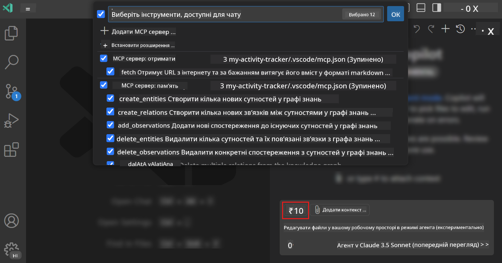
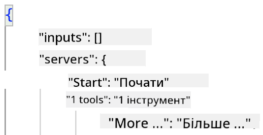

<!--
CO_OP_TRANSLATOR_METADATA:
{
  "original_hash": "8ea28e5e566edd5969337fd0b191ba3f",
  "translation_date": "2025-07-17T13:05:20+00:00",
  "source_file": "03-GettingStarted/04-vscode/README.md",
  "language_code": "uk"
}
-->
# Використання сервера в режимі GitHub Copilot Agent

Visual Studio Code та GitHub Copilot можуть виступати клієнтом і підключатися до MCP Server. Чому це може бути корисно, запитаєте ви? Це означає, що всі функції MCP Server тепер можна використовувати безпосередньо у вашому IDE. Уявіть, що ви додаєте, наприклад, MCP сервер GitHub — це дозволить керувати GitHub за допомогою підказок замість введення конкретних команд у терміналі. Або уявіть будь-що, що може покращити ваш досвід розробника, керуючись природною мовою. Тепер ви бачите перевагу, правда?

## Огляд

У цьому уроці розглядається, як використовувати Visual Studio Code та режим агента GitHub Copilot як клієнт для вашого MCP Server.

## Цілі навчання

Після завершення цього уроку ви зможете:

- Підключатися до MCP Server через Visual Studio Code.
- Запускати можливості, такі як інструменти, через GitHub Copilot.
- Налаштовувати Visual Studio Code для пошуку та керування вашим MCP Server.

## Використання

Ви можете керувати вашим MCP сервером двома способами:

- Через інтерфейс користувача, як це буде показано пізніше в цьому розділі.
- Через термінал, можна керувати сервером за допомогою виконуваного файлу `code`:

  Щоб додати MCP сервер до вашого профілю користувача, використовуйте опцію командного рядка --add-mcp і надайте конфігурацію сервера у форматі JSON у вигляді {\"name\":\"server-name\",\"command\":...}.

  ```
  code --add-mcp "{\"name\":\"my-server\",\"command\": \"uvx\",\"args\": [\"mcp-server-fetch\"]}"
  ```

### Знімки екрана

  
  


Далі поговоримо детальніше про використання візуального інтерфейсу.

## Підхід

Ось загальний план дій:

- Налаштувати файл для пошуку MCP Server.
- Запустити/підключитися до сервера, щоб отримати список його можливостей.
- Використовувати ці можливості через інтерфейс GitHub Copilot Chat.

Чудово, тепер, коли ми розуміємо послідовність, давайте спробуємо використати MCP Server у Visual Studio Code на практиці.

## Вправа: Використання сервера

У цій вправі ми налаштуємо Visual Studio Code для пошуку вашого MCP сервера, щоб його можна було використовувати через інтерфейс GitHub Copilot Chat.

### -0- Попередній крок, увімкнення виявлення MCP Server

Можливо, вам потрібно буде увімкнути виявлення MCP Server.

1. Перейдіть у Visual Studio Code до `File -> Preferences -> Settings`.

1. Знайдіть "MCP" і увімкніть `chat.mcp.discovery.enabled` у файлі settings.json.

### -1- Створення конфігураційного файлу

Почніть зі створення конфігураційного файлу у корені вашого проєкту. Вам потрібен файл MCP.json, який слід розмістити у папці .vscode. Він має виглядати так:

```text
.vscode
|-- mcp.json
```

Далі подивимось, як додати запис сервера.

### -2- Налаштування сервера

Додайте наступний вміст у *mcp.json*:

```json
{
    "inputs": [],
    "servers": {
       "hello-mcp": {
           "command": "node",
           "args": [
               "build/index.js"
           ]
       }
    }
}
```

Вище наведено простий приклад запуску сервера на Node.js, для інших середовищ вкажіть відповідну команду запуску сервера через `command` та `args`.

### -3- Запуск сервера

Тепер, коли ви додали запис, давайте запустимо сервер:

1. Знайдіть ваш запис у *mcp.json* і переконайтеся, що бачите іконку "play":

    

1. Натисніть іконку "play", ви побачите, що іконка інструментів у GitHub Copilot Chat збільшить кількість доступних інструментів. Якщо натиснути цю іконку, з’явиться список зареєстрованих інструментів. Ви можете відмічати/знімати відмітки з інструментів залежно від того, чи хочете, щоб GitHub Copilot використовував їх як контекст:

  

1. Щоб запустити інструмент, введіть підказку, яка відповідає опису одного з ваших інструментів, наприклад: "add 22 to 1":

  

  Ви повинні побачити відповідь із числом 23.

## Завдання

Спробуйте додати запис сервера у ваш файл *mcp.json* і переконайтеся, що ви можете запускати та зупиняти сервер. Також переконайтеся, що можете спілкуватися з інструментами на сервері через інтерфейс GitHub Copilot Chat.

## Розв’язок

[Розв’язок](./solution/README.md)

## Основні висновки

Основні висновки з цього розділу:

- Visual Studio Code — чудовий клієнт, який дозволяє підключатися до кількох MCP Server та їх інструментів.
- Інтерфейс GitHub Copilot Chat — це спосіб взаємодії з серверами.
- Ви можете запитувати у користувача вхідні дані, наприклад API ключі, які можна передати MCP Server під час налаштування запису сервера у файлі *mcp.json*.

## Приклади

- [Java Calculator](../samples/java/calculator/README.md)
- [.Net Calculator](../../../../03-GettingStarted/samples/csharp)
- [JavaScript Calculator](../samples/javascript/README.md)
- [TypeScript Calculator](../samples/typescript/README.md)
- [Python Calculator](../../../../03-GettingStarted/samples/python)

## Додаткові ресурси

- [Документація Visual Studio](https://code.visualstudio.com/docs/copilot/chat/mcp-servers)

## Що далі

- Далі: [Створення SSE сервера](../05-sse-server/README.md)

**Відмова від відповідальності**:  
Цей документ було перекладено за допомогою сервісу автоматичного перекладу [Co-op Translator](https://github.com/Azure/co-op-translator). Хоча ми прагнемо до точності, будь ласка, майте на увазі, що автоматичні переклади можуть містити помилки або неточності. Оригінальний документ рідною мовою слід вважати авторитетним джерелом. Для критично важливої інформації рекомендується звертатися до професійного людського перекладу. Ми не несемо відповідальності за будь-які непорозуміння або неправильні тлумачення, що виникли внаслідок використання цього перекладу.