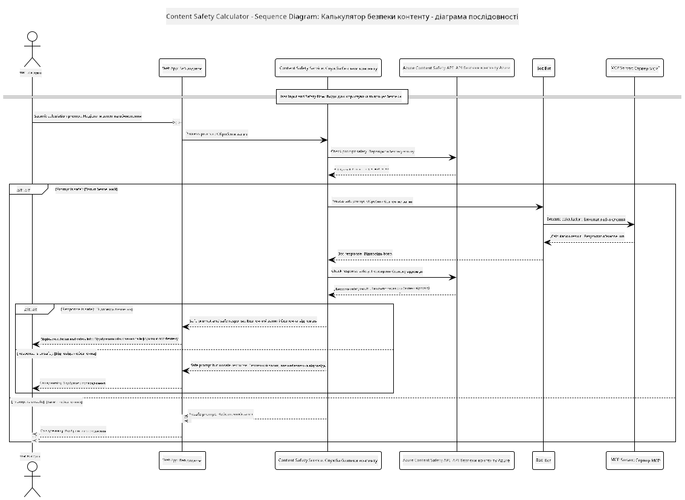

<!--
CO_OP_TRANSLATOR_METADATA:
{
  "original_hash": "e5ea5e7582f70008ea9bec3b3820f20a",
  "translation_date": "2025-06-17T17:07:23+00:00",
  "source_file": "04-PracticalImplementation/samples/java/containerapp/README.md",
  "language_code": "uk"
}
-->
## Архітектура системи

Цей проєкт демонструє веб-застосунок, який використовує перевірку безпеки контенту перед тим, як передати запити користувача до сервісу калькулятора через Model Context Protocol (MCP).



### Як це працює

1. **Введення користувача**: Користувач вводить запит на обчислення у веб-інтерфейсі  
2. **Перевірка безпеки контенту (вхідні дані)**: Запит аналізується за допомогою Azure Content Safety API  
3. **Рішення про безпеку (вхідні дані)**:  
   - Якщо контент безпечний (рівень серйозності < 2 у всіх категоріях), запит передається калькулятору  
   - Якщо контент позначено як потенційно шкідливий, процес зупиняється і повертається попередження  
4. **Інтеграція з калькулятором**: Безпечний контент обробляється LangChain4j, який взаємодіє з MCP-сервером калькулятора  
5. **Перевірка безпеки контенту (вихідні дані)**: Відповідь бота аналізується Azure Content Safety API  
6. **Рішення про безпеку (вихідні дані)**:  
   - Якщо відповідь бота безпечна, вона відображається користувачу  
   - Якщо відповідь бота позначена як потенційно шкідлива, вона замінюється на попередження  
7. **Відповідь**: Результати (якщо безпечні) відображаються користувачу разом з обома аналізами безпеки

## Використання Model Context Protocol (MCP) з калькуляторними сервісами

Цей проєкт демонструє, як використовувати Model Context Protocol (MCP) для виклику калькуляторних MCP-сервісів з LangChain4j. Реалізація використовує локальний MCP-сервер, який працює на порті 8080 і надає операції калькулятора.

### Налаштування Azure Content Safety Service

Перед використанням функцій безпеки контенту потрібно створити ресурс Azure Content Safety service:

1. Увійдіть у [Azure Portal](https://portal.azure.com)  
2. Натисніть «Create a resource» і знайдіть «Content Safety»  
3. Виберіть «Content Safety» і натисніть «Create»  
4. Введіть унікальне ім’я для вашого ресурсу  
5. Виберіть підписку та групу ресурсів (або створіть нову)  
6. Оберіть підтримуваний регіон (перевірте [Region availability](https://azure.microsoft.com/en-us/global-infrastructure/services/?products=cognitive-services) для деталей)  
7. Виберіть відповідний тарифний план  
8. Натисніть «Create» для розгортання ресурсу  
9. Після завершення розгортання натисніть «Go to resource»  
10. У лівій панелі, в розділі «Resource Management», виберіть «Keys and Endpoint»  
11. Скопіюйте будь-який із ключів та URL кінцевої точки для використання на наступному кроці

### Налаштування змінних середовища

Встановіть змінну середовища `GITHUB_TOKEN` для аутентифікації моделей GitHub:  
```sh
export GITHUB_TOKEN=<your_github_token>
```

Для функцій безпеки контенту встановіть:  
```sh
export CONTENT_SAFETY_ENDPOINT=<your_content_safety_endpoint>
export CONTENT_SAFETY_KEY=<your_content_safety_key>
```

Ці змінні середовища використовуються застосунком для аутентифікації з Azure Content Safety service. Якщо змінні не встановлені, застосунок використовуватиме значення-заповнювачі для демонстрації, але функції безпеки контенту працюватимуть некоректно.

### Запуск MCP-сервера калькулятора

Перед запуском клієнта потрібно запустити MCP-сервер калькулятора в режимі SSE на localhost:8080.

## Опис проєкту

Цей проєкт демонструє інтеграцію Model Context Protocol (MCP) з LangChain4j для виклику калькуляторних сервісів. Основні можливості:

- Використання MCP для підключення до сервісу калькулятора для базових математичних операцій  
- Дворівнева перевірка безпеки контенту як в запитах користувача, так і у відповідях бота  
- Інтеграція з моделлю GitHub gpt-4.1-nano через LangChain4j  
- Використання Server-Sent Events (SSE) для транспорту MCP

## Інтеграція безпеки контенту

Проєкт включає комплексні функції безпеки контенту, щоб гарантувати, що як введення користувача, так і відповіді системи не містять шкідливого контенту:

1. **Перевірка вхідних даних**: Всі запити користувачів аналізуються на наявність шкідливих категорій контенту, таких як мова ворожнечі, насильство, самошкодження та сексуальний контент перед обробкою.  

2. **Перевірка вихідних даних**: Навіть при використанні потенційно неконтрольованих моделей система перевіряє всі згенеровані відповіді через ті ж фільтри безпеки перед відображенням користувачу.  

Такий дворівневий підхід гарантує безпеку системи незалежно від того, яка AI-модель використовується, захищаючи користувачів як від шкідливих запитів, так і від потенційно проблемних відповідей AI.

## Веб-клієнт

Застосунок включає зручний веб-інтерфейс, що дозволяє користувачам взаємодіяти з системою Content Safety Calculator:

### Особливості веб-інтерфейсу

- Простий, інтуїтивно зрозумілий формуляр для введення запитів на обчислення  
- Дворівнева перевірка безпеки контенту (вхідні та вихідні дані)  
- Зворотній зв’язок у реальному часі щодо безпеки запиту та відповіді  
- Кольорові індикатори безпеки для легкого сприйняття  
- Чистий, адаптивний дизайн, що працює на різних пристроях  
- Приклади безпечних запитів для допомоги користувачам

### Використання веб-клієнта

1. Запустіть застосунок:  
   ```sh
   mvn spring-boot:run
   ```

2. Відкрийте браузер і перейдіть за адресою `http://localhost:8087`

3. Введіть запит на обчислення у наданому текстовому полі (наприклад, «Обчислити суму 24.5 та 17.3»)

4. Натисніть «Submit» для обробки запиту

5. Перегляньте результати, які включатимуть:  
   - Аналіз безпеки вашого запиту  
   - Обчислений результат (якщо запит був безпечним)  
   - Аналіз безпеки відповіді бота  
   - Попередження про безпеку, якщо вхідні або вихідні дані були позначені

Веб-клієнт автоматично виконує обидва процеси перевірки безпеки контенту, забезпечуючи безпечну та відповідну взаємодію незалежно від використовуваної AI-моделі.

**Відмова від відповідальності**:  
Цей документ було перекладено за допомогою сервісу автоматичного перекладу [Co-op Translator](https://github.com/Azure/co-op-translator). Хоча ми прагнемо до точності, просимо враховувати, що автоматичні переклади можуть містити помилки або неточності. Оригінальний документ рідною мовою слід вважати авторитетним джерелом. Для критичної інформації рекомендується звертатися до професійного людського перекладу. Ми не несемо відповідальності за будь-які непорозуміння або неправильні тлумачення, що виникли внаслідок використання цього перекладу.