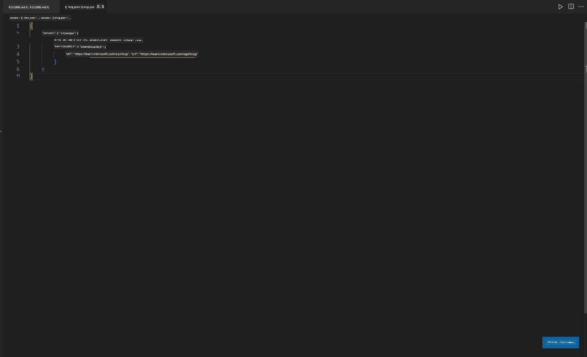
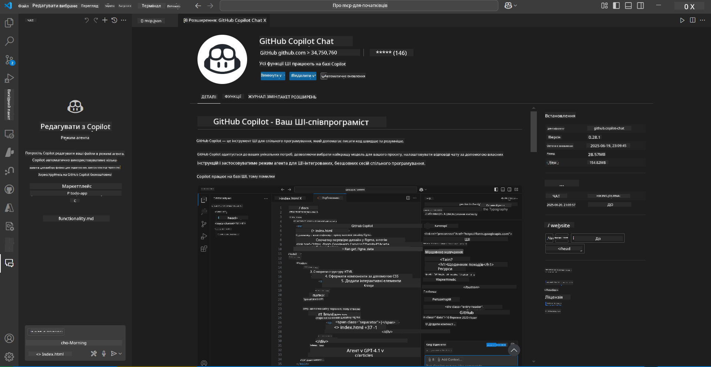
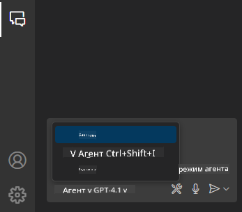
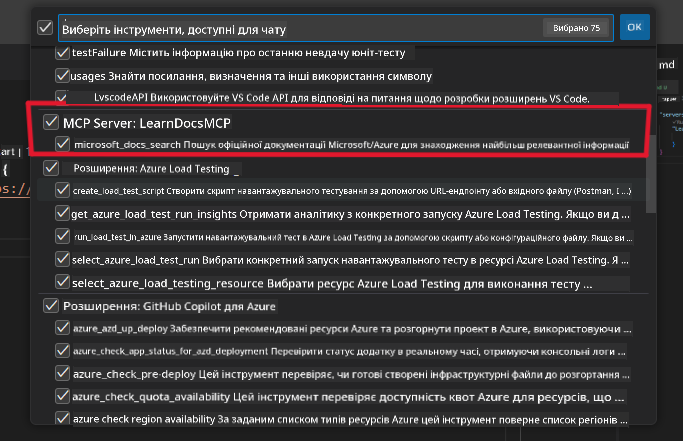
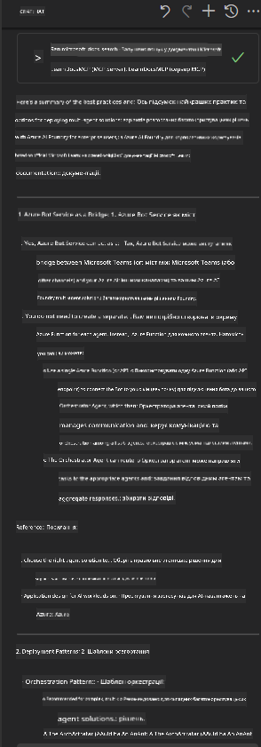

<!--
CO_OP_TRANSLATOR_METADATA:
{
  "original_hash": "db532b1ec386c9ce38c791653dc3c881",
  "translation_date": "2025-06-21T14:45:28+00:00",
  "source_file": "09-CaseStudy/docs-mcp/solution/scenario3/README.md",
  "language_code": "uk"
}
-->
# Сценарій 3: Документація в редакторі з MCP сервером у VS Code

## Огляд

У цьому сценарії ви дізнаєтеся, як інтегрувати Microsoft Learn Docs безпосередньо у ваше середовище Visual Studio Code за допомогою MCP сервера. Замість постійного перемикання між вкладками браузера для пошуку документації, ви зможете отримувати доступ, шукати та посилатися на офіційну документацію прямо в редакторі. Такий підхід оптимізує ваш робочий процес, допомагає залишатися зосередженим і забезпечує безшовну інтеграцію з інструментами, такими як GitHub Copilot.

- Шукайте та читайте документацію всередині VS Code, не виходячи з середовища кодування.
- Посилайтеся на документацію та вставляйте посилання безпосередньо у ваш README або файли курсу.
- Використовуйте GitHub Copilot і MCP разом для зручного, підтримуваного ШІ робочого процесу з документацією.

## Цілі навчання

Після проходження цього розділу ви знатимете, як налаштувати та використовувати MCP сервер у VS Code для покращення вашої роботи з документацією та розробкою. Ви зможете:

- Налаштувати робоче середовище для використання MCP сервера для пошуку документації.
- Шукати та вставляти документацію безпосередньо з VS Code.
- Поєднувати можливості GitHub Copilot і MCP для більш продуктивного робочого процесу з підтримкою ШІ.

Ці навички допоможуть вам залишатися зосередженими, покращити якість документації та підвищити продуктивність як розробника або технічного автора.

## Рішення

Щоб отримати доступ до документації в редакторі, виконайте низку кроків для інтеграції MCP сервера з VS Code і GitHub Copilot. Це рішення ідеально підходить для авторів курсів, технічних письменників і розробників, які хочуть залишатися зосередженими в редакторі під час роботи з документацією та Copilot.

- Швидко додавайте посилання на документацію в README під час написання курсу або документації проекту.
- Використовуйте Copilot для генерації коду, а MCP — для миттєвого пошуку та цитування релевантної документації.
- Залишайтеся зосередженими в редакторі та підвищуйте продуктивність.

### Покрокова інструкція

Щоб почати, виконайте ці кроки. Для кожного кроку ви можете додати скріншот з папки assets для візуального пояснення процесу.

1. **Додайте конфігурацію MCP:**
   У корені вашого проєкту створіть файл `.vscode/mcp.json` і додайте наступну конфігурацію:
   ```json
   {
     "servers": {
       "LearnDocsMCP": {
         "url": "https://learn.microsoft.com/api/mcp"
       }
     }
   }
   ```
   Ця конфігурація вказує VS Code, як підключатися до [`Microsoft Learn Docs MCP server`](https://github.com/MicrosoftDocs/mcp).
   
   
    
2. **Відкрийте панель GitHub Copilot Chat:**
   Якщо у вас ще не встановлено розширення GitHub Copilot, перейдіть до розділу Розширення у VS Code і встановіть його. Ви можете завантажити його безпосередньо з [Visual Studio Code Marketplace](https://marketplace.visualstudio.com/items?itemName=GitHub.copilot-chat). Потім відкрийте панель Copilot Chat у бічній панелі.

   

3. **Увімкніть агентський режим і перевірте інструменти:**
   У панелі Copilot Chat увімкніть агентський режим.

   

   Після увімкнення агентського режиму переконайтеся, що MCP сервер відображається серед доступних інструментів. Це гарантує, що агент Copilot може звертатися до сервера документації для отримання релевантної інформації.
   
   
4. **Почніть новий чат і задайте запит агенту:**
   Відкрийте новий чат у панелі Copilot Chat. Тепер ви можете ставити агенту запити щодо документації. Агент використовуватиме MCP сервер, щоб отримувати та відображати релевантну документацію Microsoft Learn безпосередньо у вашому редакторі.

   - *"Я намагаюся скласти план навчання з теми X. Планую вивчати її протягом 8 тижнів, запропонуй, будь ласка, матеріал для кожного тижня."*

   

5. **Живі запити:**

   > Розглянемо живий запит із розділу [#get-help](https://discord.gg/D6cRhjHWSC) на Discord Azure AI Foundry ([переглянути оригінальне повідомлення](https://discord.com/channels/1113626258182504448/1385498306720829572)):
   
   *"Шукаю відповіді щодо розгортання мультиагентного рішення з AI агентами, розробленими на Azure AI Foundry. Бачу, що немає прямого способу розгортання, як у Copilot Studio channels. Тож які існують різні способи розгортання для корпоративних користувачів, щоб вони могли взаємодіяти та виконувати завдання?
Існує багато статей/блогів, де кажуть, що можна використовувати Azure Bot service як міст між MS Teams і Azure AI Foundry Agents. Чи спрацює це, якщо я налаштую Azure bot, який підключається до Orchestrator Agent на Azure AI Foundry через Azure function для оркестрації, або мені потрібно створювати Azure function для кожного AI агента мультиагентного рішення, щоб виконувати оркестрацію на рівні Bot framework? Будь-які інші пропозиції дуже вітаються."*

   

   Агент відповість релевантними посиланнями на документацію та їх короткими викладами, які ви зможете безпосередньо вставляти у свої markdown файли або використовувати як посилання у коді.
   
### Приклади запитів

Ось кілька прикладів запитів, які ви можете спробувати. Вони демонструють, як MCP сервер і Copilot працюють разом, щоб надавати миттєву, контекстно-залежну документацію та посилання без виходу з VS Code:

- "Покажи, як використовувати тригери Azure Functions."
- "Встав посилання на офіційну документацію для Azure Key Vault."
- "Які найкращі практики для захисту ресурсів Azure?"
- "Знайди quickstart для сервісів Azure AI."

Ці запити демонструють, як MCP сервер і Copilot можуть працювати разом, щоб надавати миттєву, контекстно-залежну документацію та посилання без виходу з VS Code.

---

**Відмова від відповідальності**:  
Цей документ було перекладено за допомогою сервісу автоматичного перекладу [Co-op Translator](https://github.com/Azure/co-op-translator). Хоча ми прагнемо до точності, будь ласка, майте на увазі, що автоматичні переклади можуть містити помилки або неточності. Оригінальний документ рідною мовою слід вважати авторитетним джерелом. Для критично важливої інформації рекомендується звертатися до професійного людського перекладу. Ми не несемо відповідальності за будь-які непорозуміння чи неправильні тлумачення, що виникли внаслідок використання цього перекладу.