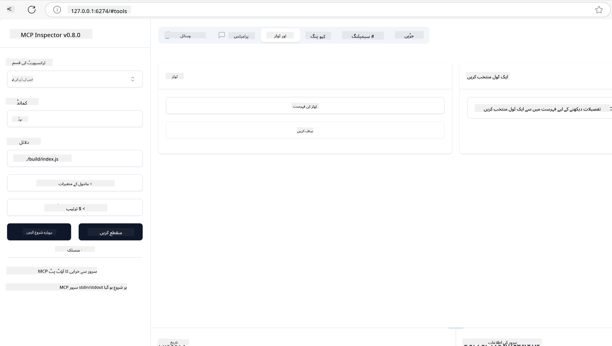

<!--
CO_OP_TRANSLATOR_METADATA:
{
  "original_hash": "f01d4263fc6eec331615fef42429b720",
  "translation_date": "2025-06-18T18:15:14+00:00",
  "source_file": "03-GettingStarted/01-first-server/README.md",
  "language_code": "ur"
}
-->
### -2- پروجیکٹ بنائیں

اب جب کہ آپ نے SDK انسٹال کر لیا ہے، آئیں اگلا قدم اٹھاتے ہوئے پروجیکٹ بنائیں:

### -3- پروجیکٹ فائلز بنائیں

### -4- سرور کا کوڈ لکھیں

### -5- ایک ٹول اور ریسورس شامل کرنا

مندرجہ ذیل کوڈ شامل کرکے ایک ٹول اور ریسورس شامل کریں:

### -6- آخری کوڈ

آئیے وہ آخری کوڈ شامل کریں جس کی ضرورت ہے تاکہ سرور شروع ہو سکے:

### -7- سرور کی جانچ کریں

مندرجہ ذیل کمانڈ کے ساتھ سرور شروع کریں:

### -8- انسپکٹر کے ذریعے چلائیں

انسپکٹر ایک بہترین ٹول ہے جو آپ کے سرور کو شروع کرتا ہے اور آپ کو اس کے ساتھ تعامل کرنے دیتا ہے تاکہ آپ جانچ سکیں کہ یہ کام کر رہا ہے۔ آئیے اسے شروع کرتے ہیں:

> [!NOTE]
> "command" فیلڈ میں یہ مختلف نظر آ سکتا ہے کیونکہ اس میں آپ کے مخصوص رن ٹائم کے ساتھ سرور چلانے کی کمانڈ شامل ہوتی ہے۔

آپ کو درج ذیل یوزر انٹرفیس نظر آئے گا:

1. کنیکٹ بٹن کو منتخب کرکے سرور سے جڑیں  
   ایک بار جب آپ سرور سے جڑ جائیں گے، تو آپ کو درج ذیل نظر آئے گا:

   

2. "Tools" اور "listTools" منتخب کریں، آپ کو "Add" نظر آئے گا، "Add" کو منتخب کریں اور پیرامیٹر ویلیوز بھر دیں۔

   آپ کو درج ذیل جواب نظر آئے گا، یعنی "add" ٹول کا نتیجہ:

   

مبارک ہو، آپ نے اپنا پہلا سرور کامیابی سے بنایا اور چلایا ہے!

### سرکاری SDKs

MCP مختلف زبانوں کے لیے سرکاری SDKs فراہم کرتا ہے:

- [C# SDK](https://github.com/modelcontextprotocol/csharp-sdk) - مائیکروسافٹ کے تعاون سے برقرار رکھا گیا
- [Java SDK](https://github.com/modelcontextprotocol/java-sdk) - Spring AI کے تعاون سے برقرار رکھا گیا
- [TypeScript SDK](https://github.com/modelcontextprotocol/typescript-sdk) - سرکاری TypeScript نفاذ
- [Python SDK](https://github.com/modelcontextprotocol/python-sdk) - سرکاری Python نفاذ
- [Kotlin SDK](https://github.com/modelcontextprotocol/kotlin-sdk) - سرکاری Kotlin نفاذ
- [Swift SDK](https://github.com/modelcontextprotocol/swift-sdk) - Loopwork AI کے تعاون سے برقرار رکھا گیا
- [Rust SDK](https://github.com/modelcontextprotocol/rust-sdk) - سرکاری Rust نفاذ

## اہم نکات

- MCP کی ڈیولپمنٹ ماحول کی ترتیب زبان مخصوص SDKs کے ساتھ آسان ہے  
- MCP سرور بنانے کے لیے ٹولز کو واضح اسکیموں کے ساتھ تخلیق اور رجسٹر کرنا ضروری ہے  
- جانچ اور ڈی بگنگ قابل اعتماد MCP نفاذ کے لیے ضروری ہیں  

## نمونے

- [Java کیلکولیٹر](../samples/java/calculator/README.md)  
- [.Net کیلکولیٹر](../../../../03-GettingStarted/samples/csharp)  
- [JavaScript کیلکولیٹر](../samples/javascript/README.md)  
- [TypeScript کیلکولیٹر](../samples/typescript/README.md)  
- [Python کیلکولیٹر](../../../../03-GettingStarted/samples/python)

## اسائنمنٹ

اپنی پسند کا ایک آسان MCP سرور بنائیں:

1. اپنے پسندیدہ زبان (.NET, Java, Python, یا JavaScript) میں ٹول کو نافذ کریں۔  
2. ان پٹ پیرامیٹرز اور ریٹرن ویلیوز کی تعریف کریں۔  
3. انسپکٹر ٹول چلائیں تاکہ یہ یقینی بنایا جا سکے کہ سرور ٹھیک کام کر رہا ہے۔  
4. مختلف ان پٹس کے ساتھ نفاذ کی جانچ کریں۔

## حل

[حل](./solution/README.md)

## اضافی وسائل

- [Azure پر Model Context Protocol کے ذریعے ایجنٹس بنائیں](https://learn.microsoft.com/azure/developer/ai/intro-agents-mcp)  
- [Azure Container Apps کے ساتھ ریموٹ MCP (Node.js/TypeScript/JavaScript)](https://learn.microsoft.com/samples/azure-samples/mcp-container-ts/mcp-container-ts/)  
- [.NET OpenAI MCP ایجنٹ](https://learn.microsoft.com/samples/azure-samples/openai-mcp-agent-dotnet/openai-mcp-agent-dotnet/)

## اگلا کیا ہے

اگلا: [MCP کلائنٹس کے ساتھ شروعات](/03-GettingStarted/02-client/README.md)

**دستخطی بیان**:  
یہ دستاویز AI ترجمہ سروس [Co-op Translator](https://github.com/Azure/co-op-translator) کے ذریعے ترجمہ کی گئی ہے۔ اگرچہ ہم درستگی کی کوشش کرتے ہیں، براہ کرم اس بات سے آگاہ رہیں کہ خودکار ترجمے میں غلطیاں یا کمی بیشی ہو سکتی ہے۔ اصل دستاویز اپنی مادری زبان میں معتبر ذریعہ سمجھی جائے۔ اہم معلومات کے لیے پیشہ ور انسانی ترجمہ کی سفارش کی جاتی ہے۔ اس ترجمے کے استعمال سے پیدا ہونے والی کسی بھی غلط فہمی یا غلط تشریح کی ذمہ داری ہم پر عائد نہیں ہوتی۔