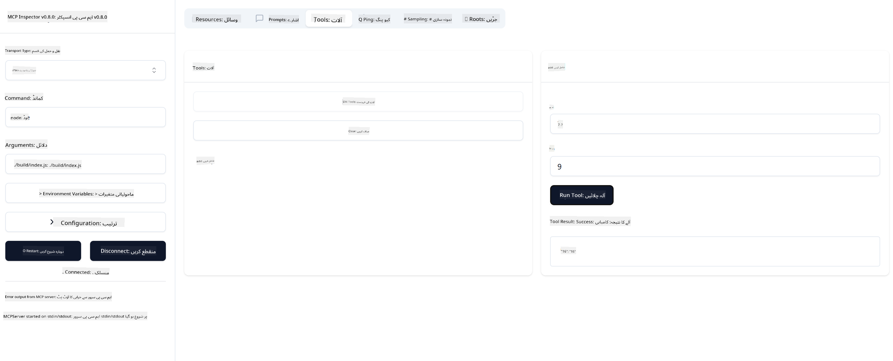

<!--
CO_OP_TRANSLATOR_METADATA:
{
  "original_hash": "bf05718d019040cf0c7d4ccc6d6a1a88",
  "translation_date": "2025-06-13T05:52:06+00:00",
  "source_file": "03-GettingStarted/01-first-server/README.md",
  "language_code": "ur"
}
-->
### -2- پروجیکٹ بنائیں

اب جب کہ آپ نے اپنا SDK انسٹال کر لیا ہے، تو آئیے اگلا قدم پروجیکٹ بنانے کا ہے:

### -3- پروجیکٹ فائلیں بنائیں

### -4- سرور کا کوڈ لکھیں

### -5- ایک ٹول اور ایک ریسورس شامل کرنا

مندرجہ ذیل کوڈ شامل کرکے ایک ٹول اور ایک ریسورس شامل کریں:

### -6- آخری کوڈ

آئیے وہ آخری کوڈ شامل کرتے ہیں جس سے سرور شروع ہو سکے:

### -7- سرور کا ٹیسٹ کریں

مندرجہ ذیل کمانڈ کے ذریعے سرور شروع کریں:

### -8- انسپیکٹر کے ذریعے چلائیں

انسپیکٹر ایک بہترین ٹول ہے جو آپ کے سرور کو شروع کرتا ہے اور آپ کو اس کے ساتھ بات چیت کرنے دیتا ہے تاکہ آپ اس کا ٹیسٹ کر سکیں کہ یہ کام کر رہا ہے۔ آئیے اسے شروع کرتے ہیں:

> [!NOTE]
> "کمانڈ" فیلڈ میں یہ مختلف نظر آ سکتا ہے کیونکہ اس میں آپ کے مخصوص رن ٹائم کے ساتھ سرور چلانے کی کمانڈ شامل ہوتی ہے۔

آپ کو درج ذیل یوزر انٹرفیس نظر آئے گا:

1. کنیکٹ بٹن کو منتخب کرکے سرور سے جڑیں  
   جب آپ سرور سے جڑ جائیں گے، تو آپ کو درج ذیل نظر آئے گا:

   

2. "Tools" اور "listTools" منتخب کریں، آپ کو "Add" نظر آئے گا، "Add" منتخب کریں اور پیرامیٹر ویلیوز بھر دیں۔

   آپ کو درج ذیل جواب نظر آئے گا، یعنی "add" ٹول کا نتیجہ:

   

مبارک ہو، آپ نے اپنا پہلا سرور کامیابی سے بنایا اور چلایا ہے!

### آفیشل SDKs

MCP مختلف زبانوں کے لیے آفیشل SDKs فراہم کرتا ہے:  
- [C# SDK](https://github.com/modelcontextprotocol/csharp-sdk) - مائیکروسافٹ کے تعاون سے مینٹینڈ  
- [Java SDK](https://github.com/modelcontextprotocol/java-sdk) - Spring AI کے تعاون سے مینٹینڈ  
- [TypeScript SDK](https://github.com/modelcontextprotocol/typescript-sdk) - آفیشل TypeScript امپلیمینٹیشن  
- [Python SDK](https://github.com/modelcontextprotocol/python-sdk) - آفیشل Python امپلیمینٹیشن  
- [Kotlin SDK](https://github.com/modelcontextprotocol/kotlin-sdk) - آفیشل Kotlin امپلیمینٹیشن  
- [Swift SDK](https://github.com/modelcontextprotocol/swift-sdk) - Loopwork AI کے تعاون سے مینٹینڈ  
- [Rust SDK](https://github.com/modelcontextprotocol/rust-sdk) - آفیشل Rust امپلیمینٹیشن  

## اہم نکات

- MCP ڈیولپمنٹ ماحول کی سیٹ اپ زبان کے مخصوص SDKs کے ساتھ آسان ہے  
- MCP سرور بنانے میں واضح اسکیموں کے ساتھ ٹولز کی تخلیق اور رجسٹریشن شامل ہے  
- ٹیسٹنگ اور ڈیبگنگ MCP امپلیمینٹیشنز کے لیے ضروری ہیں  

## نمونے

- [Java Calculator](../samples/java/calculator/README.md)  
- [.Net Calculator](../../../../03-GettingStarted/samples/csharp)  
- [JavaScript Calculator](../samples/javascript/README.md)  
- [TypeScript Calculator](../samples/typescript/README.md)  
- [Python Calculator](../../../../03-GettingStarted/samples/python)  

## اسائنمنٹ

اپنی پسند کا ایک سادہ MCP سرور بنائیں:  
1. اپنی پسندیدہ زبان میں ٹول امپلیمینٹ کریں (.NET, Java, Python, یا JavaScript).  
2. ان پٹ پیرامیٹرز اور ریٹرن ویلیوز کو ڈیفائن کریں۔  
3. انسپیکٹر ٹول چلائیں تاکہ سرور کی فعالیت کی تصدیق ہو سکے۔  
4. مختلف ان پٹس کے ساتھ امپلیمینٹیشن کو ٹیسٹ کریں۔  

## حل

[Solution](./solution/README.md)

## اضافی وسائل

- [Build Agents using Model Context Protocol on Azure](https://learn.microsoft.com/azure/developer/ai/intro-agents-mcp)  
- [Remote MCP with Azure Container Apps (Node.js/TypeScript/JavaScript)](https://learn.microsoft.com/samples/azure-samples/mcp-container-ts/mcp-container-ts/)  
- [.NET OpenAI MCP Agent](https://learn.microsoft.com/samples/azure-samples/openai-mcp-agent-dotnet/openai-mcp-agent-dotnet/)  

## اگلا قدم

اگلا: [Getting Started with MCP Clients](/03-GettingStarted/02-client/README.md)

**دستخطی دستبرد**:  
یہ دستاویز AI ترجمہ سروس [Co-op Translator](https://github.com/Azure/co-op-translator) کے ذریعے ترجمہ کی گئی ہے۔ اگرچہ ہم درستگی کی کوشش کرتے ہیں، براہ کرم آگاہ رہیں کہ خودکار ترجموں میں غلطیاں یا عدم صحت ہو سکتی ہے۔ اصل دستاویز اپنی مادری زبان میں ہی معتبر ماخذ سمجھی جانی چاہیے۔ اہم معلومات کے لیے پیشہ ور انسانی ترجمہ تجویز کیا جاتا ہے۔ اس ترجمے کے استعمال سے پیدا ہونے والی کسی بھی غلط فہمی یا غلط تشریح کی ذمہ داری ہم پر عائد نہیں ہوتی۔