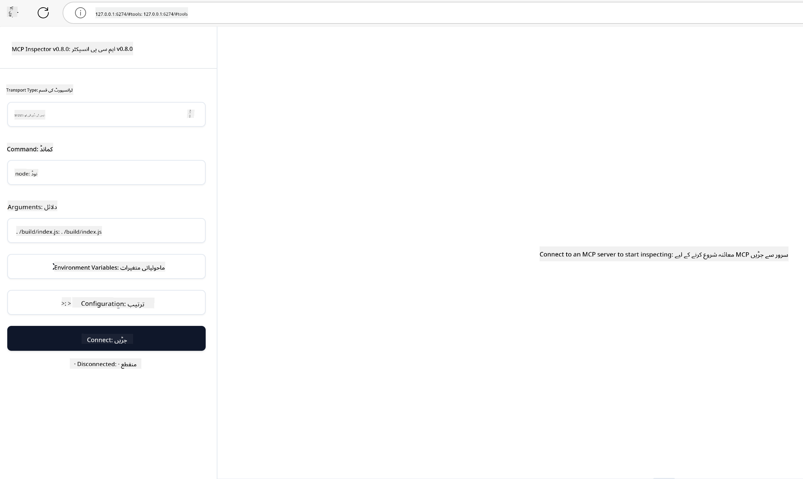

<!--
CO_OP_TRANSLATOR_METADATA:
{
  "original_hash": "262e6e510f0c3fe1e36180eadcd67c33",
  "translation_date": "2025-06-02T17:19:52+00:00",
  "source_file": "03-GettingStarted/01-first-server/README.md",
  "language_code": "ur"
}
-->
### -2- پروجیکٹ بنائیں

اب جب کہ آپ نے SDK انسٹال کر لیا ہے، آئیں اگلا قدم یعنی پروجیکٹ بنائیں:

### -3- پروجیکٹ فائلز بنائیں

### -4- سرور کوڈ بنائیں

### -5- ایک ٹول اور ایک ریسورس شامل کریں

مندرجہ ذیل کوڈ شامل کر کے ایک ٹول اور ایک ریسورس شامل کریں:

### -6- آخری کوڈ

آئیے وہ آخری کوڈ شامل کریں جس سے سرور شروع ہو سکے:

### -7- سرور کی جانچ کریں

مندرجہ ذیل کمانڈ سے سرور شروع کریں:

### -8- انسپکٹر کا استعمال

انسپکٹر ایک بہترین ٹول ہے جو آپ کے سرور کو شروع کرتا ہے اور آپ کو اس کے ساتھ تعامل کرنے دیتا ہے تاکہ آپ اس کی جانچ کر سکیں کہ یہ کام کر رہا ہے۔ آئیے اسے شروع کرتے ہیں:

> [!NOTE]
> یہ "کمانڈ" فیلڈ میں مختلف لگ سکتا ہے کیونکہ اس میں آپ کے مخصوص رن ٹائم کے لیے سرور چلانے کی کمانڈ شامل ہوتی ہے۔

آپ کو درج ذیل یوزر انٹرفیس نظر آئے گا:

1. کنیکٹ بٹن منتخب کر کے سرور سے کنیکٹ کریں  
   سرور سے کنیکٹ ہونے کے بعد آپ کو درج ذیل نظر آئے گا:

   

2. "Tools" اور "listTools" منتخب کریں، آپ کو "Add" نظر آئے گا، "Add" منتخب کریں اور پیرامیٹر کی ویلیوز بھر دیں۔

   آپ کو درج ذیل جواب ملے گا، یعنی "add" ٹول کا نتیجہ:

   

مبارک ہو، آپ نے اپنا پہلا سرور کامیابی سے بنایا اور چلایا ہے!

### آفیشل SDKs

MCP کئی زبانوں کے لیے آفیشل SDKs فراہم کرتا ہے:
- [C# SDK](https://github.com/modelcontextprotocol/csharp-sdk) - مائیکروسافٹ کے تعاون سے مینٹینڈ
- [Java SDK](https://github.com/modelcontextprotocol/java-sdk) - Spring AI کے تعاون سے مینٹینڈ
- [TypeScript SDK](https://github.com/modelcontextprotocol/typescript-sdk) - آفیشل TypeScript امپلیمنٹیشن
- [Python SDK](https://github.com/modelcontextprotocol/python-sdk) - آفیشل Python امپلیمنٹیشن
- [Kotlin SDK](https://github.com/modelcontextprotocol/kotlin-sdk) - آفیشل Kotlin امپلیمنٹیشن
- [Swift SDK](https://github.com/modelcontextprotocol/swift-sdk) - Loopwork AI کے تعاون سے مینٹینڈ
- [Rust SDK](https://github.com/modelcontextprotocol/rust-sdk) - آفیشل Rust امپلیمنٹیشن

## اہم نکات

- MCP ڈویلپمنٹ ماحول کا قیام زبان کی مخصوص SDKs کے ساتھ آسان ہے
- MCP سرورز بنانے میں واضح اسکیموں کے ساتھ ٹولز کی تخلیق اور رجسٹریشن شامل ہے
- جانچ اور ڈیبگنگ MCP امپلیمنٹیشنز کی بھروسے مندی کے لیے ضروری ہے

## نمونے

- [Java Calculator](../samples/java/calculator/README.md)
- [.Net Calculator](../../../../03-GettingStarted/samples/csharp)
- [JavaScript Calculator](../samples/javascript/README.md)
- [TypeScript Calculator](../samples/typescript/README.md)
- [Python Calculator](../../../../03-GettingStarted/samples/python)

## اسائنمنٹ

اپنی پسند کا ایک آسان MCP سرور بنائیں:
1. اپنی پسندیدہ زبان (.NET، Java، Python، یا JavaScript) میں ٹول کو امپلیمنٹ کریں۔
2. ان پٹ پیرامیٹرز اور ریٹرن ویلیوز کی تعریف کریں۔
3. انسپکٹر ٹول چلائیں تاکہ یہ یقینی بنایا جا سکے کہ سرور صحیح کام کر رہا ہے۔
4. مختلف ان پٹس کے ساتھ امپلیمنٹیشن کی جانچ کریں۔

## حل

[حل](./solution/README.md)

## اضافی وسائل

- [Azure پر Model Context Protocol کے ذریعے ایجنٹس بنائیں](https://learn.microsoft.com/azure/developer/ai/intro-agents-mcp)
- [Azure Container Apps کے ساتھ Remote MCP (Node.js/TypeScript/JavaScript)](https://learn.microsoft.com/samples/azure-samples/mcp-container-ts/mcp-container-ts/)
- [.NET OpenAI MCP Agent](https://learn.microsoft.com/samples/azure-samples/openai-mcp-agent-dotnet/openai-mcp-agent-dotnet/)

## آگے کیا ہے

اگلا: [MCP کلائنٹس کے ساتھ شروعات](/03-GettingStarted/02-client/README.md)

**ڈس کلیمر**:  
یہ دستاویز AI ترجمہ سروس [Co-op Translator](https://github.com/Azure/co-op-translator) کے ذریعے ترجمہ کی گئی ہے۔ اگرچہ ہم درستگی کی کوشش کرتے ہیں، براہ کرم اس بات سے آگاہ رہیں کہ خودکار تراجم میں غلطیاں یا بے ضابطگیاں ہو سکتی ہیں۔ اصل دستاویز اپنی مادری زبان میں ہی معتبر ماخذ سمجھی جانی چاہیے۔ اہم معلومات کے لیے پیشہ ور انسانی ترجمہ کی سفارش کی جاتی ہے۔ ہم اس ترجمے کے استعمال سے پیدا ہونے والی کسی بھی غلط فہمی یا غلط تشریح کے ذمہ دار نہیں ہیں۔