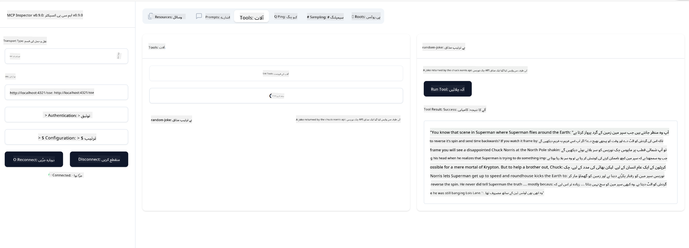

<!--
CO_OP_TRANSLATOR_METADATA:
{
  "original_hash": "64645691bf0985f1760b948123edf269",
  "translation_date": "2025-06-13T10:42:39+00:00",
  "source_file": "03-GettingStarted/05-sse-server/README.md",
  "language_code": "ur"
}
-->
اب جب کہ ہم SSE کے بارے میں کچھ زیادہ جان چکے ہیں، آئیں اگلا قدم اٹھاتے ہوئے ایک SSE سرور بنائیں۔

## مشق: SSE سرور بنانا

اپنا سرور بنانے کے لیے، ہمیں دو باتیں ذہن میں رکھنی ہوں گی:

- کنکشن اور میسجز کے لیے اینڈپوائنٹس ظاہر کرنے کے لیے ویب سرور استعمال کرنا ہوگا۔
- اپنے سرور کو ویسے ہی بنائیں جیسے ہم stdio استعمال کرتے ہوئے ٹولز، وسائل اور پرامپٹس کے ساتھ کرتے ہیں۔

### -1- سرور کا ایک انسٹینس بنائیں

اپنا سرور بنانے کے لیے، ہم وہی ٹائپس استعمال کرتے ہیں جو stdio کے ساتھ استعمال کرتے ہیں۔ البتہ، ٹرانسپورٹ کے لیے، ہمیں SSE منتخب کرنا ہوگا۔

آئیں اب ضروری روٹس شامل کرتے ہیں۔

### -2- روٹس شامل کریں

آئیں ایسے روٹس شامل کریں جو کنکشن اور آنے والے میسجز کو ہینڈل کریں:

اب سرور میں صلاحیتیں شامل کرتے ہیں۔

### -3- سرور کی صلاحیتیں شامل کرنا

اب جب کہ ہم نے SSE مخصوص تمام چیزیں متعین کر دی ہیں، آئیے سرور کی صلاحیتیں شامل کریں جیسے ٹولز، پرامپٹس اور وسائل۔

آپ کا مکمل کوڈ کچھ یوں نظر آنا چاہیے:

زبردست، ہمارے پاس SSE استعمال کرتے ہوئے ایک سرور ہے، آئیں اسے آزما کر دیکھتے ہیں۔

## مشق: Inspector کے ساتھ SSE سرور کی ڈیبگنگ

Inspector ایک بہترین ٹول ہے جسے ہم نے پچھلے سبق [اپنا پہلا سرور بنانا](/03-GettingStarted/01-first-server/README.md) میں دیکھا تھا۔ آئیں دیکھتے ہیں کہ کیا ہم یہاں بھی Inspector استعمال کر سکتے ہیں:

### -1- Inspector چلانا

Inspector چلانے کے لیے، آپ کے پاس پہلے ایک SSE سرور چل رہا ہونا چاہیے، تو آئیں اسے چلائیں:

1. سرور چلائیں

1. Inspector چلائیں

    > ![NOTE]
    > اسے سرور کے چلنے والی ٹرمینل ونڈو سے الگ ٹرمینل میں چلائیں۔ یہ بھی نوٹ کریں کہ آپ کو نیچے دی گئی کمانڈ کو اپنے سرور کے چلنے والے URL کے مطابق ایڈجسٹ کرنا ہوگا۔

    ```sh
    npx @modelcontextprotocol/inspector --cli http://localhost:8000/sse --method tools/list
    ```

    Inspector کو چلانا تمام رن ٹائمز میں ایک جیسا ہوتا ہے۔ دھیان دیں کہ ہم سرور کا راستہ اور شروع کرنے کا کمانڈ دینے کے بجائے، ہم اس URL کو دیتے ہیں جہاں سرور چل رہا ہوتا ہے اور ہم `/sse` روٹ بھی مخصوص کرتے ہیں۔

### -2- ٹول آزمانا

SSE کو ڈراپ لسٹ میں سے منتخب کریں اور اپنے سرور کے چلنے والے URL، مثلاً http:localhost:4321/sse، کو url فیلڈ میں بھریں۔ پھر "Connect" بٹن پر کلک کریں۔ جیسا کہ پہلے، ٹولز کی فہرست دیکھیں، ایک ٹول منتخب کریں اور ان پٹ ویلیوز فراہم کریں۔ آپ کو نیچے جیسا نتیجہ نظر آئے گا:



زبردست، آپ Inspector کے ساتھ کام کر سکتے ہیں، آئیں دیکھتے ہیں کہ Visual Studio Code کے ساتھ کیسے کام کیا جا سکتا ہے۔

## اسائنمنٹ

اپنے سرور میں مزید صلاحیتیں شامل کرنے کی کوشش کریں۔ مثال کے طور پر، [اس صفحے](https://api.chucknorris.io/) کو دیکھیں تاکہ آپ کوئی ایسا ٹول شامل کر سکیں جو API کال کرے، آپ فیصلہ کریں کہ سرور کیسا ہونا چاہیے۔ مزہ کریں :)

## حل

[حل](./solution/README.md) یہاں ایک ممکنہ حل ہے جس میں کام کرنے والا کوڈ موجود ہے۔

## اہم نکات

اس باب سے نکالے جانے والے اہم نکات درج ذیل ہیں:

- SSE stdio کے بعد دوسرا سپورٹڈ ٹرانسپورٹ ہے۔
- SSE کی حمایت کے لیے، آپ کو ویب فریم ورک استعمال کرتے ہوئے آنے والے کنکشنز اور میسجز کو منظم کرنا ہوگا۔
- آپ Inspector اور Visual Studio Code دونوں استعمال کر سکتے ہیں SSE سرور کو استعمال کرنے کے لیے، بالکل stdio سرورز کی طرح۔ دھیان دیں کہ stdio اور SSE میں تھوڑا فرق ہے۔ SSE کے لیے، آپ کو سرور کو الگ سے شروع کرنا ہوتا ہے اور پھر Inspector ٹول چلانا ہوتا ہے۔ Inspector ٹول کے لیے بھی کچھ فرق ہے کہ آپ کو URL مخصوص کرنا ہوتا ہے۔

## نمونے

- [Java کیلکولیٹر](../samples/java/calculator/README.md)
- [.Net کیلکولیٹر](../../../../03-GettingStarted/samples/csharp)
- [JavaScript کیلکولیٹر](../samples/javascript/README.md)
- [TypeScript کیلکولیٹر](../samples/typescript/README.md)
- [Python کیلکولیٹر](../../../../03-GettingStarted/samples/python)

## اضافی وسائل

- [SSE](https://developer.mozilla.org/en-US/docs/Web/API/Server-sent_events)

## اگلا کیا ہے

- اگلا: [MCP کے ساتھ HTTP اسٹریمنگ (Streamable HTTP)](/03-GettingStarted/06-http-streaming/README.md)

**ڈس کلیمر**:  
یہ دستاویز AI ترجمہ سروس [Co-op Translator](https://github.com/Azure/co-op-translator) کے ذریعے ترجمہ کی گئی ہے۔ اگرچہ ہم درستگی کے لیے کوشاں ہیں، براہ کرم اس بات سے آگاہ رہیں کہ خودکار ترجمے میں غلطیاں یا بے دقتیاں ہو سکتی ہیں۔ اصل دستاویز اپنی مادری زبان میں ہی معتبر ماخذ سمجھی جانی چاہیے۔ اہم معلومات کے لیے پیشہ ورانہ انسانی ترجمہ تجویز کیا جاتا ہے۔ اس ترجمے کے استعمال سے پیدا ہونے والی کسی بھی غلط فہمی یا غلط تعبیر کی ذمہ داری ہم پر عائد نہیں ہوتی۔