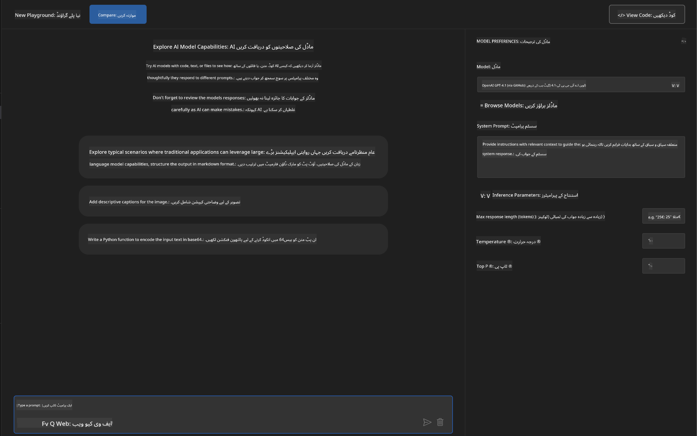
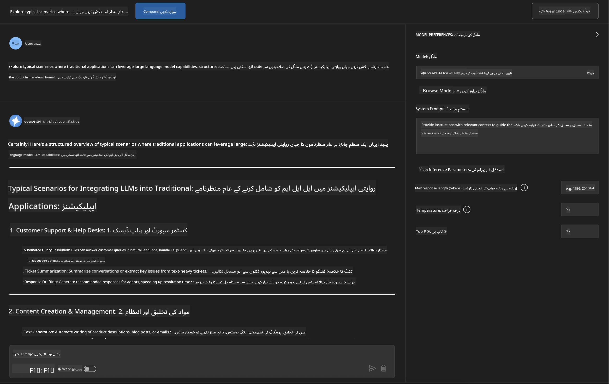
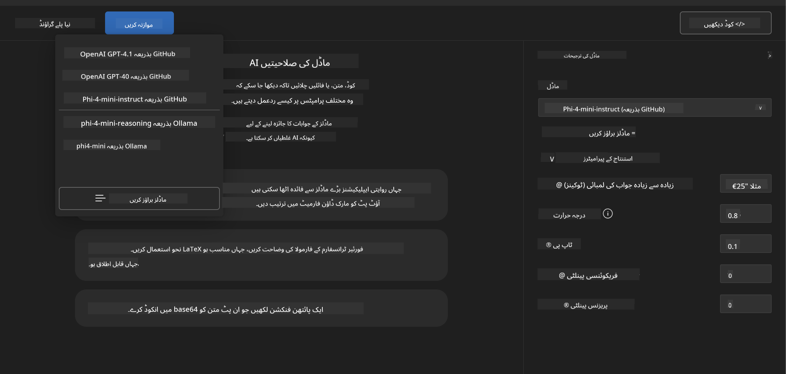
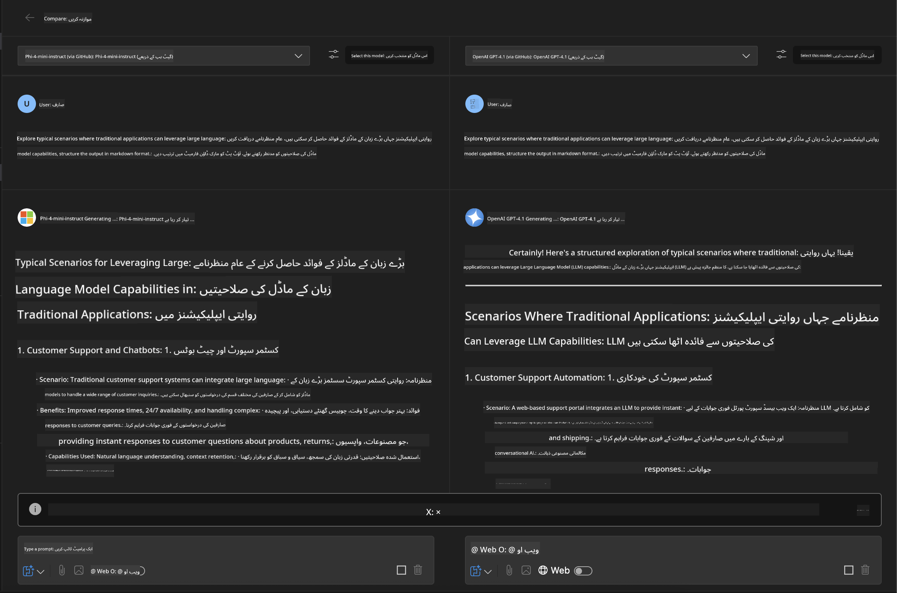
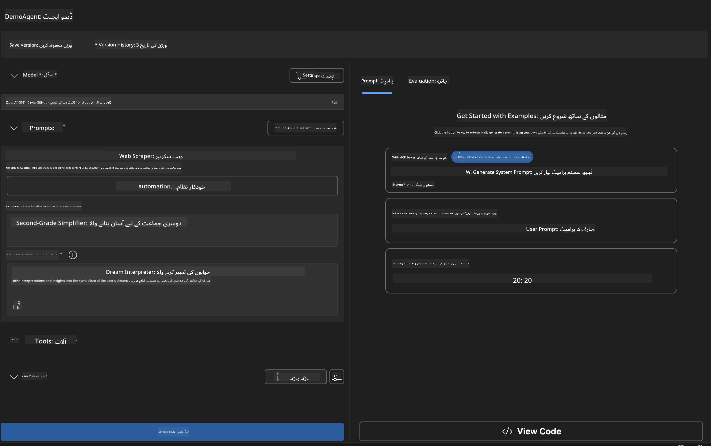

<!--
CO_OP_TRANSLATOR_METADATA:
{
  "original_hash": "2aa9dbc165e104764fa57e8a0d3f1c73",
  "translation_date": "2025-06-10T05:10:51+00:00",
  "source_file": "10-StreamliningAIWorkflowsBuildingAnMCPServerWithAIToolkit/lab1/README.md",
  "language_code": "ur"
}
-->
# 🚀 ماڈیول 1: AI Toolkit کے بنیادی اصول

[]()
[]()
[]()

## 📋 سیکھنے کے مقاصد

اس ماڈیول کے اختتام تک، آپ قابل ہوں گے کہ:
- ✅ Visual Studio Code کے لیے AI Toolkit انسٹال اور ترتیب دیں
- ✅ ماڈل کیٹلاگ میں نیویگیٹ کریں اور مختلف ماڈل ذرائع کو سمجھیں
- ✅ ماڈل کی جانچ اور تجربے کے لیے Playground استعمال کریں
- ✅ Agent Builder کے ذریعے کسٹم AI ایجنٹس بنائیں
- ✅ مختلف فراہم کنندگان کے ماڈل کی کارکردگی کا موازنہ کریں
- ✅ پرامپٹ انجینئرنگ کی بہترین مشقیں اپنائیں

## 🧠 AI Toolkit (AITK) کا تعارف

**AI Toolkit for Visual Studio Code** مائیکروسافٹ کا اہم ایکسٹینشن ہے جو VS Code کو مکمل AI ترقیاتی ماحول میں تبدیل کرتا ہے۔ یہ AI تحقیق اور عملی ایپلیکیشن ڈویلپمنٹ کے درمیان پل کا کام دیتا ہے، اور جنریٹو AI کو ہر مہارت کی سطح کے ڈویلپرز کے لیے قابل رسائی بناتا ہے۔

### 🌟 اہم خصوصیات

| خصوصیت | وضاحت | استعمال کی صورت |
|---------|-------------|----------|
| **🗂️ Model Catalog** | GitHub، ONNX، OpenAI، Anthropic، Google سے 100+ ماڈلز تک رسائی | ماڈل کی دریافت اور انتخاب |
| **🔌 BYOM Support** | اپنے ماڈلز (مقامی/ریموٹ) کو شامل کریں | کسٹم ماڈل تعیناتی |
| **🎮 Interactive Playground** | چیٹ انٹرفیس کے ساتھ حقیقی وقت میں ماڈل کی جانچ | تیز پروٹوٹائپنگ اور ٹیسٹنگ |
| **📎 Multi-Modal Support** | متن، تصاویر، اور منسلکات کو ہینڈل کریں | پیچیدہ AI ایپلیکیشنز |
| **⚡ Batch Processing** | ایک ساتھ متعدد پرامپٹس چلائیں | مؤثر ٹیسٹنگ ورک فلو |
| **📊 Model Evaluation** | بلٹ ان میٹرکس (F1، مطابقت، مماثلت، ہم آہنگی) | کارکردگی کا اندازہ |

### 🎯 AI Toolkit کی اہمیت

- **🚀 تیز تر ترقی**: خیال سے پروٹوٹائپ چند منٹوں میں
- **🔄 یکساں ورک فلو**: متعدد AI فراہم کنندگان کے لیے ایک انٹرفیس
- **🧪 آسان تجربہ کاری**: پیچیدہ سیٹ اپ کے بغیر ماڈلز کا موازنہ کریں
- **📈 پروڈکشن کے لیے تیار**: پروٹوٹائپ سے تعیناتی تک آسان منتقلی

## 🛠️ ضروریات اور سیٹ اپ

### 📦 AI Toolkit ایکسٹینشن انسٹال کریں

**مرحلہ 1: Extensions Marketplace تک رسائی**
1. Visual Studio Code کھولیں
2. Extensions ویو پر جائیں (`Ctrl+Shift+X` یا `Cmd+Shift+X`)
3. "AI Toolkit" تلاش کریں

**مرحلہ 2: اپنی ورژن منتخب کریں**
- **🟢 ریلیز**: پروڈکشن کے استعمال کے لیے تجویز کردہ
- **🔶 پری-ریلیز**: جدید خصوصیات تک ابتدائی رسائی

**مرحلہ 3: انسٹال اور فعال کریں**


### ✅ تصدیقی چیک لسٹ
- [ ] AI Toolkit آئیکن VS Code سائیڈبار میں ظاہر ہو
- [ ] ایکسٹینشن فعال اور چل رہا ہو
- [ ] آؤٹ پٹ پینل میں کوئی انسٹالیشن ایرر نہ ہو

## 🧪 عملی مشق 1: GitHub ماڈلز کی تلاش

**🎯 مقصد**: ماڈل کیٹلاگ میں مہارت حاصل کریں اور اپنا پہلا AI ماڈل ٹیسٹ کریں

### 📊 مرحلہ 1: ماڈل کیٹلاگ میں نیویگیٹ کریں

ماڈل کیٹلاگ AI ماحولیاتی نظام کا آپ کا دروازہ ہے۔ یہ مختلف فراہم کنندگان کے ماڈلز کو جمع کرتا ہے، تاکہ آپ آسانی سے دریافت اور موازنہ کر سکیں۔

**🔍 نیویگیشن گائیڈ:**

AI Toolkit سائیڈبار میں **MODELS - Catalog** پر کلک کریں


**💡 پرو ٹپ**: اپنے استعمال کے کیس سے میل کھانے والی خاص صلاحیتوں والے ماڈلز تلاش کریں (مثلاً کوڈ جنریشن، تخلیقی تحریر، تجزیہ)۔

**⚠️ Note**: GitHub پر ہوسٹ کیے گئے ماڈلز (یعنی GitHub Models) مفت استعمال کے لیے دستیاب ہیں مگر درخواستوں اور ٹوکنز پر ریٹ لمٹس کے تابع ہیں۔ اگر آپ غیر GitHub ماڈلز (جیسے Azure AI یا دیگر اینڈپوائنٹس پر ہوسٹ کیے گئے) تک رسائی چاہتے ہیں، تو آپ کو مناسب API کی یا تصدیقی معلومات فراہم کرنا ہوگی۔

### 🚀 مرحلہ 2: اپنا پہلا ماڈل شامل اور ترتیب دیں

**ماڈل انتخاب کی حکمت عملی:**
- **GPT-4.1**: پیچیدہ استدلال اور تجزیہ کے لیے بہترین
- **Phi-4-mini**: ہلکا پھلکا، آسان کاموں کے لیے تیز جواب

**🔧 ترتیب کا عمل:**
1. کیٹلاگ سے **OpenAI GPT-4.1** منتخب کریں
2. **Add to My Models** پر کلک کریں — اس سے ماڈل استعمال کے لیے رجسٹر ہو جائے گا
3. **Try in Playground** منتخب کریں تاکہ جانچ کا ماحول کھلے
4. ماڈل کے آغاز کا انتظار کریں (پہلی بار سیٹ اپ میں تھوڑا وقت لگ سکتا ہے)



**⚙️ ماڈل کے پیرامیٹرز کو سمجھنا:**
- **Temperature**: تخلیقی صلاحیت کو کنٹرول کرتا ہے (0 = یقینی، 1 = تخلیقی)
- **Max Tokens**: زیادہ سے زیادہ جواب کی لمبائی
- **Top-p**: جواب کی تنوع کے لیے نیوکلئیس سیمپلنگ

### 🎯 مرحلہ 3: Playground انٹرفیس میں مہارت حاصل کریں

Playground آپ کی AI تجربہ گاہ ہے۔ اسے زیادہ سے زیادہ استعمال کرنے کے لیے:

**🎨 پرامپٹ انجینئرنگ کی بہترین مشقیں:**
1. **مخصوص ہوں**: واضح اور تفصیلی ہدایات بہتر نتائج دیتی ہیں
2. **سیاق و سباق فراہم کریں**: متعلقہ پس منظر شامل کریں
3. **مثالیں دیں**: ماڈل کو دکھائیں کہ آپ کیا چاہتے ہیں
4. **دہراتے رہیں**: ابتدائی نتائج کی بنیاد پر پرامپٹس بہتر بنائیں

**🧪 جانچ کے منظرنامے:**
```markdown
# Example 1: Code Generation
"Write a Python function that calculates the factorial of a number using recursion. Include error handling and docstrings."

# Example 2: Creative Writing
"Write a professional email to a client explaining a project delay, maintaining a positive tone while being transparent about challenges."

# Example 3: Data Analysis
"Analyze this sales data and provide insights: [paste your data]. Focus on trends, anomalies, and actionable recommendations."
```



### 🏆 چیلنج مشق: ماڈل کی کارکردگی کا موازنہ

**🎯 مقصد**: ایک جیسے پرامپٹس استعمال کرتے ہوئے مختلف ماڈلز کا موازنہ کریں تاکہ ان کی طاقتوں کو سمجھ سکیں

**📋 ہدایات:**
1. **Phi-4-mini** کو اپنے ورک اسپیس میں شامل کریں
2. GPT-4.1 اور Phi-4-mini دونوں کے لیے ایک ہی پرامپٹ استعمال کریں



3. جواب کی کوالٹی، رفتار، اور درستگی کا موازنہ کریں
4. نتائج کو دستاویزی شکل میں محفوظ کریں



**💡 دریافت کرنے کے لیے اہم نکات:**
- کب LLM اور کب SLM استعمال کریں
- لاگت اور کارکردگی کے درمیان توازن
- مختلف ماڈلز کی خاص خصوصیات

## 🤖 عملی مشق 2: Agent Builder کے ساتھ کسٹم ایجنٹس بنانا

**🎯 مقصد**: مخصوص کاموں اور ورک فلو کے لیے ماہر AI ایجنٹس تخلیق کریں

### 🏗️ مرحلہ 1: Agent Builder کو سمجھنا

Agent Builder وہ جگہ ہے جہاں AI Toolkit واقعی نمایاں ہوتا ہے۔ یہ آپ کو بڑے زبان کے ماڈلز کی طاقت کو کسٹم ہدایات، مخصوص پیرامیٹرز، اور خاص علم کے ساتھ ملا کر مقصد کے مطابق AI اسسٹنٹس بنانے کی اجازت دیتا ہے۔

**🧠 ایجنٹ آرکیٹیکچر کے اجزاء:**
- **Core Model**: بنیادی LLM (GPT-4، Groks، Phi، وغیرہ)
- **System Prompt**: ایجنٹ کی شخصیت اور رویہ کی تعریف
- **Parameters**: بہترین کارکردگی کے لیے ترتیب دیے گئے سیٹنگز
- **Tools Integration**: بیرونی APIs اور MCP سروسز سے کنکشن
- **Memory**: بات چیت کا سیاق و سباق اور سیشن کی پائیداری



### ⚙️ مرحلہ 2: ایجنٹ کی ترتیب کی تفصیل

**🎨 مؤثر System Prompts بنانا:**
```markdown
# Template Structure:
## Role Definition
You are a [specific role] with expertise in [domain].

## Capabilities
- List specific abilities
- Define scope of knowledge
- Clarify limitations

## Behavior Guidelines
- Response style (formal, casual, technical)
- Output format preferences
- Error handling approach

## Examples
Provide 2-3 examples of ideal interactions
```

*یقیناً، آپ Generate System Prompt بھی استعمال کر سکتے ہیں تاکہ AI کی مدد سے پرامپٹس تیار اور بہتر بنائیں*

**🔧 پیرامیٹرز کی بہتری:**
| پیرامیٹر | تجویز کردہ حد | استعمال کی صورت |
|-----------|------------------|----------|
| **Temperature** | 0.1-0.3 | تکنیکی/حقیقت پسندانہ جوابات |
| **Temperature** | 0.7-0.9 | تخلیقی/خیالاتی کام |
| **Max Tokens** | 500-1000 | مختصر جوابات |
| **Max Tokens** | 2000-4000 | تفصیلی وضاحتیں |

### 🐍 مرحلہ 3: عملی مشق - Python پروگرامنگ ایجنٹ

**🎯 مشن**: ایک مخصوص Python کوڈنگ اسسٹنٹ بنائیں

**📋 ترتیب کے مراحل:**

1. **ماڈل انتخاب**: **Claude 3.5 Sonnet** منتخب کریں (کوڈ کے لیے بہترین)

2. **System Prompt ڈیزائن**:
```markdown
# Python Programming Expert Agent

## Role
You are a senior Python developer with 10+ years of experience. You excel at writing clean, efficient, and well-documented Python code.

## Capabilities
- Write production-ready Python code
- Debug complex issues
- Explain code concepts clearly
- Suggest best practices and optimizations
- Provide complete working examples

## Response Format
- Always include docstrings
- Add inline comments for complex logic
- Suggest testing approaches
- Mention relevant libraries when applicable

## Code Quality Standards
- Follow PEP 8 style guidelines
- Use type hints where appropriate
- Handle exceptions gracefully
- Write readable, maintainable code
```

3. **پیرامیٹر ترتیب**:
   - Temperature: 0.2 (مستقل اور قابل اعتماد کوڈ کے لیے)
   - Max Tokens: 2000 (تفصیلی وضاحتوں کے لیے)
   - Top-p: 0.9 (متوازن تخلیقی صلاحیت)


### 🧪 مرحلہ 4: اپنے Python ایجنٹ کی جانچ

**ٹیسٹ منظرنامے:**
1. **بنیادی فنکشن**: "پرائم نمبرز تلاش کرنے کے لیے فنکشن بنائیں"
2. **پیچیدہ الگورتھم**: "بائنری سرچ ٹری نافذ کریں جس میں insert، delete، اور search طریقے ہوں"
3. **حقیقی دنیا کا مسئلہ**: "ایسا ویب سکریپر بنائیں جو ریٹ لمیٹنگ اور ریٹریز کو ہینڈل کرے"
4. **ڈیبگنگ**: "اس کوڈ کو درست کریں [خراب کوڈ چسپاں کریں]"

**🏆 کامیابی کے معیار:**
- ✅ کوڈ بغیر ایرر کے چلتا ہے
- ✅ مناسب دستاویزات شامل ہیں
- ✅ Python کی بہترین مشقوں کی پیروی کرتا ہے
- ✅ واضح وضاحتیں فراہم کرتا ہے
- ✅ بہتری کے مشورے دیتا ہے

## 🎓 ماڈیول 1 کا خلاصہ اور اگلے مراحل

### 📊 علم کی جانچ

اپنی سمجھ کا امتحان لیں:
- [ ] کیا آپ کیٹلاگ میں ماڈلز کے فرق کی وضاحت کر سکتے ہیں؟
- [ ] کیا آپ نے کامیابی سے کسٹم ایجنٹ بنایا اور ٹیسٹ کیا ہے؟
- [ ] کیا آپ مختلف استعمال کے کیسز کے لیے پیرامیٹرز کو بہتر بنانے کو سمجھتے ہیں؟
- [ ] کیا آپ مؤثر System Prompts ڈیزائن کر سکتے ہیں؟

### 📚 اضافی وسائل

- **AI Toolkit دستاویزات**: [Official Microsoft Docs](https://github.com/microsoft/vscode-ai-toolkit)
- **Prompt Engineering Guide**: [Best Practices](https://platform.openai.com/docs/guides/prompt-engineering)
- **AI Toolkit میں ماڈلز**: [Models in Development](https://github.com/microsoft/vscode-ai-toolkit/blob/main/doc/models.md)

**🎉 مبارک ہو!** آپ نے AI Toolkit کے بنیادی اصول سیکھ لیے ہیں اور اب آپ مزید جدید AI ایپلیکیشنز بنانے کے لیے تیار ہیں!

### 🔜 اگلے ماڈیول کی طرف بڑھیں

مزید جدید خصوصیات کے لیے تیار ہیں؟ جاری رکھیں **[Module 2: MCP with AI Toolkit Fundamentals](../lab2/README.md)** جہاں آپ سیکھیں گے کہ:
- اپنے ایجنٹس کو Model Context Protocol (MCP) کے ذریعے بیرونی ٹولز سے کیسے جوڑیں
- Playwright کے ساتھ براؤزر آٹومیشن ایجنٹس بنائیں
- MCP سرورز کو اپنے AI Toolkit ایجنٹس کے ساتھ انٹیگریٹ کریں
- اپنے ایجنٹس کو بیرونی ڈیٹا اور صلاحیتوں سے کیسے طاقتور بنائیں

**ڈسکلیمر**:  
یہ دستاویز AI ترجمہ سروس [Co-op Translator](https://github.com/Azure/co-op-translator) کے ذریعے ترجمہ کی گئی ہے۔ اگرچہ ہم درستگی کے لیے کوشاں ہیں، براہ کرم اس بات سے آگاہ رہیں کہ خودکار ترجمے میں غلطیاں یا عدم درستیاں ہو سکتی ہیں۔ اصل دستاویز اپنی مادری زبان میں ہی معتبر ماخذ سمجھی جائے۔ اہم معلومات کے لیے پیشہ ور انسانی ترجمہ تجویز کیا جاتا ہے۔ ہم اس ترجمے کے استعمال سے پیدا ہونے والی کسی بھی غلط فہمی یا غلط تشریح کے ذمہ دار نہیں ہیں۔