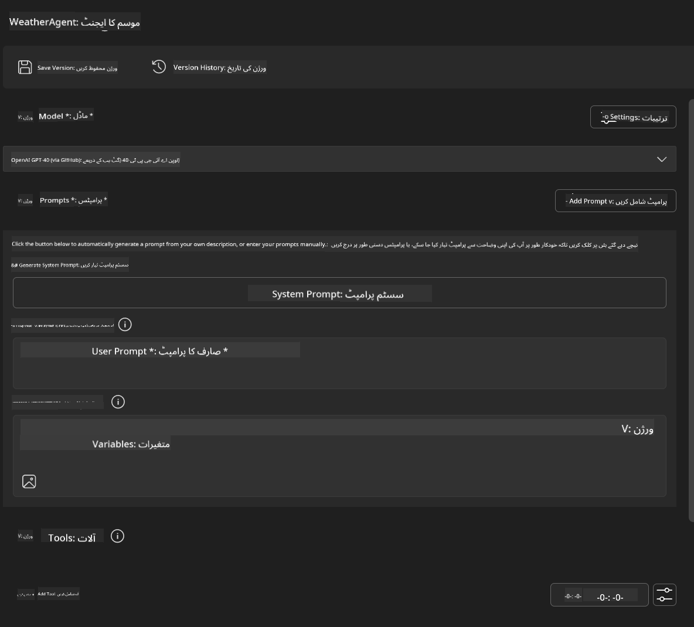
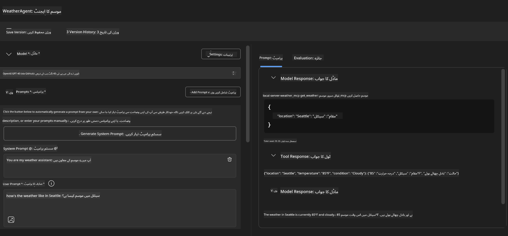

<!--
CO_OP_TRANSLATOR_METADATA:
{
  "original_hash": "dd8da3f75addcef453fe11f02a270217",
  "translation_date": "2025-06-10T06:04:05+00:00",
  "source_file": "10-StreamliningAIWorkflowsBuildingAnMCPServerWithAIToolkit/lab3/README.md",
  "language_code": "ur"
}
-->
# 🔧 ماڈیول 3: AI Toolkit کے ساتھ جدید MCP ڈیولپمنٹ


## 🎯 سیکھنے کے مقاصد

اس لیب کے آخر تک، آپ کر سکیں گے:

- ✅ AI Toolkit کا استعمال کرتے ہوئے کسٹم MCP سرورز بنائیں
- ✅ جدید ترین MCP Python SDK (v1.9.3) کو ترتیب دیں اور استعمال کریں
- ✅ MCP Inspector کو ڈیبگنگ کے لیے سیٹ اپ اور استعمال کریں
- ✅ Agent Builder اور Inspector دونوں ماحول میں MCP سرورز کو ڈیبگ کریں
- ✅ جدید MCP سرور ڈیولپمنٹ ورک فلو کو سمجھیں

## 📋 پیشگی ضروریات

- لیب 2 (MCP Fundamentals) مکمل کرنا
- VS Code میں AI Toolkit ایکسٹینشن انسٹال ہونا
- Python 3.10+ ماحول
- Inspector سیٹ اپ کے لیے Node.js اور npm

## 🏗️ آپ کیا بنائیں گے

اس لیب میں، آپ ایک **Weather MCP Server** بنائیں گے جو درج ذیل دکھاتا ہے:
- کسٹم MCP سرور کی عمل درآمد
- AI Toolkit Agent Builder کے ساتھ انٹیگریشن
- پیشہ ورانہ ڈیبگنگ ورک فلو
- جدید MCP SDK کے استعمال کے انداز

---

## 🔧 بنیادی اجزاء کا جائزہ

### 🐍 MCP Python SDK
Model Context Protocol Python SDK کسٹم MCP سرورز بنانے کی بنیاد فراہم کرتا ہے۔ آپ ورژن 1.9.3 استعمال کریں گے جس میں بہتر ڈیبگنگ صلاحیتیں شامل ہیں۔

### 🔍 MCP Inspector
ایک طاقتور ڈیبگنگ ٹول جو فراہم کرتا ہے:
- سرور کی حقیقی وقت نگرانی
- ٹول کے نفاذ کی بصری نمائندگی
- نیٹ ورک ریکویسٹ/ریسپانس کی جانچ
- انٹرایکٹو ٹیسٹنگ ماحول

---

## 📖 مرحلہ وار عمل درآمد

### مرحلہ 1: Agent Builder میں WeatherAgent بنائیں

1. **Agent Builder لانچ کریں** VS Code میں AI Toolkit ایکسٹینشن کے ذریعے
2. **نیا ایجنٹ بنائیں** درج ذیل کنفیگریشن کے ساتھ:
   - Agent Name: `WeatherAgent`



### مرحلہ 2: MCP سرور پروجیکٹ شروع کریں

1. **Tools میں جائیں** → **Add Tool** Agent Builder میں
2. **"MCP Server" منتخب کریں** دستیاب آپشنز میں سے
3. **"Create A new MCP Server" منتخب کریں**
4. **`python-weather` ٹیمپلیٹ منتخب کریں**
5. **اپنے سرور کا نام رکھیں:** `weather_mcp`


### مرحلہ 3: پروجیکٹ کھولیں اور جائزہ لیں

1. **پیدا شدہ پروجیکٹ VS Code میں کھولیں**
2. **پروجیکٹ کی ساخت کا جائزہ لیں:**
   ```
   weather_mcp/
   ├── src/
   │   ├── __init__.py
   │   └── server.py
   ├── inspector/
   │   ├── package.json
   │   └── package-lock.json
   ├── .vscode/
   │   ├── launch.json
   │   └── tasks.json
   ├── pyproject.toml
   └── README.md
   ```

### مرحلہ 4: جدید ترین MCP SDK پر اپ گریڈ کریں

> **🔍 اپ گریڈ کیوں؟** ہم جدید MCP SDK (v1.9.3) اور Inspector سروس (0.14.0) استعمال کرنا چاہتے ہیں تاکہ بہتر خصوصیات اور ڈیبگنگ ممکن ہو۔

#### 4a. Python Dependencies اپ ڈیٹ کریں

**`pyproject.toml`:** update [./code/weather_mcp/pyproject.toml](../../../../10-StreamliningAIWorkflowsBuildingAnMCPServerWithAIToolkit/lab3/code/weather_mcp/pyproject.toml)


#### 4b. Update Inspector Configuration

**Edit `inspector/package.json`:** update [./code/weather_mcp/inspector/package.json](../../../../10-StreamliningAIWorkflowsBuildingAnMCPServerWithAIToolkit/lab3/code/weather_mcp/inspector/package.json)

#### 4c. Update Inspector Dependencies

**Edit `inspector/package-lock.json`:** update [./code/weather_mcp/inspector/package-lock.json](../../../../10-StreamliningAIWorkflowsBuildingAnMCPServerWithAIToolkit/lab3/code/weather_mcp/inspector/package-lock.json)

> **📝 Note:** This file contains extensive dependency definitions. Below is the essential structure - the full content ensures proper dependency resolution.


> **⚡ Full Package Lock:** The complete package-lock.json contains ~3000 lines of dependency definitions. The above shows the key structure - use the provided file for complete dependency resolution.

### Step 5: Configure VS Code Debugging

*Note: Please copy the file in the specified path to replace the corresponding local file*

#### 5a. Update Launch Configuration

**Edit `.vscode/launch.json` ایڈٹ کریں:**

```json
{
  "version": "0.2.0",
  "configurations": [
    {
      "name": "Attach to Local MCP",
      "type": "debugpy",
      "request": "attach",
      "connect": {
        "host": "localhost",
        "port": 5678
      },
      "presentation": {
        "hidden": true
      },
      "internalConsoleOptions": "neverOpen",
      "postDebugTask": "Terminate All Tasks"
    },
    {
      "name": "Launch Inspector (Edge)",
      "type": "msedge",
      "request": "launch",
      "url": "http://localhost:6274?timeout=60000&serverUrl=http://localhost:3001/sse#tools",
      "cascadeTerminateToConfigurations": [
        "Attach to Local MCP"
      ],
      "presentation": {
        "hidden": true
      },
      "internalConsoleOptions": "neverOpen"
    },
    {
      "name": "Launch Inspector (Chrome)",
      "type": "chrome",
      "request": "launch",
      "url": "http://localhost:6274?timeout=60000&serverUrl=http://localhost:3001/sse#tools",
      "cascadeTerminateToConfigurations": [
        "Attach to Local MCP"
      ],
      "presentation": {
        "hidden": true
      },
      "internalConsoleOptions": "neverOpen"
    }
  ],
  "compounds": [
    {
      "name": "Debug in Agent Builder",
      "configurations": [
        "Attach to Local MCP"
      ],
      "preLaunchTask": "Open Agent Builder",
    },
    {
      "name": "Debug in Inspector (Edge)",
      "configurations": [
        "Launch Inspector (Edge)",
        "Attach to Local MCP"
      ],
      "preLaunchTask": "Start MCP Inspector",
      "stopAll": true
    },
    {
      "name": "Debug in Inspector (Chrome)",
      "configurations": [
        "Launch Inspector (Chrome)",
        "Attach to Local MCP"
      ],
      "preLaunchTask": "Start MCP Inspector",
      "stopAll": true
    }
  ]
}
```

**`.vscode/tasks.json` ایڈٹ کریں:**

```
{
  "version": "2.0.0",
  "tasks": [
    {
      "label": "Start MCP Server",
      "type": "shell",
      "command": "python -m debugpy --listen 127.0.0.1:5678 src/__init__.py sse",
      "isBackground": true,
      "options": {
        "cwd": "${workspaceFolder}",
        "env": {
          "PORT": "3001"
        }
      },
      "problemMatcher": {
        "pattern": [
          {
            "regexp": "^.*$",
            "file": 0,
            "location": 1,
            "message": 2
          }
        ],
        "background": {
          "activeOnStart": true,
          "beginsPattern": ".*",
          "endsPattern": "Application startup complete|running"
        }
      }
    },
    {
      "label": "Start MCP Inspector",
      "type": "shell",
      "command": "npm run dev:inspector",
      "isBackground": true,
      "options": {
        "cwd": "${workspaceFolder}/inspector",
        "env": {
          "CLIENT_PORT": "6274",
          "SERVER_PORT": "6277",
        }
      },
      "problemMatcher": {
        "pattern": [
          {
            "regexp": "^.*$",
            "file": 0,
            "location": 1,
            "message": 2
          }
        ],
        "background": {
          "activeOnStart": true,
          "beginsPattern": "Starting MCP inspector",
          "endsPattern": "Proxy server listening on port"
        }
      },
      "dependsOn": [
        "Start MCP Server"
      ]
    },
    {
      "label": "Open Agent Builder",
      "type": "shell",
      "command": "echo ${input:openAgentBuilder}",
      "presentation": {
        "reveal": "never"
      },
      "dependsOn": [
        "Start MCP Server"
      ],
    },
    {
      "label": "Terminate All Tasks",
      "command": "echo ${input:terminate}",
      "type": "shell",
      "problemMatcher": []
    }
  ],
  "inputs": [
    {
      "id": "openAgentBuilder",
      "type": "command",
      "command": "ai-mlstudio.agentBuilder",
      "args": {
        "initialMCPs": [ "local-server-weather_mcp" ],
        "triggeredFrom": "vsc-tasks"
      }
    },
    {
      "id": "terminate",
      "type": "command",
      "command": "workbench.action.tasks.terminate",
      "args": "terminateAll"
    }
  ]
}
```


---

## 🚀 اپنے MCP سرور کو چلائیں اور ٹیسٹ کریں

### مرحلہ 6: Dependencies انسٹال کریں

کنفیگریشن تبدیلیوں کے بعد، درج ذیل کمانڈز چلائیں:

**Python dependencies انسٹال کریں:**
```bash
uv sync
```

**Inspector dependencies انسٹال کریں:**
```bash
cd inspector
npm install
```

### مرحلہ 7: Agent Builder کے ساتھ ڈیبگ کریں

1. **F5 دبائیں** یا **"Debug in Agent Builder"** کنفیگریشن استعمال کریں
2. **ڈیبگ پینل سے کمپاؤنڈ کنفیگریشن منتخب کریں**
3. **سرور کے شروع ہونے اور Agent Builder کے کھلنے کا انتظار کریں**
4. **اپنے Weather MCP سرور کو قدرتی زبان کی کوئریز کے ساتھ ٹیسٹ کریں**

ایسا ان پٹ دیں

SYSTEM_PROMPT

```
You are my weather assistant
```

USER_PROMPT

```
How's the weather like in Seattle
```



### مرحلہ 8: MCP Inspector کے ساتھ ڈیبگ کریں

1. **"Debug in Inspector"** کنفیگریشن استعمال کریں (Edge یا Chrome)
2. **Inspector انٹرفیس کھولیں** `http://localhost:6274` پر
3. **انٹرایکٹو ٹیسٹنگ ماحول کو دریافت کریں:**
   - دستیاب ٹولز دیکھیں
   - ٹول کے نفاذ کو ٹیسٹ کریں
   - نیٹ ورک ریکویسٹ مانیٹر کریں
   - سرور کے جوابات کو ڈیبگ کریں


---

## 🎯 کلیدی سیکھنے کے نتائج

اس لیب کو مکمل کر کے، آپ نے:

- [x] **AI Toolkit ٹیمپلیٹس کا استعمال کرتے ہوئے کسٹم MCP سرور بنایا**
- [x] **جدید ترین MCP SDK (v1.9.3) پر اپ گریڈ کیا** بہتر فعالیت کے لیے
- [x] **Agent Builder اور Inspector دونوں کے لیے پیشہ ورانہ ڈیبگنگ ورک فلو ترتیب دیا**
- [x] **MCP Inspector کو انٹرایکٹو سرور ٹیسٹنگ کے لیے سیٹ اپ کیا**
- [x] **VS Code ڈیبگنگ کنفیگریشنز میں مہارت حاصل کی** MCP ڈیولپمنٹ کے لیے

## 🔧 دریافت شدہ جدید خصوصیات

| خصوصیت | وضاحت | استعمال کا کیس |
|---------|-------------|----------|
| **MCP Python SDK v1.9.3** | جدید پروٹوکول عمل درآمد | جدید سرور ڈیولپمنٹ |
| **MCP Inspector 0.14.0** | انٹرایکٹو ڈیبگنگ ٹول | حقیقی وقت سرور ٹیسٹنگ |
| **VS Code Debugging** | مربوط ڈیولپمنٹ ماحول | پیشہ ورانہ ڈیبگنگ ورک فلو |
| **Agent Builder Integration** | براہ راست AI Toolkit کنکشن | اختتامی نقطہ ایجنٹ ٹیسٹنگ |

## 📚 اضافی وسائل

- [MCP Python SDK Documentation](https://modelcontextprotocol.io/docs/sdk/python)
- [AI Toolkit Extension Guide](https://code.visualstudio.com/docs/ai/ai-toolkit)
- [VS Code Debugging Documentation](https://code.visualstudio.com/docs/editor/debugging)
- [Model Context Protocol Specification](https://modelcontextprotocol.io/docs/concepts/architecture)

---

**🎉 مبارک ہو!** آپ نے کامیابی سے لیب 3 مکمل کر لیا ہے اور اب آپ پیشہ ورانہ ڈیولپمنٹ ورک فلو کے ذریعے کسٹم MCP سرورز بنا، ڈیبگ اور ڈیپلائے کر سکتے ہیں۔

### 🔜 اگلے ماڈیول کی طرف بڑھیں

اپنی MCP مہارتوں کو حقیقی دنیا کے ڈیولپمنٹ ورک فلو میں لاگو کرنے کے لیے تیار ہیں؟ جاری رکھیں **[Module 4: Practical MCP Development - Custom GitHub Clone Server](../lab4/README.md)** جہاں آپ:
- پروڈکشن کے لیے تیار MCP سرور بنائیں گے جو GitHub ریپوزٹری آپریشنز کو خودکار بنائے گا
- MCP کے ذریعے GitHub ریپوزٹری کلوننگ کی فعالیت نافذ کریں گے
- VS Code اور GitHub Copilot Agent Mode کے ساتھ کسٹم MCP سرورز کو انٹیگریٹ کریں گے
- پروڈکشن ماحول میں کسٹم MCP سرورز کو ٹیسٹ اور ڈیپلائے کریں گے
- ڈیولپرز کے لیے عملی ورک فلو آٹومیشن سیکھیں گے

**ڈسکلیمر**:  
یہ دستاویز AI ترجمہ سروس [Co-op Translator](https://github.com/Azure/co-op-translator) کے ذریعے ترجمہ کی گئی ہے۔ اگرچہ ہم درستگی کے لیے کوشاں ہیں، براہ کرم اس بات سے آگاہ رہیں کہ خودکار ترجمے میں غلطیاں یا عدم درستیاں ہو سکتی ہیں۔ اصل دستاویز اپنی مادری زبان میں ہی معتبر ماخذ سمجھی جانی چاہیے۔ اہم معلومات کے لیے پیشہ ورانہ انسانی ترجمہ تجویز کیا جاتا ہے۔ ہم اس ترجمے کے استعمال سے پیدا ہونے والی کسی بھی غلط فہمی یا غلط تشریح کے ذمہ دار نہیں ہیں۔