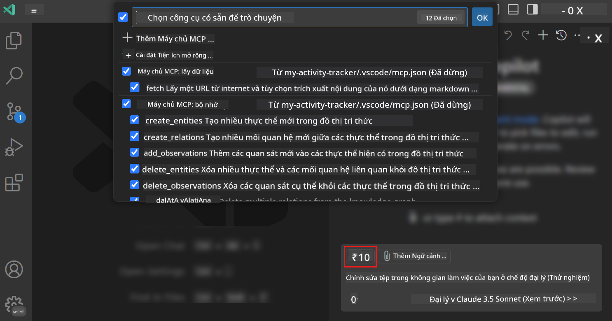
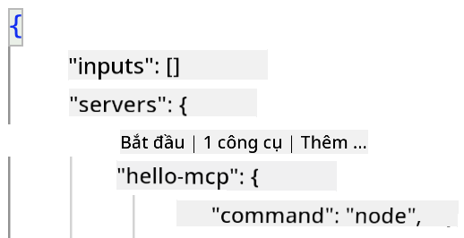

<!--
CO_OP_TRANSLATOR_METADATA:
{
  "original_hash": "8ea28e5e566edd5969337fd0b191ba3f",
  "translation_date": "2025-07-17T07:44:03+00:00",
  "source_file": "03-GettingStarted/04-vscode/README.md",
  "language_code": "vi"
}
-->
# Sử dụng một server từ chế độ GitHub Copilot Agent

Visual Studio Code và GitHub Copilot có thể hoạt động như một client để kết nối và sử dụng MCP Server. Bạn có thể thắc mắc tại sao lại muốn làm điều này? Điều đó có nghĩa là bất kỳ tính năng nào của MCP Server giờ đây có thể được sử dụng ngay trong IDE của bạn. Hãy tưởng tượng bạn thêm ví dụ như MCP server của GitHub, điều này sẽ cho phép bạn điều khiển GitHub qua các câu lệnh tự nhiên thay vì phải gõ các lệnh cụ thể trong terminal. Hoặc nói chung, bất cứ thứ gì có thể cải thiện trải nghiệm phát triển của bạn đều có thể được điều khiển bằng ngôn ngữ tự nhiên. Giờ bạn đã thấy lợi ích rồi chứ?

## Tổng quan

Bài học này hướng dẫn cách sử dụng Visual Studio Code và chế độ Agent của GitHub Copilot như một client cho MCP Server của bạn.

## Mục tiêu học tập

Sau bài học này, bạn sẽ có thể:

- Sử dụng MCP Server qua Visual Studio Code.
- Chạy các tính năng như công cụ thông qua GitHub Copilot.
- Cấu hình Visual Studio Code để tìm và quản lý MCP Server của bạn.

## Cách sử dụng

Bạn có thể điều khiển MCP Server của mình theo hai cách khác nhau:

- Giao diện người dùng, bạn sẽ thấy cách làm này ở phần sau của chương này.
- Terminal, bạn có thể điều khiển từ terminal bằng cách sử dụng lệnh `code`:

  Để thêm một MCP server vào hồ sơ người dùng, sử dụng tùy chọn dòng lệnh --add-mcp và cung cấp cấu hình server dưới dạng JSON như {\"name\":\"server-name\",\"command\":...}.

  ```
  code --add-mcp "{\"name\":\"my-server\",\"command\": \"uvx\",\"args\": [\"mcp-server-fetch\"]}"
  ```

### Ảnh chụp màn hình

  
  


Chúng ta sẽ nói kỹ hơn về cách sử dụng giao diện trực quan trong các phần tiếp theo.

## Cách tiếp cận

Dưới đây là cách tiếp cận tổng quan:

- Cấu hình một file để tìm MCP Server của bạn.
- Khởi động/Kết nối đến server đó để lấy danh sách các tính năng.
- Sử dụng các tính năng đó qua giao diện GitHub Copilot Chat.

Tuyệt vời, giờ khi đã hiểu quy trình, hãy thử sử dụng MCP Server qua Visual Studio Code trong bài tập sau.

## Bài tập: Sử dụng một server

Trong bài tập này, chúng ta sẽ cấu hình Visual Studio Code để tìm MCP Server của bạn nhằm sử dụng nó qua giao diện GitHub Copilot Chat.

### -0- Bước chuẩn bị, bật tính năng phát hiện MCP Server

Bạn có thể cần bật tính năng phát hiện MCP Server.

1. Vào `File -> Preferences -> Settings` trong Visual Studio Code.

1. Tìm kiếm "MCP" và bật `chat.mcp.discovery.enabled` trong file settings.json.

### -1- Tạo file cấu hình

Bắt đầu bằng cách tạo một file cấu hình trong thư mục gốc dự án, bạn cần một file tên là MCP.json và đặt nó trong thư mục .vscode. File sẽ trông như sau:

```text
.vscode
|-- mcp.json
```

Tiếp theo, hãy xem cách thêm một mục server.

### -2- Cấu hình một server

Thêm nội dung sau vào *mcp.json*:

```json
{
    "inputs": [],
    "servers": {
       "hello-mcp": {
           "command": "node",
           "args": [
               "build/index.js"
           ]
       }
    }
}
```

Ví dụ đơn giản trên cho thấy cách khởi động một server viết bằng Node.js, với các runtime khác bạn chỉ cần chỉ định đúng lệnh khởi động server bằng `command` và `args`.

### -3- Khởi động server

Sau khi thêm mục, hãy khởi động server:

1. Tìm mục của bạn trong *mcp.json* và chắc chắn bạn thấy biểu tượng "play":

    

1. Nhấn vào biểu tượng "play", bạn sẽ thấy biểu tượng công cụ trong GitHub Copilot Chat tăng số lượng công cụ có sẵn. Nếu bạn nhấn vào biểu tượng công cụ đó, bạn sẽ thấy danh sách các công cụ đã đăng ký. Bạn có thể chọn hoặc bỏ chọn từng công cụ tùy theo việc bạn muốn GitHub Copilot sử dụng chúng làm ngữ cảnh hay không:

  

1. Để chạy một công cụ, gõ một câu lệnh mà bạn biết sẽ phù hợp với mô tả của một trong các công cụ, ví dụ câu lệnh "add 22 to 1":

  

  Bạn sẽ nhận được phản hồi là 23.

## Bài tập về nhà

Hãy thử thêm một mục server vào file *mcp.json* và đảm bảo bạn có thể khởi động/dừng server. Đồng thời đảm bảo bạn có thể giao tiếp với các công cụ trên server qua giao diện GitHub Copilot Chat.

## Giải pháp

[Solution](./solution/README.md)

## Những điểm chính cần nhớ

Những điểm chính từ chương này là:

- Visual Studio Code là một client tuyệt vời cho phép bạn sử dụng nhiều MCP Server và các công cụ của chúng.
- Giao diện GitHub Copilot Chat là cách bạn tương tác với các server.
- Bạn có thể yêu cầu người dùng nhập các thông tin như API key và truyền chúng đến MCP Server khi cấu hình mục server trong file *mcp.json*.

## Mẫu ví dụ

- [Java Calculator](../samples/java/calculator/README.md)
- [.Net Calculator](../../../../03-GettingStarted/samples/csharp)
- [JavaScript Calculator](../samples/javascript/README.md)
- [TypeScript Calculator](../samples/typescript/README.md)
- [Python Calculator](../../../../03-GettingStarted/samples/python)

## Tài nguyên bổ sung

- [Visual Studio docs](https://code.visualstudio.com/docs/copilot/chat/mcp-servers)

## Tiếp theo

- Tiếp theo: [Tạo một SSE Server](../05-sse-server/README.md)

**Tuyên bố từ chối trách nhiệm**:  
Tài liệu này đã được dịch bằng dịch vụ dịch thuật AI [Co-op Translator](https://github.com/Azure/co-op-translator). Mặc dù chúng tôi cố gắng đảm bảo độ chính xác, xin lưu ý rằng các bản dịch tự động có thể chứa lỗi hoặc không chính xác. Tài liệu gốc bằng ngôn ngữ gốc của nó nên được coi là nguồn chính xác và đáng tin cậy. Đối với các thông tin quan trọng, nên sử dụng dịch vụ dịch thuật chuyên nghiệp do con người thực hiện. Chúng tôi không chịu trách nhiệm về bất kỳ sự hiểu lầm hoặc giải thích sai nào phát sinh từ việc sử dụng bản dịch này.