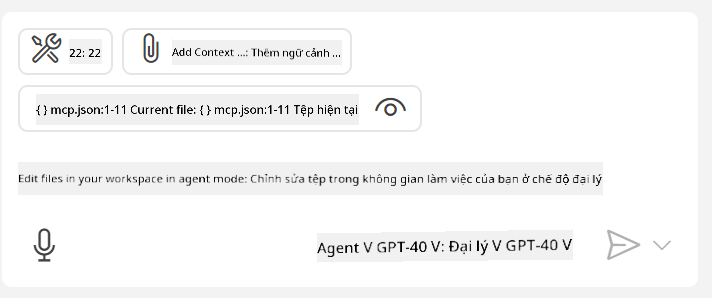

<!--
CO_OP_TRANSLATOR_METADATA:
{
  "original_hash": "54e9ffc5dba01afcb8880a9949fd1881",
  "translation_date": "2025-07-13T19:32:37+00:00",
  "source_file": "03-GettingStarted/04-vscode/README.md",
  "language_code": "vi"
}
-->
Hãy cùng tìm hiểu thêm về cách sử dụng giao diện trực quan trong các phần tiếp theo.

## Cách tiếp cận

Dưới đây là cách chúng ta cần tiếp cận ở mức độ tổng quát:

- Cấu hình một file để tìm MCP Server của chúng ta.
- Khởi động/Kết nối với server đó để lấy danh sách các khả năng của nó.
- Sử dụng các khả năng đó thông qua giao diện GitHub Copilot Chat.

Tuyệt vời, giờ khi đã hiểu được quy trình, hãy thử sử dụng MCP Server qua Visual Studio Code thông qua một bài tập.

## Bài tập: Sử dụng một server

Trong bài tập này, chúng ta sẽ cấu hình Visual Studio Code để tìm MCP server của bạn để có thể sử dụng từ giao diện GitHub Copilot Chat.

### -0- Bước chuẩn bị, bật tính năng phát hiện MCP Server

Bạn có thể cần bật tính năng phát hiện MCP Servers.

1. Vào `File -> Preferences -> Settings` trong Visual Studio Code.

2. Tìm kiếm "MCP" và bật `chat.mcp.discovery.enabled` trong file settings.json.

### -1- Tạo file cấu hình

Bắt đầu bằng cách tạo một file cấu hình trong thư mục gốc dự án, bạn cần một file tên là MCP.json và đặt nó trong thư mục .vscode. File sẽ trông như sau:

```text
.vscode
|-- mcp.json
```

Tiếp theo, hãy xem cách thêm một mục server.

### -2- Cấu hình một server

Thêm nội dung sau vào *mcp.json*:

```json
{
    "inputs": [],
    "servers": {
       "hello-mcp": {
           "command": "node",
           "args": [
               "build/index.js"
           ]
       }
    }
}
```

Đây là ví dụ đơn giản về cách khởi động một server viết bằng Node.js, với các runtime khác bạn chỉ cần chỉ định đúng lệnh khởi động server bằng `command` và `args`.

### -3- Khởi động server

Bây giờ bạn đã thêm một mục, hãy khởi động server:

1. Tìm mục của bạn trong *mcp.json* và chắc chắn bạn thấy biểu tượng "play":

    

2. Nhấn vào biểu tượng "play", bạn sẽ thấy biểu tượng công cụ trong GitHub Copilot Chat tăng số lượng công cụ có sẵn. Nếu bạn nhấn vào biểu tượng công cụ đó, bạn sẽ thấy danh sách các công cụ đã đăng ký. Bạn có thể chọn hoặc bỏ chọn từng công cụ tùy theo việc bạn muốn GitHub Copilot sử dụng chúng làm ngữ cảnh hay không:

  

3. Để chạy một công cụ, gõ một câu lệnh mà bạn biết sẽ khớp với mô tả của một trong các công cụ, ví dụ như câu lệnh "add 22 to 1":

  

  Bạn sẽ thấy phản hồi trả về là 23.

## Bài tập về nhà

Hãy thử thêm một mục server vào file *mcp.json* của bạn và đảm bảo bạn có thể khởi động/dừng server. Đồng thời đảm bảo bạn có thể giao tiếp với các công cụ trên server thông qua giao diện GitHub Copilot Chat.

## Giải pháp

[Giải pháp](./solution/README.md)

## Những điểm chính cần nhớ

Những điểm chính rút ra từ chương này là:

- Visual Studio Code là một client tuyệt vời cho phép bạn sử dụng nhiều MCP Servers và các công cụ của chúng.
- Giao diện GitHub Copilot Chat là cách bạn tương tác với các server.
- Bạn có thể yêu cầu người dùng nhập các thông tin như khóa API để truyền cho MCP Server khi cấu hình mục server trong file *mcp.json*.

## Mẫu ví dụ

- [Máy tính Java](../samples/java/calculator/README.md)
- [Máy tính .Net](../../../../03-GettingStarted/samples/csharp)
- [Máy tính JavaScript](../samples/javascript/README.md)
- [Máy tính TypeScript](../samples/typescript/README.md)
- [Máy tính Python](../../../../03-GettingStarted/samples/python)

## Tài nguyên bổ sung

- [Tài liệu Visual Studio](https://code.visualstudio.com/docs/copilot/chat/mcp-servers)

## Tiếp theo

- Tiếp theo: [Tạo một SSE Server](../05-sse-server/README.md)

**Tuyên bố từ chối trách nhiệm**:  
Tài liệu này đã được dịch bằng dịch vụ dịch thuật AI [Co-op Translator](https://github.com/Azure/co-op-translator). Mặc dù chúng tôi cố gắng đảm bảo độ chính xác, xin lưu ý rằng bản dịch tự động có thể chứa lỗi hoặc không chính xác. Tài liệu gốc bằng ngôn ngữ gốc của nó nên được coi là nguồn chính xác và đáng tin cậy. Đối với các thông tin quan trọng, nên sử dụng dịch vụ dịch thuật chuyên nghiệp do con người thực hiện. Chúng tôi không chịu trách nhiệm về bất kỳ sự hiểu lầm hoặc giải thích sai nào phát sinh từ việc sử dụng bản dịch này.