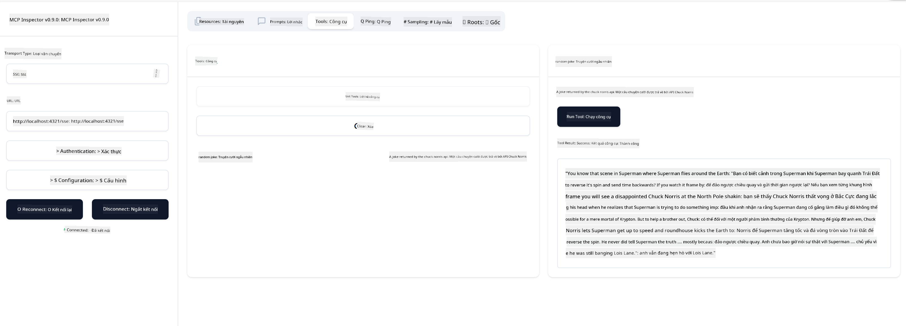

<!--
CO_OP_TRANSLATOR_METADATA:
{
  "original_hash": "1681ca3633aeb49ee03766abdbb94a93",
  "translation_date": "2025-06-17T22:20:43+00:00",
  "source_file": "03-GettingStarted/05-sse-server/README.md",
  "language_code": "vi"
}
-->
Bây giờ chúng ta đã hiểu thêm một chút về SSE, hãy cùng xây dựng một server SSE tiếp theo.

## Bài tập: Tạo một server SSE

Để tạo server của chúng ta, cần lưu ý hai điều sau:

- Chúng ta cần sử dụng một web server để mở các endpoint cho kết nối và tin nhắn.
- Xây dựng server giống như cách bình thường với các công cụ, tài nguyên và prompt khi chúng ta sử dụng stdio.

### -1- Tạo một instance server

Để tạo server, chúng ta sử dụng cùng các kiểu như với stdio. Tuy nhiên, đối với transport, chúng ta cần chọn SSE.

---

Bây giờ hãy thêm các route cần thiết.

### -2- Thêm các route

Hãy thêm các route để xử lý kết nối và tin nhắn đến:

---

Tiếp theo, hãy thêm các khả năng cho server.

### -3- Thêm các khả năng cho server

Bây giờ chúng ta đã định nghĩa xong các phần đặc thù của SSE, hãy thêm các khả năng cho server như công cụ, prompt và tài nguyên.

---

Mã nguồn đầy đủ của bạn sẽ trông như sau:

---

Tuyệt vời, chúng ta đã có một server sử dụng SSE, giờ hãy thử chạy nó.

## Bài tập: Gỡ lỗi server SSE với Inspector

Inspector là một công cụ tuyệt vời mà chúng ta đã thấy trong bài học trước [Tạo server đầu tiên của bạn](/03-GettingStarted/01-first-server/README.md). Hãy xem liệu chúng ta có thể sử dụng Inspector ở đây không:

### -1- Chạy Inspector

Để chạy Inspector, trước tiên bạn phải có một server SSE đang chạy, vậy hãy làm điều đó trước:

1. Chạy server

---

1. Chạy Inspector

    > ![NOTE]
    > Hãy chạy lệnh này trong một cửa sổ terminal riêng biệt với nơi server đang chạy. Ngoài ra, lưu ý bạn cần điều chỉnh lệnh dưới đây cho phù hợp với URL mà server của bạn đang chạy.

    ```sh
    npx @modelcontextprotocol/inspector --cli http://localhost:8000/sse --method tools/list
    ```

    Việc chạy Inspector giống nhau trên tất cả các runtime. Lưu ý rằng thay vì truyền đường dẫn đến server và một lệnh để khởi động server, chúng ta truyền URL nơi server đang chạy và chỉ định route `/sse`.

### -2- Thử nghiệm công cụ

Kết nối tới server bằng cách chọn SSE trong danh sách thả xuống và điền vào trường URL nơi server của bạn đang chạy, ví dụ http:localhost:4321/sse. Bây giờ nhấn nút "Connect". Như trước, chọn để liệt kê công cụ, chọn một công cụ và cung cấp các giá trị đầu vào. Bạn sẽ thấy kết quả như hình dưới đây:



Tuyệt vời, bạn đã có thể làm việc với Inspector, giờ hãy xem cách làm việc với Visual Studio Code.

## Bài tập về nhà

Hãy thử xây dựng server của bạn với nhiều khả năng hơn. Tham khảo [trang này](https://api.chucknorris.io/) để, ví dụ, thêm một công cụ gọi API. Bạn quyết định server sẽ như thế nào. Chúc bạn vui :)

## Giải pháp

[Giải pháp](./solution/README.md) Đây là một giải pháp có mã nguồn hoạt động.

## Những điểm chính cần nhớ

Những điểm chính từ chương này là:

- SSE là loại transport thứ hai được hỗ trợ bên cạnh stdio.
- Để hỗ trợ SSE, bạn cần quản lý các kết nối và tin nhắn đến bằng một framework web.
- Bạn có thể sử dụng cả Inspector và Visual Studio Code để tiêu thụ server SSE, giống như với server stdio. Lưu ý sự khác biệt nhỏ giữa stdio và SSE. Với SSE, bạn cần khởi động server riêng biệt rồi mới chạy công cụ Inspector. Với Inspector, cũng có một số khác biệt là bạn cần chỉ định URL.

## Mẫu ví dụ

- [Máy tính Java](../samples/java/calculator/README.md)
- [Máy tính .Net](../../../../03-GettingStarted/samples/csharp)
- [Máy tính JavaScript](../samples/javascript/README.md)
- [Máy tính TypeScript](../samples/typescript/README.md)
- [Máy tính Python](../../../../03-GettingStarted/samples/python)

## Tài nguyên bổ sung

- [SSE](https://developer.mozilla.org/en-US/docs/Web/API/Server-sent_events)

## Tiếp theo

- Tiếp theo: [HTTP Streaming với MCP (Streamable HTTP)](/03-GettingStarted/06-http-streaming/README.md)

**Tuyên bố từ chối trách nhiệm**:  
Tài liệu này đã được dịch bằng dịch vụ dịch thuật AI [Co-op Translator](https://github.com/Azure/co-op-translator). Mặc dù chúng tôi cố gắng đảm bảo độ chính xác, xin lưu ý rằng bản dịch tự động có thể chứa lỗi hoặc sai sót. Tài liệu gốc bằng ngôn ngữ gốc của nó nên được coi là nguồn tham khảo chính xác nhất. Đối với các thông tin quan trọng, nên sử dụng dịch vụ dịch thuật chuyên nghiệp do con người thực hiện. Chúng tôi không chịu trách nhiệm đối với bất kỳ sự hiểu lầm hoặc diễn giải sai nào phát sinh từ việc sử dụng bản dịch này.