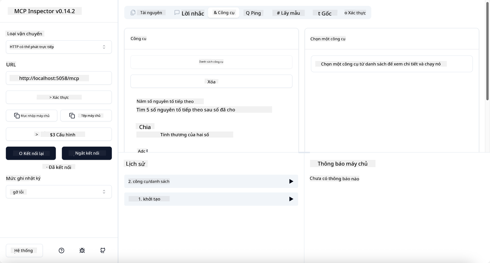

<!--
CO_OP_TRANSLATOR_METADATA:
{
  "original_hash": "0bc7bd48f55f1565f1d95ccb2c16f728",
  "translation_date": "2025-06-18T07:51:47+00:00",
  "source_file": "04-PracticalImplementation/samples/csharp/README.md",
  "language_code": "vi"
}
-->
# Sample

Ví dụ trước cho thấy cách sử dụng một dự án .NET cục bộ với kiểu `stdio`. Và cách chạy server cục bộ trong một container. Đây là giải pháp tốt trong nhiều tình huống. Tuy nhiên, việc chạy server từ xa, chẳng hạn trong môi trường đám mây, cũng rất hữu ích. Đó là lúc kiểu `http` phát huy tác dụng.

Nhìn vào giải pháp trong thư mục `04-PracticalImplementation`, nó có vẻ phức tạp hơn nhiều so với ví dụ trước. Nhưng thực tế thì không phải vậy. Nếu bạn xem kỹ dự án `src/Calculator`, bạn sẽ thấy nó gần như cùng một đoạn mã với ví dụ trước. Sự khác biệt duy nhất là chúng ta sử dụng thư viện khác `ModelContextProtocol.AspNetCore` để xử lý các yêu cầu HTTP. Và chúng ta thay đổi phương thức `IsPrime` thành private, chỉ để minh họa rằng bạn có thể có các phương thức private trong mã của mình. Phần còn lại của mã vẫn giữ nguyên như trước.

Các dự án khác đến từ [.NET Aspire](https://learn.microsoft.com/dotnet/aspire/get-started/aspire-overview). Việc có .NET Aspire trong giải pháp sẽ cải thiện trải nghiệm của nhà phát triển trong quá trình phát triển và kiểm thử, đồng thời hỗ trợ quan sát hệ thống. Nó không bắt buộc để chạy server, nhưng là một thói quen tốt khi có trong giải pháp của bạn.

## Khởi động server cục bộ

1. Từ VS Code (với extension C# DevKit), điều hướng đến thư mục `04-PracticalImplementation/samples/csharp`.
1. Thực thi lệnh sau để khởi động server:

   ```bash
    dotnet watch run --project ./src/AppHost
   ```

1. Khi trình duyệt web mở bảng điều khiển .NET Aspire, chú ý URL `http`. Nó sẽ có dạng `http://localhost:5058/`.

   

## Kiểm thử Streamable HTTP với MCP Inspector

Nếu bạn có Node.js phiên bản 22.7.5 trở lên, bạn có thể dùng MCP Inspector để kiểm thử server.

Khởi động server và chạy lệnh sau trong terminal:

```bash
npx @modelcontextprotocol/inspector http://localhost:5058
```



- Chọn `Streamable HTTP` as the Transport type.
- In the Url field, enter the URL of the server noted earlier, and append `/mcp`. Nó nên là `http` (không phải `https`) something like `http://localhost:5058/mcp`.
- select the Connect button.

A nice thing about the Inspector is that it provide a nice visibility on what is happening.

- Try listing the available tools
- Try some of them, it should works just like before.

## Test MCP Server with GitHub Copilot Chat in VS Code

To use the Streamable HTTP transport with GitHub Copilot Chat, change the configuration of the `calc-mcp` server đã tạo trước đó để trông như thế này:

```jsonc
// .vscode/mcp.json
{
  "servers": {
    "calc-mcp": {
      "type": "http",
      "url": "http://localhost:5058/mcp"
    }
  }
}
```

Thực hiện một số kiểm thử:

- Hỏi "3 số nguyên tố sau 6780". Lưu ý Copilot sẽ dùng công cụ mới `NextFivePrimeNumbers` và chỉ trả về 3 số nguyên tố đầu tiên.
- Hỏi "7 số nguyên tố sau 111", để xem kết quả ra sao.
- Hỏi "John có 24 viên kẹo và muốn chia đều cho 3 đứa con. Mỗi đứa sẽ nhận bao nhiêu viên?", để xem kết quả.

## Triển khai server lên Azure

Chúng ta sẽ triển khai server lên Azure để nhiều người có thể sử dụng.

Từ terminal, điều hướng đến thư mục `04-PracticalImplementation/samples/csharp` và chạy lệnh sau:

```bash
azd up
```

Khi quá trình triển khai hoàn tất, bạn sẽ thấy thông báo như sau:


Lấy URL này và sử dụng trong MCP Inspector cũng như trong GitHub Copilot Chat.

```jsonc
// .vscode/mcp.json
{
  "servers": {
    "calc-mcp": {
      "type": "http",
      "url": "https://calc-mcp.gentleriver-3977fbcf.australiaeast.azurecontainerapps.io/mcp"
    }
  }
}
```

## Tiếp theo là gì?

Chúng ta đã thử các kiểu giao thức khác nhau và các công cụ kiểm thử. Đồng thời cũng triển khai MCP server lên Azure. Nhưng nếu server của chúng ta cần truy cập tài nguyên riêng tư? Ví dụ như cơ sở dữ liệu hoặc API riêng? Ở chương tiếp theo, chúng ta sẽ tìm hiểu cách nâng cao bảo mật cho server.

**Tuyên bố từ chối trách nhiệm**:  
Tài liệu này đã được dịch bằng dịch vụ dịch thuật AI [Co-op Translator](https://github.com/Azure/co-op-translator). Mặc dù chúng tôi cố gắng đảm bảo độ chính xác, xin lưu ý rằng bản dịch tự động có thể chứa lỗi hoặc sai sót. Tài liệu gốc bằng ngôn ngữ nguyên bản được coi là nguồn chính xác và có thẩm quyền. Đối với các thông tin quan trọng, nên sử dụng dịch vụ dịch thuật chuyên nghiệp do con người thực hiện. Chúng tôi không chịu trách nhiệm về bất kỳ sự hiểu nhầm hoặc giải thích sai nào phát sinh từ việc sử dụng bản dịch này.