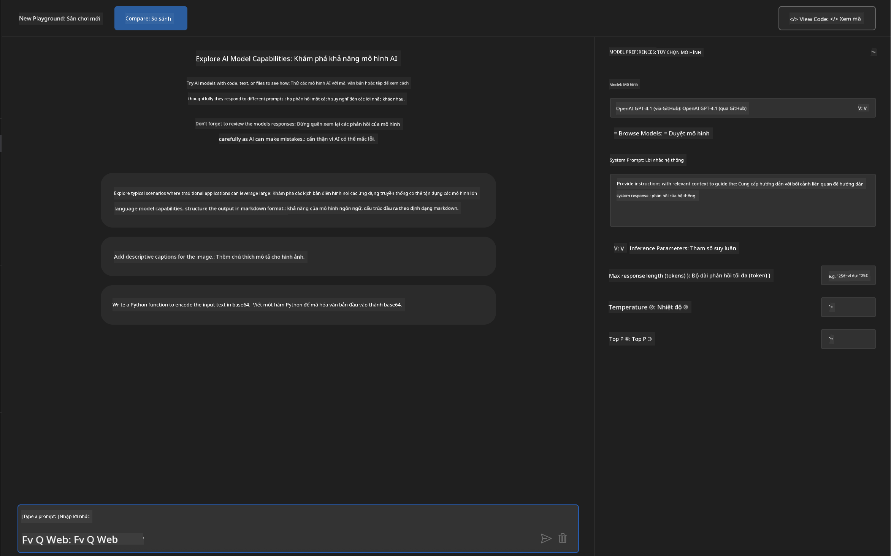
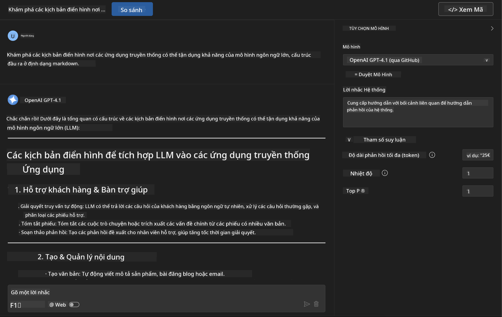
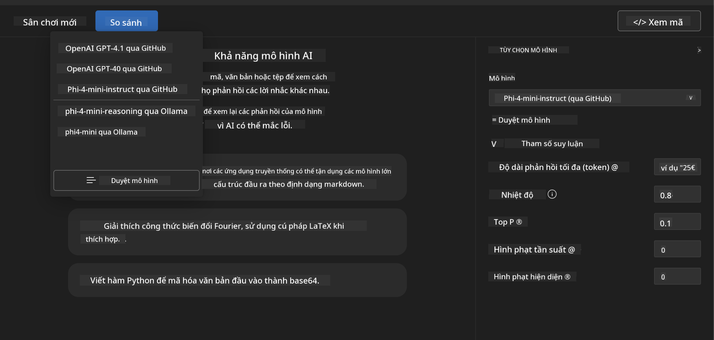
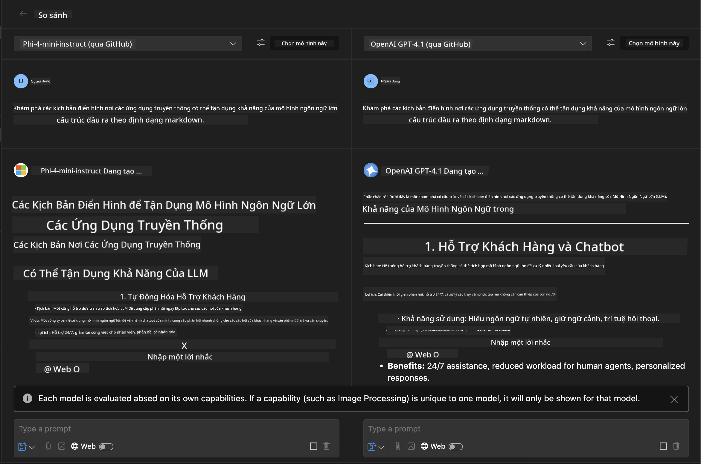
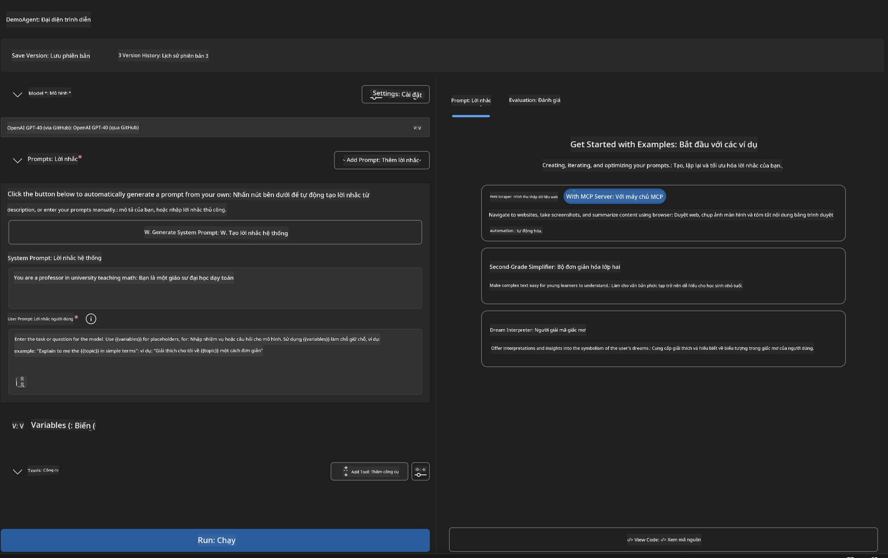

<!--
CO_OP_TRANSLATOR_METADATA:
{
  "original_hash": "2aa9dbc165e104764fa57e8a0d3f1c73",
  "translation_date": "2025-06-10T05:26:12+00:00",
  "source_file": "10-StreamliningAIWorkflowsBuildingAnMCPServerWithAIToolkit/lab1/README.md",
  "language_code": "vi"
}
-->
# 🚀 Mô-đun 1: Những kiến thức cơ bản về AI Toolkit

[]()
[]()
[]()

## 📋 Mục tiêu học tập

Sau khi hoàn thành mô-đun này, bạn sẽ có thể:
- ✅ Cài đặt và cấu hình AI Toolkit cho Visual Studio Code
- ✅ Duyệt qua Model Catalog và hiểu về các nguồn mô hình khác nhau
- ✅ Sử dụng Playground để thử nghiệm và kiểm tra mô hình
- ✅ Tạo các tác nhân AI tùy chỉnh bằng Agent Builder
- ✅ So sánh hiệu suất mô hình giữa các nhà cung cấp khác nhau
- ✅ Áp dụng các phương pháp hay nhất trong thiết kế prompt

## 🧠 Giới thiệu về AI Toolkit (AITK)

**AI Toolkit cho Visual Studio Code** là tiện ích mở rộng chủ lực của Microsoft, biến VS Code thành môi trường phát triển AI toàn diện. Nó kết nối giữa nghiên cứu AI và phát triển ứng dụng thực tế, giúp AI tạo sinh trở nên dễ tiếp cận với mọi nhà phát triển, bất kể trình độ.

### 🌟 Những khả năng chính

| Tính năng | Mô tả | Trường hợp sử dụng |
|---------|-------------|----------|
| **🗂️ Model Catalog** | Truy cập hơn 100 mô hình từ GitHub, ONNX, OpenAI, Anthropic, Google | Khám phá và lựa chọn mô hình |
| **🔌 BYOM Support** | Tích hợp mô hình riêng của bạn (cục bộ/đám mây) | Triển khai mô hình tùy chỉnh |
| **🎮 Interactive Playground** | Thử nghiệm mô hình thời gian thực với giao diện chat | Phát triển và kiểm thử nhanh |
| **📎 Multi-Modal Support** | Xử lý văn bản, hình ảnh và tệp đính kèm | Ứng dụng AI phức tạp |
| **⚡ Batch Processing** | Chạy nhiều prompt cùng lúc | Quy trình kiểm thử hiệu quả |
| **📊 Model Evaluation** | Các chỉ số tích hợp (F1, liên quan, tương đồng, mạch lạc) | Đánh giá hiệu suất |

### 🎯 Tại sao AI Toolkit quan trọng

- **🚀 Phát triển nhanh chóng**: Từ ý tưởng đến nguyên mẫu chỉ trong vài phút
- **🔄 Quy trình làm việc thống nhất**: Một giao diện cho nhiều nhà cung cấp AI
- **🧪 Thử nghiệm dễ dàng**: So sánh mô hình mà không cần cấu hình phức tạp
- **📈 Sẵn sàng sản xuất**: Chuyển đổi mượt mà từ nguyên mẫu sang triển khai

## 🛠️ Yêu cầu & Cài đặt

### 📦 Cài đặt tiện ích AI Toolkit

**Bước 1: Truy cập Marketplace tiện ích mở rộng**
1. Mở Visual Studio Code
2. Điều hướng đến phần Extensions (`Ctrl+Shift+X` hoặc `Cmd+Shift+X`)
3. Tìm kiếm "AI Toolkit"

**Bước 2: Chọn phiên bản của bạn**
- **🟢 Phiên bản chính thức**: Khuyến nghị cho môi trường sản xuất
- **🔶 Phiên bản thử nghiệm**: Truy cập sớm các tính năng mới nhất

**Bước 3: Cài đặt và kích hoạt**


### ✅ Danh sách kiểm tra xác minh
- [ ] Biểu tượng AI Toolkit xuất hiện trên thanh bên VS Code
- [ ] Tiện ích đã được bật và kích hoạt
- [ ] Không có lỗi cài đặt trong bảng đầu ra

## 🧪 Bài tập thực hành 1: Khám phá các mô hình GitHub

**🎯 Mục tiêu**: Làm chủ Model Catalog và thử mô hình AI đầu tiên của bạn

### 📊 Bước 1: Duyệt Model Catalog

Model Catalog là cánh cửa dẫn bạn vào hệ sinh thái AI. Nó tổng hợp mô hình từ nhiều nhà cung cấp, giúp bạn dễ dàng khám phá và so sánh.

**🔍 Hướng dẫn duyệt:**

Nhấn vào **MODELS - Catalog** trong thanh bên AI Toolkit


**💡 Mẹo chuyên gia**: Tìm các mô hình có khả năng phù hợp với trường hợp sử dụng của bạn (ví dụ: tạo mã, viết sáng tạo, phân tích).

**⚠️ Lưu ý**: Các mô hình lưu trữ trên GitHub (GitHub Models) được sử dụng miễn phí nhưng bị giới hạn về số lượt yêu cầu và token. Nếu bạn muốn truy cập mô hình ngoài GitHub (ví dụ mô hình bên ngoài qua Azure AI hoặc các endpoint khác), bạn cần cung cấp khóa API hoặc xác thực phù hợp.

### 🚀 Bước 2: Thêm và cấu hình mô hình đầu tiên của bạn

**Chiến lược chọn mô hình:**
- **GPT-4.1**: Tốt nhất cho các tác vụ phân tích và suy luận phức tạp
- **Phi-4-mini**: Nhẹ, phản hồi nhanh cho các tác vụ đơn giản

**🔧 Quy trình cấu hình:**
1. Chọn **OpenAI GPT-4.1** từ catalog
2. Nhấn **Add to My Models** - đăng ký mô hình để sử dụng
3. Chọn **Try in Playground** để mở môi trường thử nghiệm
4. Chờ mô hình khởi tạo (lần đầu có thể mất chút thời gian)



**⚙️ Giải thích các tham số mô hình:**
- **Temperature**: Điều chỉnh mức độ sáng tạo (0 = xác định, 1 = sáng tạo)
- **Max Tokens**: Độ dài tối đa của phản hồi
- **Top-p**: Phương pháp lấy mẫu để tăng đa dạng phản hồi

### 🎯 Bước 3: Làm chủ giao diện Playground

Playground là phòng thí nghiệm thử nghiệm AI của bạn. Dưới đây là cách tận dụng tối đa:

**🎨 Những lưu ý khi thiết kế prompt:**
1. **Cụ thể**: Hướng dẫn rõ ràng, chi tiết cho kết quả tốt hơn
2. **Cung cấp ngữ cảnh**: Bao gồm thông tin nền phù hợp
3. **Dùng ví dụ**: Cho mô hình thấy bạn muốn gì qua ví dụ minh họa
4. **Lặp lại**: Tinh chỉnh prompt dựa trên kết quả ban đầu

**🧪 Các kịch bản thử nghiệm:**
```markdown
# Example 1: Code Generation
"Write a Python function that calculates the factorial of a number using recursion. Include error handling and docstrings."

# Example 2: Creative Writing
"Write a professional email to a client explaining a project delay, maintaining a positive tone while being transparent about challenges."

# Example 3: Data Analysis
"Analyze this sales data and provide insights: [paste your data]. Focus on trends, anomalies, and actionable recommendations."
```



### 🏆 Bài tập thử thách: So sánh hiệu suất mô hình

**🎯 Mục tiêu**: So sánh các mô hình khác nhau với cùng prompt để hiểu điểm mạnh của từng mô hình

**📋 Hướng dẫn:**
1. Thêm **Phi-4-mini** vào workspace của bạn
2. Sử dụng cùng một prompt cho cả GPT-4.1 và Phi-4-mini



3. So sánh chất lượng phản hồi, tốc độ và độ chính xác
4. Ghi lại kết quả trong phần báo cáo



**💡 Những điều quan trọng cần khám phá:**
- Khi nào nên dùng LLM và khi nào nên dùng SLM
- So sánh chi phí và hiệu suất
- Các khả năng chuyên biệt của từng mô hình

## 🤖 Bài tập thực hành 2: Tạo tác nhân tùy chỉnh với Agent Builder

**🎯 Mục tiêu**: Tạo các tác nhân AI chuyên biệt phù hợp với các tác vụ và quy trình làm việc cụ thể

### 🏗️ Bước 1: Hiểu về Agent Builder

Agent Builder là nơi AI Toolkit thể hiện sức mạnh thực sự. Nó cho phép bạn tạo trợ lý AI chuyên dụng, kết hợp sức mạnh của các mô hình ngôn ngữ lớn với hướng dẫn tùy chỉnh, tham số cụ thể và kiến thức chuyên môn.

**🧠 Các thành phần kiến trúc của tác nhân:**
- **Core Model**: Mô hình nền tảng (GPT-4, Groks, Phi, v.v.)
- **System Prompt**: Xác định tính cách và hành vi của tác nhân
- **Parameters**: Các thiết lập tinh chỉnh cho hiệu suất tối ưu
- **Tools Integration**: Kết nối với API bên ngoài và dịch vụ MCP
- **Memory**: Ngữ cảnh hội thoại và lưu trữ phiên làm việc



### ⚙️ Bước 2: Tìm hiểu sâu về cấu hình tác nhân

**🎨 Tạo System Prompt hiệu quả:**
```markdown
# Template Structure:
## Role Definition
You are a [specific role] with expertise in [domain].

## Capabilities
- List specific abilities
- Define scope of knowledge
- Clarify limitations

## Behavior Guidelines
- Response style (formal, casual, technical)
- Output format preferences
- Error handling approach

## Examples
Provide 2-3 examples of ideal interactions
```

*Bạn cũng có thể dùng tính năng Generate System Prompt để AI hỗ trợ tạo và tối ưu prompt*

**🔧 Tối ưu tham số:**
| Tham số | Khoảng khuyến nghị | Trường hợp sử dụng |
|-----------|------------------|----------|
| **Temperature** | 0.1-0.3 | Phản hồi kỹ thuật/factual |
| **Temperature** | 0.7-0.9 | Tác vụ sáng tạo/động não |
| **Max Tokens** | 500-1000 | Phản hồi ngắn gọn |
| **Max Tokens** | 2000-4000 | Giải thích chi tiết |

### 🐍 Bước 3: Bài tập thực tế - Tác nhân lập trình Python

**🎯 Nhiệm vụ**: Tạo trợ lý lập trình Python chuyên biệt

**📋 Các bước cấu hình:**

1. **Chọn mô hình**: Chọn **Claude 3.5 Sonnet** (xuất sắc cho lập trình)

2. **Thiết kế System Prompt**:
```markdown
# Python Programming Expert Agent

## Role
You are a senior Python developer with 10+ years of experience. You excel at writing clean, efficient, and well-documented Python code.

## Capabilities
- Write production-ready Python code
- Debug complex issues
- Explain code concepts clearly
- Suggest best practices and optimizations
- Provide complete working examples

## Response Format
- Always include docstrings
- Add inline comments for complex logic
- Suggest testing approaches
- Mention relevant libraries when applicable

## Code Quality Standards
- Follow PEP 8 style guidelines
- Use type hints where appropriate
- Handle exceptions gracefully
- Write readable, maintainable code
```

3. **Cấu hình tham số**:
   - Temperature: 0.2 (cho mã ổn định, đáng tin cậy)
   - Max Tokens: 2000 (giải thích chi tiết)
   - Top-p: 0.9 (cân bằng sáng tạo)


### 🧪 Bước 4: Thử nghiệm tác nhân Python của bạn

**Kịch bản kiểm thử:**
1. **Hàm cơ bản**: "Tạo hàm tìm số nguyên tố"
2. **Thuật toán phức tạp**: "Cài đặt cây tìm kiếm nhị phân với các phương thức chèn, xóa và tìm kiếm"
3. **Vấn đề thực tế**: "Xây dựng trình thu thập dữ liệu web xử lý giới hạn tốc độ và thử lại"
4. **Gỡ lỗi**: "Sửa đoạn mã này [dán mã lỗi]"

**🏆 Tiêu chí thành công:**
- ✅ Mã chạy không lỗi
- ✅ Có tài liệu giải thích rõ ràng
- ✅ Tuân thủ các chuẩn tốt nhất của Python
- ✅ Giải thích rõ ràng
- ✅ Đề xuất cải tiến

## 🎓 Kết thúc Mô-đun 1 & Các bước tiếp theo

### 📊 Kiểm tra kiến thức

Kiểm tra hiểu biết của bạn:
- [ ] Bạn có thể giải thích sự khác biệt giữa các mô hình trong catalog không?
- [ ] Bạn đã tạo và thử nghiệm thành công tác nhân tùy chỉnh chưa?
- [ ] Bạn hiểu cách tối ưu tham số cho các trường hợp sử dụng khác nhau chưa?
- [ ] Bạn có thể thiết kế System Prompt hiệu quả không?

### 📚 Tài nguyên bổ sung

- **AI Toolkit Documentation**: [Official Microsoft Docs](https://github.com/microsoft/vscode-ai-toolkit)
- **Prompt Engineering Guide**: [Best Practices](https://platform.openai.com/docs/guides/prompt-engineering)
- **Models in AI Toolkit**: [Models in Develpment](https://github.com/microsoft/vscode-ai-toolkit/blob/main/doc/models.md)

**🎉 Chúc mừng!** Bạn đã nắm vững kiến thức cơ bản về AI Toolkit và sẵn sàng xây dựng các ứng dụng AI nâng cao hơn!

### 🔜 Tiếp tục sang Mô-đun kế tiếp

Sẵn sàng với những tính năng nâng cao hơn? Tiếp tục với **[Module 2: MCP with AI Toolkit Fundamentals](../lab2/README.md)** để học cách:
- Kết nối tác nhân với công cụ bên ngoài qua Model Context Protocol (MCP)
- Xây dựng tác nhân tự động hóa trình duyệt với Playwright
- Tích hợp máy chủ MCP với tác nhân AI Toolkit của bạn
- Tăng cường tác nhân với dữ liệu và khả năng bên ngoài

**Tuyên bố từ chối trách nhiệm**:  
Tài liệu này đã được dịch bằng dịch vụ dịch thuật AI [Co-op Translator](https://github.com/Azure/co-op-translator). Mặc dù chúng tôi cố gắng đảm bảo độ chính xác, xin lưu ý rằng các bản dịch tự động có thể chứa lỗi hoặc không chính xác. Tài liệu gốc bằng ngôn ngữ gốc nên được xem là nguồn chính xác và đáng tin cậy. Đối với các thông tin quan trọng, nên sử dụng dịch vụ dịch thuật chuyên nghiệp do con người thực hiện. Chúng tôi không chịu trách nhiệm về bất kỳ sự hiểu lầm hoặc giải thích sai nào phát sinh từ việc sử dụng bản dịch này.