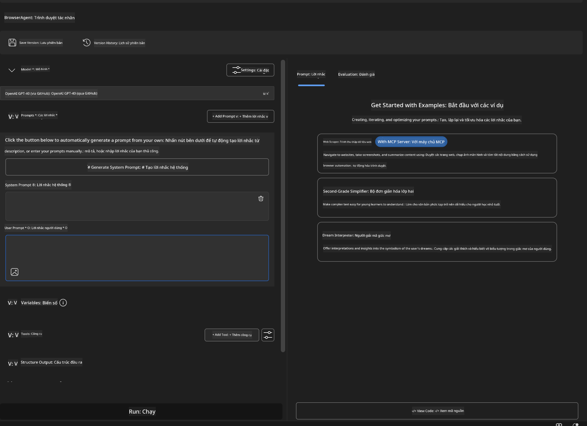
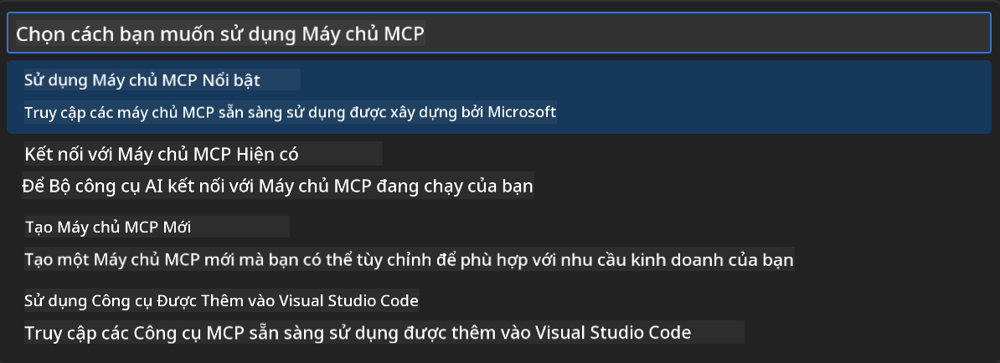
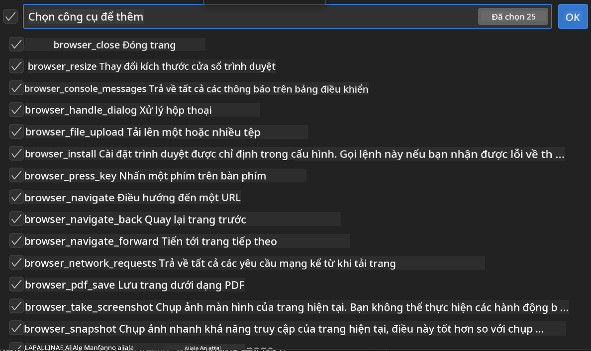
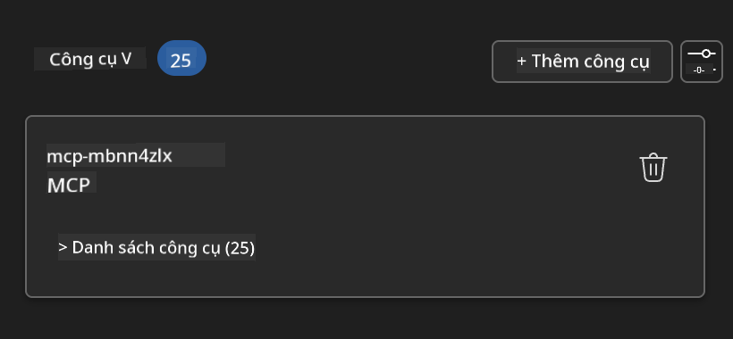
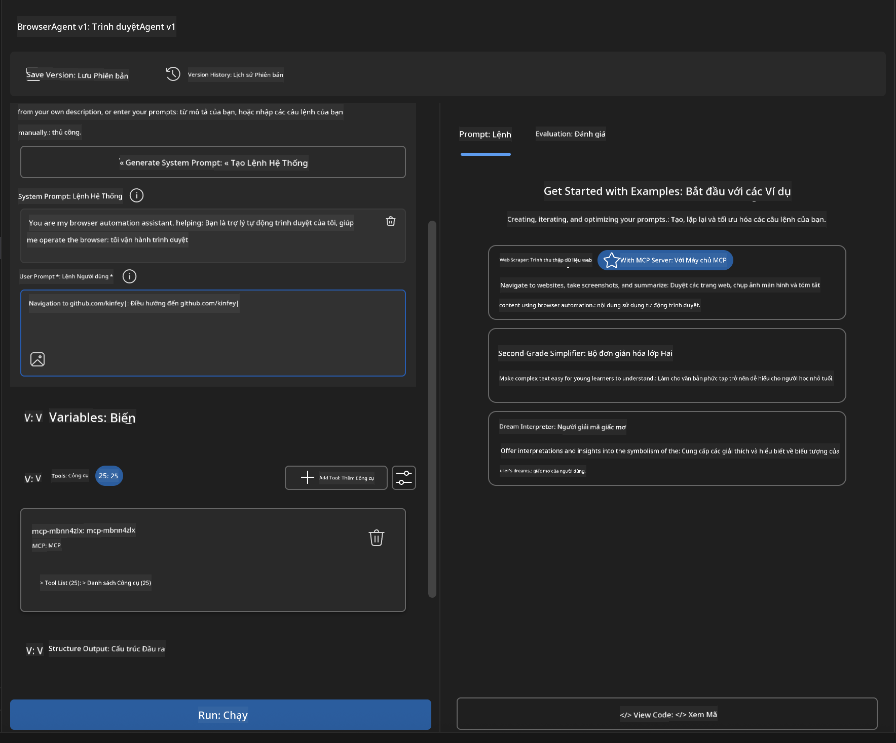
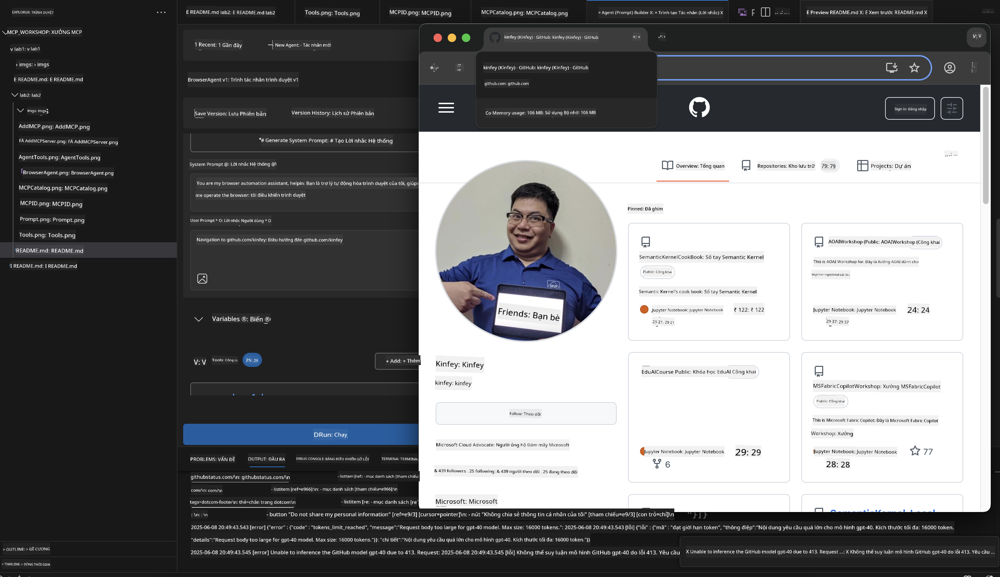
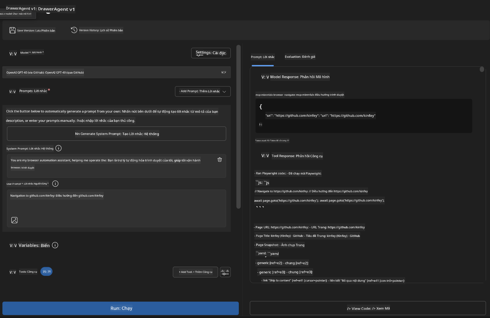
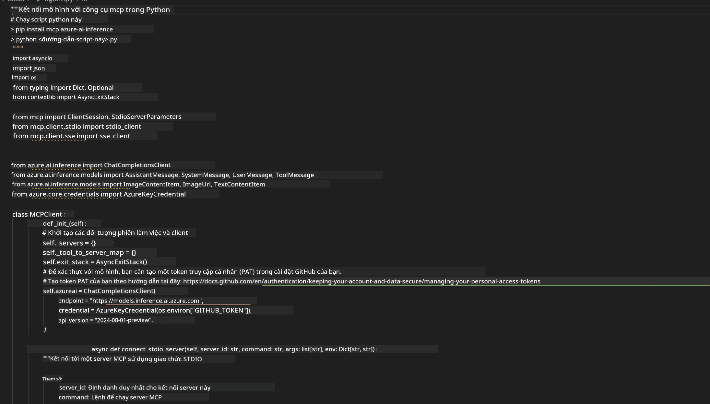

<!--
CO_OP_TRANSLATOR_METADATA:
{
  "original_hash": "a22b7dd11cd7690f99f9195877cafdc3",
  "translation_date": "2025-06-10T05:53:14+00:00",
  "source_file": "10-StreamliningAIWorkflowsBuildingAnMCPServerWithAIToolkit/lab2/README.md",
  "language_code": "vi"
}
-->
# 🌐 Module 2: MCP với AI Toolkit Fundamentals

[]()
[]()
[]()

## 📋 Mục tiêu học tập

Kết thúc module này, bạn sẽ có thể:
- ✅ Hiểu kiến trúc và lợi ích của Model Context Protocol (MCP)
- ✅ Khám phá hệ sinh thái máy chủ MCP của Microsoft
- ✅ Tích hợp các máy chủ MCP với AI Toolkit Agent Builder
- ✅ Xây dựng agent tự động trình duyệt hoạt động bằng Playwright MCP
- ✅ Cấu hình và kiểm tra các công cụ MCP trong agent của bạn
- ✅ Xuất và triển khai các agent chạy MCP cho môi trường sản xuất

## 🎯 Nối tiếp Module 1

Trong Module 1, chúng ta đã làm chủ các kiến thức cơ bản về AI Toolkit và tạo agent Python đầu tiên. Bây giờ, chúng ta sẽ **nâng cấp** agent của bạn bằng cách kết nối chúng với các công cụ và dịch vụ bên ngoài thông qua giao thức đột phá **Model Context Protocol (MCP)**.

Hãy tưởng tượng như nâng cấp từ máy tính bỏ túi lên một chiếc máy tính hoàn chỉnh – các agent AI của bạn sẽ có khả năng:
- 🌐 Duyệt và tương tác với các trang web
- 📁 Truy cập và xử lý tệp tin
- 🔧 Tích hợp với các hệ thống doanh nghiệp
- 📊 Xử lý dữ liệu thời gian thực từ các API

## 🧠 Hiểu về Model Context Protocol (MCP)

### 🔍 MCP là gì?

Model Context Protocol (MCP) là **"USB-C cho các ứng dụng AI"** – một chuẩn mở đột phá kết nối các mô hình ngôn ngữ lớn (LLMs) với các công cụ, nguồn dữ liệu và dịch vụ bên ngoài. Giống như USB-C giải quyết sự lộn xộn của cáp bằng một đầu nối chung, MCP loại bỏ sự phức tạp trong tích hợp AI bằng một giao thức chuẩn duy nhất.

### 🎯 Vấn đề MCP giải quyết

**Trước MCP:**
- 🔧 Tích hợp tùy chỉnh cho từng công cụ
- 🔄 Bị khóa bởi nhà cung cấp với các giải pháp độc quyền  
- 🔒 Lỗ hổng bảo mật do kết nối tùy tiện
- ⏱️ Phát triển mất nhiều tháng cho các tích hợp cơ bản

**Với MCP:**
- ⚡ Tích hợp công cụ cắm là chạy
- 🔄 Kiến trúc không phụ thuộc nhà cung cấp
- 🛡️ Thực hành bảo mật tích hợp sẵn
- 🚀 Thêm tính năng mới chỉ trong vài phút

### 🏗️ Khám phá kiến trúc MCP

MCP tuân theo kiến trúc **client-server** tạo nên một hệ sinh thái an toàn, có khả năng mở rộng:

```mermaid
graph TB
    A[AI Application/Agent] --> B[MCP Client]
    B --> C[MCP Server 1: Files]
    B --> D[MCP Server 2: Web APIs]
    B --> E[MCP Server 3: Database]
    B --> F[MCP Server N: Custom Tools]
    
    C --> G[Local File System]
    D --> H[External APIs]
    E --> I[Database Systems]
    F --> J[Enterprise Systems]
```

**🔧 Các thành phần chính:**

| Thành phần | Vai trò | Ví dụ |
|------------|---------|-------|
| **MCP Hosts** | Ứng dụng sử dụng dịch vụ MCP | Claude Desktop, VS Code, AI Toolkit |
| **MCP Clients** | Bộ xử lý giao thức (1:1 với server) | Tích hợp trong ứng dụng host |
| **MCP Servers** | Cung cấp khả năng qua giao thức chuẩn | Playwright, Files, Azure, GitHub |
| **Transport Layer** | Phương thức giao tiếp | stdio, HTTP, WebSockets |


## 🏢 Hệ sinh thái máy chủ MCP của Microsoft

Microsoft dẫn đầu hệ sinh thái MCP với bộ máy chủ cấp doanh nghiệp toàn diện, đáp ứng nhu cầu kinh doanh thực tế.

### 🌟 Máy chủ MCP Microsoft nổi bật

#### 1. ☁️ Azure MCP Server
**🔗 Repository**: [azure/azure-mcp](https://github.com/azure/azure-mcp)  
**🎯 Mục đích**: Quản lý tài nguyên Azure toàn diện với tích hợp AI

**✨ Tính năng chính:**
- Cung cấp hạ tầng theo khai báo
- Giám sát tài nguyên thời gian thực
- Đề xuất tối ưu chi phí
- Kiểm tra tuân thủ bảo mật

**🚀 Ứng dụng:**
- Hạ tầng như mã với trợ giúp AI
- Tự động mở rộng tài nguyên
- Tối ưu chi phí đám mây
- Tự động hóa quy trình DevOps

#### 2. 📊 Microsoft Dataverse MCP
**📚 Tài liệu**: [Microsoft Dataverse Integration](https://go.microsoft.com/fwlink/?linkid=2320176)  
**🎯 Mục đích**: Giao diện ngôn ngữ tự nhiên cho dữ liệu doanh nghiệp

**✨ Tính năng chính:**
- Truy vấn cơ sở dữ liệu bằng ngôn ngữ tự nhiên
- Hiểu ngữ cảnh kinh doanh
- Mẫu prompt tùy chỉnh
- Quản trị dữ liệu doanh nghiệp

**🚀 Ứng dụng:**
- Báo cáo trí tuệ kinh doanh
- Phân tích dữ liệu khách hàng
- Hiểu biết về pipeline bán hàng
- Truy vấn dữ liệu tuân thủ

#### 3. 🌐 Playwright MCP Server
**🔗 Repository**: [microsoft/playwright-mcp](https://github.com/microsoft/playwright-mcp)  
**🎯 Mục đích**: Tự động hóa trình duyệt và tương tác web

**✨ Tính năng chính:**
- Tự động hóa đa trình duyệt (Chrome, Firefox, Safari)
- Phát hiện phần tử thông minh
- Chụp ảnh màn hình và tạo PDF
- Giám sát lưu lượng mạng

**🚀 Ứng dụng:**
- Quy trình kiểm thử tự động
- Thu thập dữ liệu web và trích xuất
- Giám sát UI/UX
- Tự động phân tích đối thủ

#### 4. 📁 Files MCP Server
**🔗 Repository**: [microsoft/files-mcp-server](https://github.com/microsoft/files-mcp-server)  
**🎯 Mục đích**: Thao tác hệ thống tệp thông minh

**✨ Tính năng chính:**
- Quản lý tệp theo khai báo
- Đồng bộ nội dung
- Tích hợp kiểm soát phiên bản
- Trích xuất siêu dữ liệu

**🚀 Ứng dụng:**
- Quản lý tài liệu
- Tổ chức kho mã nguồn
- Quy trình xuất bản nội dung
- Xử lý tệp trong pipeline dữ liệu

#### 5. 📝 MarkItDown MCP Server
**🔗 Repository**: [microsoft/markitdown](https://github.com/microsoft/markitdown)  
**🎯 Mục đích**: Xử lý và thao tác Markdown nâng cao

**✨ Tính năng chính:**
- Phân tích Markdown phong phú
- Chuyển đổi định dạng (MD ↔ HTML ↔ PDF)
- Phân tích cấu trúc nội dung
- Xử lý mẫu

**🚀 Ứng dụng:**
- Quy trình tài liệu kỹ thuật
- Hệ thống quản lý nội dung
- Tạo báo cáo
- Tự động hóa cơ sở kiến thức

#### 6. 📈 Clarity MCP Server
**📦 Package**: [@microsoft/clarity-mcp-server](https://www.npmjs.com/package/@microsoft/clarity-mcp-server)  
**🎯 Mục đích**: Phân tích web và hiểu hành vi người dùng

**✨ Tính năng chính:**
- Phân tích dữ liệu heatmap
- Ghi lại phiên người dùng
- Chỉ số hiệu suất
- Phân tích phễu chuyển đổi

**🚀 Ứng dụng:**
- Tối ưu hóa website
- Nghiên cứu trải nghiệm người dùng
- Phân tích A/B testing
- Bảng điều khiển trí tuệ kinh doanh

### 🌍 Hệ sinh thái cộng đồng

Ngoài các máy chủ của Microsoft, hệ sinh thái MCP còn bao gồm:  
- **🐙 GitHub MCP**: Quản lý kho và phân tích mã nguồn  
- **🗄️ Database MCPs**: Tích hợp PostgreSQL, MySQL, MongoDB  
- **☁️ Cloud Provider MCPs**: Công cụ AWS, GCP, Digital Ocean  
- **📧 Communication MCPs**: Tích hợp Slack, Teams, Email  

## 🛠️ Thực hành: Xây dựng agent tự động trình duyệt

**🎯 Mục tiêu dự án**: Tạo agent tự động trình duyệt thông minh dùng Playwright MCP server có thể điều hướng web, trích xuất thông tin và thực hiện các tương tác phức tạp.

### 🚀 Giai đoạn 1: Thiết lập nền tảng agent

#### Bước 1: Khởi tạo agent của bạn
1. **Mở AI Toolkit Agent Builder**  
2. **Tạo agent mới** với cấu hình sau:  
   - **Tên**: `BrowserAgent`
   - **Model**: Choose GPT-4o 




### 🔧 Phase 2: MCP Integration Workflow

#### Step 3: Add MCP Server Integration
1. **Navigate to Tools Section** in Agent Builder
2. **Click "Add Tool"** to open the integration menu
3. **Select "MCP Server"** from available options


**🔍 Understanding Tool Types:**
- **Built-in Tools**: Pre-configured AI Toolkit functions
- **MCP Servers**: External service integrations
- **Custom APIs**: Your own service endpoints
- **Function Calling**: Direct model function access

#### Step 4: MCP Server Selection
1. **Choose "MCP Server"** option to proceed


2. **Browse MCP Catalog** to explore available integrations



### 🎮 Phase 3: Playwright MCP Configuration

#### Step 5: Select and Configure Playwright
1. **Click "Use Featured MCP Servers"** to access Microsoft's verified servers
2. **Select "Playwright"** from the featured list
3. **Accept Default MCP ID** or customize for your environment


#### Step 6: Enable Playwright Capabilities
**🔑 Critical Step**: Select **ALL** available Playwright methods for maximum functionality



**🛠️ Essential Playwright Tools:**
- **Navigation**: `goto`, `goBack`, `goForward`, `reload`
- **Interaction**: `click`, `fill`, `press`, `hover`, `drag`
- **Extraction**: `textContent`, `innerHTML`, `getAttribute`
- **Validation**: `isVisible`, `isEnabled`, `waitForSelector`
- **Capture**: `screenshot`, `pdf`, `video`
- **Network**: `setExtraHTTPHeaders`, `route`, `waitForResponse`

#### Bước 7: Xác nhận tích hợp thành công
**✅ Dấu hiệu thành công:**
- Tất cả công cụ hiển thị trong giao diện Agent Builder
- Không có lỗi trong bảng điều khiển tích hợp
- Trạng thái máy chủ Playwright hiện "Connected"



**🔧 Khắc phục sự cố phổ biến:**
- **Kết nối thất bại**: Kiểm tra kết nối internet và cài đặt tường lửa  
- **Thiếu công cụ**: Đảm bảo đã chọn đầy đủ khả năng trong quá trình thiết lập  
- **Lỗi quyền**: Xác nhận VS Code có quyền hệ thống cần thiết  

### 🎯 Giai đoạn 4: Kỹ thuật prompt nâng cao

#### Bước 8: Thiết kế prompt hệ thống thông minh
Tạo các prompt tinh vi tận dụng tối đa khả năng của Playwright:

```markdown
# Web Automation Expert System Prompt

## Core Identity
You are an advanced web automation specialist with deep expertise in browser automation, web scraping, and user experience analysis. You have access to Playwright tools for comprehensive browser control.

## Capabilities & Approach
### Navigation Strategy
- Always start with screenshots to understand page layout
- Use semantic selectors (text content, labels) when possible
- Implement wait strategies for dynamic content
- Handle single-page applications (SPAs) effectively

### Error Handling
- Retry failed operations with exponential backoff
- Provide clear error descriptions and solutions
- Suggest alternative approaches when primary methods fail
- Always capture diagnostic screenshots on errors

### Data Extraction
- Extract structured data in JSON format when possible
- Provide confidence scores for extracted information
- Validate data completeness and accuracy
- Handle pagination and infinite scroll scenarios

### Reporting
- Include step-by-step execution logs
- Provide before/after screenshots for verification
- Suggest optimizations and alternative approaches
- Document any limitations or edge cases encountered

## Ethical Guidelines
- Respect robots.txt and rate limiting
- Avoid overloading target servers
- Only extract publicly available information
- Follow website terms of service
```

#### Bước 9: Tạo prompt người dùng động
Thiết kế prompt thể hiện các khả năng đa dạng:

**🌐 Ví dụ phân tích web:**  
```markdown
Navigate to github.com/kinfey and provide a comprehensive analysis including:
1. Repository structure and organization
2. Recent activity and contribution patterns  
3. Documentation quality assessment
4. Technology stack identification
5. Community engagement metrics
6. Notable projects and their purposes

Include screenshots at key steps and provide actionable insights.
```



### 🚀 Giai đoạn 5: Thực thi và kiểm thử

#### Bước 10: Thực thi tự động hóa đầu tiên
1. **Nhấn "Run"** để bắt đầu chuỗi tự động hóa  
2. **Giám sát thực thi thời gian thực**:  
   - Trình duyệt Chrome tự động mở  
   - Agent điều hướng đến trang mục tiêu  
   - Chụp ảnh màn hình từng bước chính  
   - Kết quả phân tích truyền về theo thời gian thực  



#### Bước 11: Phân tích kết quả và insight
Xem xét phân tích chi tiết trong giao diện Agent Builder:



### 🌟 Giai đoạn 6: Nâng cao khả năng và triển khai

#### Bước 12: Xuất và triển khai sản xuất
Agent Builder hỗ trợ nhiều tùy chọn triển khai:



## 🎓 Tóm tắt Module 2 & Bước tiếp theo

### 🏆 Thành tựu đạt được: Thành thạo tích hợp MCP

**✅ Kỹ năng đã làm chủ:**  
- [ ] Hiểu kiến trúc và lợi ích MCP  
- [ ] Khám phá hệ sinh thái máy chủ MCP của Microsoft  
- [ ] Tích hợp Playwright MCP với AI Toolkit  
- [ ] Xây dựng agent tự động trình duyệt phức tạp  
- [ ] Kỹ thuật prompt nâng cao cho tự động hóa web  

### 📚 Tài nguyên bổ sung

- **🔗 MCP Specification**: [Official Protocol Documentation](https://modelcontextprotocol.io/)  
- **🛠️ Playwright API**: [Complete Method Reference](https://playwright.dev/docs/api/class-playwright)  
- **🏢 Microsoft MCP Servers**: [Enterprise Integration Guide](https://github.com/microsoft/mcp-servers)  
- **🌍 Community Examples**: [MCP Server Gallery](https://github.com/modelcontextprotocol/servers)  

**🎉 Chúc mừng!** Bạn đã thành thạo tích hợp MCP và có thể xây dựng các agent AI sẵn sàng sản xuất với khả năng công cụ bên ngoài!

### 🔜 Tiếp tục sang Module kế tiếp

Sẵn sàng nâng cao kỹ năng MCP? Tiến tới **[Module 3: Advanced MCP Development with AI Toolkit](../lab3/README.md)** để học cách:  
- Tạo máy chủ MCP tùy chỉnh của riêng bạn  
- Cấu hình và sử dụng SDK Python MCP mới nhất  
- Thiết lập MCP Inspector để gỡ lỗi  
- Làm chủ quy trình phát triển máy chủ MCP nâng cao  
- Xây dựng Weather MCP Server từ đầu

**Tuyên bố miễn trừ trách nhiệm**:  
Tài liệu này đã được dịch bằng dịch vụ dịch thuật AI [Co-op Translator](https://github.com/Azure/co-op-translator). Mặc dù chúng tôi cố gắng đảm bảo độ chính xác, xin lưu ý rằng bản dịch tự động có thể chứa lỗi hoặc không chính xác. Tài liệu gốc bằng ngôn ngữ nguyên bản nên được coi là nguồn thông tin chính xác nhất. Đối với thông tin quan trọng, nên sử dụng dịch vụ dịch thuật chuyên nghiệp do con người thực hiện. Chúng tôi không chịu trách nhiệm về bất kỳ sự hiểu lầm hoặc diễn giải sai nào phát sinh từ việc sử dụng bản dịch này.