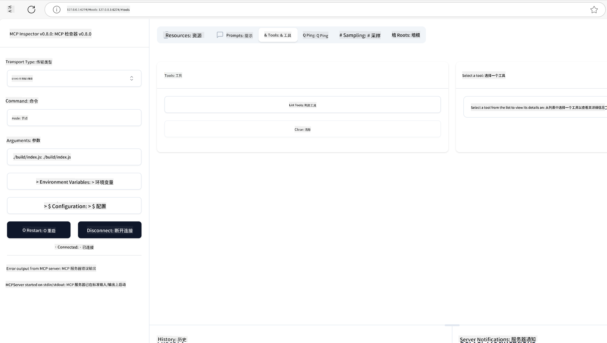

<!--
CO_OP_TRANSLATOR_METADATA:
{
  "original_hash": "5331ffd328a54b90f76706c52b673e27",
  "translation_date": "2025-05-16T15:08:59+00:00",
  "source_file": "03-GettingStarted/01-first-server/README.md",
  "language_code": "zh"
}
-->
### -2- 创建项目

既然你已经安装了 SDK，接下来让我们创建一个项目：

### -3- 创建项目文件

### -4- 编写服务器代码

### -5- 添加工具和资源

通过添加以下代码来添加一个工具和一个资源：

### -6- 完整代码

让我们添加启动服务器所需的最后代码：

### -7- 测试服务器

使用以下命令启动服务器：

### -8- 使用 Inspector 运行

Inspector 是一个很棒的工具，可以启动你的服务器并让你与之交互，以便测试其功能。让我们启动它：

> [!NOTE]
> “command”字段中显示的内容可能会有所不同，因为它包含了用于运行你所选运行时服务器的命令。

你应该会看到如下用户界面：

1. 通过选择“Connect”按钮连接到服务器  
   连接服务器后，你应该会看到如下界面：

   

2. 选择“Tools”和“listTools”，你应该会看到“Add”选项，选择“Add”并填写参数值。

   你将看到如下响应，也就是“add”工具的结果：

   

恭喜，你已经成功创建并运行了你的第一个服务器！

### 官方 SDK

MCP 提供了多种语言的官方 SDK：
- [C# SDK](https://github.com/modelcontextprotocol/csharp-sdk) - 与微软合作维护
- [Java SDK](https://github.com/modelcontextprotocol/java-sdk) - 与 Spring AI 合作维护
- [TypeScript SDK](https://github.com/modelcontextprotocol/typescript-sdk) - 官方 TypeScript 实现
- [Python SDK](https://github.com/modelcontextprotocol/python-sdk) - 官方 Python 实现
- [Kotlin SDK](https://github.com/modelcontextprotocol/kotlin-sdk) - 官方 Kotlin 实现
- [Swift SDK](https://github.com/modelcontextprotocol/swift-sdk) - 与 Loopwork AI 合作维护
- [Rust SDK](https://github.com/modelcontextprotocol/rust-sdk) - 官方 Rust 实现

## 关键要点

- 使用针对特定语言的 SDK，设置 MCP 开发环境非常简单
- 构建 MCP 服务器涉及创建并注册带有清晰模式的工具
- 测试和调试对可靠的 MCP 实现至关重要

## 示例

- [Java 计算器](../samples/java/calculator/README.md)
- [.Net 计算器](../../../../03-GettingStarted/samples/csharp)
- [JavaScript 计算器](../samples/javascript/README.md)
- [TypeScript 计算器](../samples/typescript/README.md)
- [Python 计算器](../../../../03-GettingStarted/samples/python)

## 练习任务

创建一个带有自定义工具的简单 MCP 服务器：
1. 使用你喜欢的语言（.NET、Java、Python 或 JavaScript）实现该工具。
2. 定义输入参数和返回值。
3. 运行 Inspector 工具，确保服务器按预期工作。
4. 使用各种输入测试该实现。

## 解决方案

[解决方案](./solution/README.md)

## 额外资源

- [MCP GitHub 仓库](https://github.com/microsoft/mcp-for-beginners)

## 后续内容

下一节：[MCP 客户端入门](/03-GettingStarted/02-client/README.md)

**免责声明**：  
本文件使用 AI 翻译服务 [Co-op Translator](https://github.com/Azure/co-op-translator) 进行翻译。尽管我们努力确保准确性，但请注意，自动翻译可能存在错误或不准确之处。原始文件的母语版本应被视为权威来源。对于重要信息，建议采用专业人工翻译。对于因使用本翻译而产生的任何误解或误释，我们概不负责。