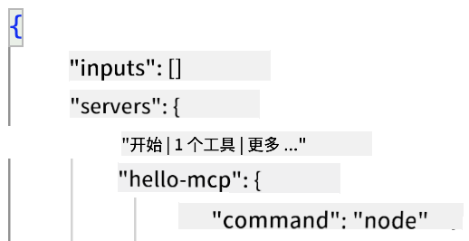

<!--
CO_OP_TRANSLATOR_METADATA:
{
  "original_hash": "0eb9557780cd0a2551cdb8a16c886b51",
  "translation_date": "2025-06-17T15:19:04+00:00",
  "source_file": "03-GettingStarted/04-vscode/README.md",
  "language_code": "zh"
}
-->
接下来我们将详细讲解如何使用可视化界面。

## 方法

我们需要从以下几个方面来实现：

- 配置一个文件以定位我们的 MCP Server。
- 启动或连接到该服务器，以获取它的功能列表。
- 通过 GitHub Copilot 聊天界面使用这些功能。

很好，了解了流程后，让我们通过一个练习来尝试通过 Visual Studio Code 使用 MCP Server。

## 练习：使用服务器

在本练习中，我们将配置 Visual Studio Code 以找到你的 MCP 服务器，从而可以通过 GitHub Copilot 聊天界面使用它。

### -0- 预备步骤，启用 MCP Server 发现功能

你可能需要启用 MCP 服务器的发现功能。

1. 进入 `File -> Preferences -> Settings` in Visual Studio Code.

1. Search for "MCP" and enable `chat.mcp.discovery.enabled`，在 settings.json 文件中进行设置。

### -1- 创建配置文件

首先在你的项目根目录创建一个配置文件，你需要一个名为 MCP.json 的文件，放在一个叫做 .vscode 的文件夹里。文件内容示例如下：

```text
.vscode
|-- mcp.json
```

接下来，我们看看如何添加服务器条目。

### -2- 配置服务器

向 *mcp.json* 添加以下内容：

```json
{
    "inputs": [],
    "servers": {
       "hello-mcp": {
           "command": "node",
           "args": [
               "build/index.js"
           ]
       }
    }
}
```

上面是一个简单的示例，展示了如何启动一个用 Node.js 编写的服务器。对于其他运行时，使用 `command` and `args` 指定正确的启动命令。

### -3- 启动服务器

添加条目后，开始启动服务器：

1. 在 *mcp.json* 中找到你的条目，确认你能看到“播放”图标：

    

2. 点击“播放”图标，你会看到 GitHub Copilot 聊天界面中的工具图标显示可用工具数量增加。点击该工具图标，会显示已注册工具列表。你可以勾选或取消勾选每个工具，决定是否让 GitHub Copilot 在上下文中使用它们：

  

3. 要运行工具，输入一个你知道会匹配某个工具描述的提示，例如“add 22 to 1”：

  

  你应该会看到回复为 23。

## 任务

尝试向你的 *mcp.json* 文件添加一个服务器条目，确保你能启动和停止服务器。同时确保可以通过 GitHub Copilot 聊天界面与服务器上的工具通信。

## 解决方案

[解决方案](./solution/README.md)

## 主要收获

本章的主要收获包括：

- Visual Studio Code 是一个优秀的客户端，可以让你使用多个 MCP 服务器及其工具。
- GitHub Copilot 聊天界面是你与服务器交互的方式。
- 你可以通过提示用户输入 API 密钥等信息，并在配置 *mcp.json* 文件中的服务器条目时将这些信息传递给 MCP 服务器。

## 示例

- [Java 计算器](../samples/java/calculator/README.md)
- [.Net 计算器](../../../../03-GettingStarted/samples/csharp)
- [JavaScript 计算器](../samples/javascript/README.md)
- [TypeScript 计算器](../samples/typescript/README.md)
- [Python 计算器](../../../../03-GettingStarted/samples/python)

## 额外资源

- [Visual Studio 文档](https://code.visualstudio.com/docs/copilot/chat/mcp-servers)

## 接下来

- 下一节：[创建 SSE 服务器](/03-GettingStarted/05-sse-server/README.md)

**免责声明**：  
本文件使用 AI 翻译服务 [Co-op Translator](https://github.com/Azure/co-op-translator) 进行翻译。尽管我们力求准确，但请注意，自动翻译可能包含错误或不准确之处。原始文件的母语版本应被视为权威来源。对于重要信息，建议使用专业人工翻译。对于因使用本翻译而产生的任何误解或误释，我们不承担任何责任。