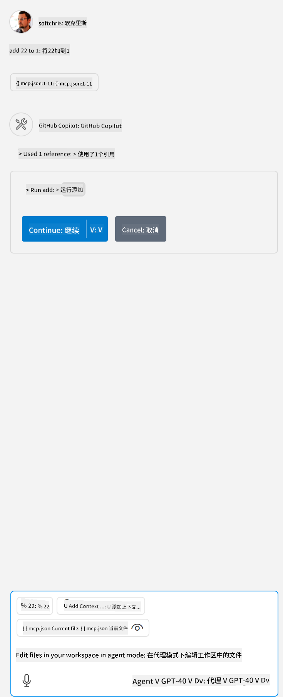

<!--
CO_OP_TRANSLATOR_METADATA:
{
  "original_hash": "8ea28e5e566edd5969337fd0b191ba3f",
  "translation_date": "2025-07-16T20:58:13+00:00",
  "source_file": "03-GettingStarted/04-vscode/README.md",
  "language_code": "zh"
}
-->
# 从 GitHub Copilot Agent 模式使用服务器

Visual Studio Code 和 GitHub Copilot 可以作为客户端来使用 MCP 服务器。你可能会问，为什么我们要这样做？这意味着 MCP 服务器的所有功能现在都可以直接在你的 IDE 中使用。想象一下，如果你添加了 GitHub 的 MCP 服务器，就可以通过自然语言提示来控制 GitHub，而不必在终端输入特定命令。或者，任何能够提升开发者体验的功能，都可以通过自然语言来控制。现在你应该能看到其中的优势了吧？

## 概述

本课将介绍如何使用 Visual Studio Code 和 GitHub Copilot 的 Agent 模式作为 MCP 服务器的客户端。

## 学习目标

完成本课后，你将能够：

- 通过 Visual Studio Code 使用 MCP 服务器。
- 通过 GitHub Copilot 运行工具等功能。
- 配置 Visual Studio Code 以查找和管理你的 MCP 服务器。

## 使用方法

你可以通过两种方式控制你的 MCP 服务器：

- 用户界面，稍后章节会介绍具体操作。
- 终端，可以使用 `code` 可执行文件从终端控制：

  要将 MCP 服务器添加到用户配置中，使用 --add-mcp 命令行选项，并提供 JSON 格式的服务器配置，如 {\"name\":\"server-name\",\"command\":...}。

  ```
  code --add-mcp "{\"name\":\"my-server\",\"command\": \"uvx\",\"args\": [\"mcp-server-fetch\"]}"
  ```

### 截图

  
  


接下来我们将详细讲解如何使用可视化界面。

## 方法

整体流程如下：

- 配置文件以定位 MCP 服务器。
- 启动/连接服务器，让其列出可用功能。
- 通过 GitHub Copilot Chat 界面使用这些功能。

了解了流程后，我们通过一个练习来尝试在 Visual Studio Code 中使用 MCP 服务器。

## 练习：使用服务器

本练习中，我们将配置 Visual Studio Code 以找到你的 MCP 服务器，从而可以通过 GitHub Copilot Chat 界面使用它。

### -0- 预备步骤，启用 MCP 服务器发现

你可能需要启用 MCP 服务器的发现功能。

1. 在 Visual Studio Code 中，进入 `文件 -> 首选项 -> 设置`。

1. 搜索 “MCP”，并在 settings.json 文件中启用 `chat.mcp.discovery.enabled`。

### -1- 创建配置文件

首先在项目根目录创建配置文件，需要在名为 .vscode 的文件夹中创建 MCP.json 文件，内容示例如下：

```text
.vscode
|-- mcp.json
```

接下来，我们看看如何添加服务器条目。

### -2- 配置服务器

向 *mcp.json* 添加以下内容：

```json
{
    "inputs": [],
    "servers": {
       "hello-mcp": {
           "command": "node",
           "args": [
               "build/index.js"
           ]
       }
    }
}
```

上面是一个用 Node.js 启动服务器的简单示例，其他运行时请通过 `command` 和 `args` 指定正确的启动命令。

### -3- 启动服务器

添加条目后，启动服务器：

1. 找到 *mcp.json* 中的条目，确认看到“播放”图标：

    

1. 点击“播放”图标，GitHub Copilot Chat 中的工具图标会显示可用工具数量增加。点击该工具图标，可以看到已注册的工具列表。你可以勾选或取消勾选工具，决定是否让 GitHub Copilot 以它们作为上下文：

  

1. 运行工具时，输入你知道会匹配某个工具描述的提示，例如“add 22 to 1”：

  

  你应该会看到返回结果为 23。

## 任务

尝试向 *mcp.json* 文件添加服务器条目，确保可以启动和停止服务器。并确保可以通过 GitHub Copilot Chat 界面与服务器上的工具通信。

## 解决方案

[解决方案](./solution/README.md)

## 关键要点

本章的关键要点如下：

- Visual Studio Code 是一个优秀的客户端，支持你使用多个 MCP 服务器及其工具。
- GitHub Copilot Chat 界面是你与服务器交互的方式。
- 你可以提示用户输入 API 密钥等信息，并在配置 *mcp.json* 文件中的服务器条目时传递给 MCP 服务器。

## 示例

- [Java 计算器](../samples/java/calculator/README.md)
- [.Net 计算器](../../../../03-GettingStarted/samples/csharp)
- [JavaScript 计算器](../samples/javascript/README.md)
- [TypeScript 计算器](../samples/typescript/README.md)
- [Python 计算器](../../../../03-GettingStarted/samples/python)

## 额外资源

- [Visual Studio 文档](https://code.visualstudio.com/docs/copilot/chat/mcp-servers)

## 后续内容

- 下一节：[创建 SSE 服务器](../05-sse-server/README.md)

**免责声明**：  
本文件使用 AI 翻译服务 [Co-op Translator](https://github.com/Azure/co-op-translator) 进行翻译。虽然我们力求准确，但请注意，自动翻译可能包含错误或不准确之处。原始文件的母语版本应被视为权威来源。对于重要信息，建议使用专业人工翻译。对于因使用本翻译而产生的任何误解或误释，我们概不负责。