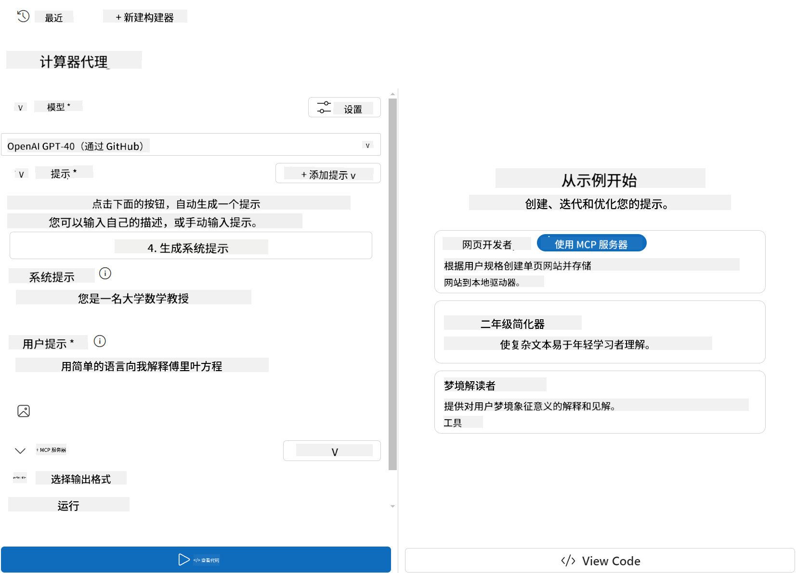
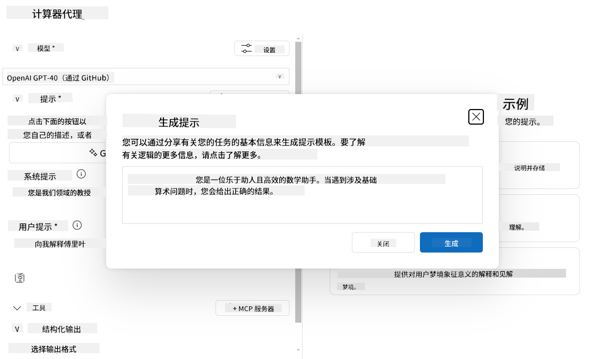

<!--
CO_OP_TRANSLATOR_METADATA:
{
  "original_hash": "d1980763f2a545ca6648363bf5757b5a",
  "translation_date": "2025-06-12T22:25:13+00:00",
  "source_file": "03-GettingStarted/07-aitk/README.md",
  "language_code": "zh"
}
-->
# 在 Visual Studio Code 的 AI Toolkit 扩展中使用服务器

构建 AI 代理时，不仅仅是生成智能回复，还要赋予代理执行操作的能力。这就是 Model Context Protocol (MCP) 的作用。MCP 让代理能够以统一的方式访问外部工具和服务。可以把它想象成为你的代理接入了一个真正能用的工具箱。

比如，你把代理连接到计算器 MCP 服务器。这样，代理只需收到“47 乘以 89 等于多少？”这样的提示，就能执行数学运算——无需硬编码逻辑或开发自定义 API。

## 概述

本课将介绍如何使用 Visual Studio Code 中的 [AI Toolkit](https://aka.ms/AIToolkit) 扩展，将计算器 MCP 服务器连接到代理，使代理能够通过自然语言执行加、减、乘、除等数学运算。

AI Toolkit 是 Visual Studio Code 的强大扩展，简化了代理开发流程。AI 工程师可以轻松开发和测试生成式 AI 模型，无论是在本地还是云端。该扩展支持目前大多数主流生成式模型。

*注*：AI Toolkit 当前支持 Python 和 TypeScript。

## 学习目标

完成本课后，你将能够：

- 通过 AI Toolkit 使用 MCP 服务器。
- 配置代理，使其能发现并使用 MCP 服务器提供的工具。
- 通过自然语言调用 MCP 工具。

## 方法

我们的大致步骤如下：

- 创建代理并定义其系统提示。
- 创建带有计算工具的 MCP 服务器。
- 将 Agent Builder 连接到 MCP 服务器。
- 通过自然语言测试代理调用工具。

很好，了解流程后，让我们配置一个 AI 代理，通过 MCP 利用外部工具，提升它的能力！

## 前提条件

- [Visual Studio Code](https://code.visualstudio.com/)
- [AI Toolkit for Visual Studio Code](https://aka.ms/AIToolkit)

## 练习：使用服务器

本练习中，你将使用 AI Toolkit 在 Visual Studio Code 内构建、运行并增强一个带有 MCP 服务器工具的 AI 代理。

### -0- 预备步骤，将 OpenAI GPT-4o 模型添加到“我的模型”

本练习使用 **GPT-4o** 模型。创建代理前，应先将该模型添加到 **我的模型**。


1. 从 **活动栏**打开 **AI Toolkit** 扩展。
1. 在 **目录** 部分选择 **模型**，打开 **模型目录**。选择后将在新编辑器标签页打开。
1. 在 **模型目录** 的搜索栏输入 **OpenAI GPT-4o**。
1. 点击 **+ 添加**，将模型添加到你的 **我的模型** 列表。确保选择的是 **GitHub 托管** 的模型。
1. 在 **活动栏**确认 **OpenAI GPT-4o** 模型已出现在列表中。

### -1- 创建代理

**Agent (Prompt) Builder** 允许你创建和定制自己的 AI 代理。本节将创建一个新代理，并为其指定对话所用模型。



1. 从 **活动栏**打开 **AI Toolkit** 扩展。
1. 在 **工具** 部分选择 **Agent (Prompt) Builder**，将在新编辑器标签页打开该工具。
1. 点击 **+ 新建代理** 按钮，扩展将通过 **命令面板** 启动设置向导。
1. 输入名称 **Calculator Agent**，按回车确认。
1. 在 **Agent (Prompt) Builder** 的 **模型** 字段选择 **OpenAI GPT-4o (via GitHub)** 模型。

### -2- 为代理创建系统提示

代理搭建完成后，接下来定义其个性和用途。本节将使用 **生成系统提示** 功能，描述代理的预期行为（此处为计算器代理），并让模型帮你写出系统提示。



1. 在 **提示** 部分，点击 **生成系统提示** 按钮。该按钮将打开提示生成器，利用 AI 为代理生成系统提示。
1. 在 **生成提示** 窗口中输入：`You are a helpful and efficient math assistant. When given a problem involving basic arithmetic, you respond with the correct result.`
1. 点击 **生成** 按钮。右下角会出现通知，确认系统提示正在生成。生成完成后，提示会显示在 **Agent (Prompt) Builder** 的 **系统提示** 字段中。
1. 审核 **系统提示**，如有需要可进行修改。

### -3- 创建 MCP 服务器

定义好代理的系统提示后，接下来为代理配备实际功能。本节将创建一个带有加、减、乘、除工具的计算器 MCP 服务器。该服务器将使代理能够根据自然语言提示执行实时数学运算。


AI Toolkit 提供了模板，方便你创建 MCP 服务器。这里我们使用 Python 模板创建计算器 MCP 服务器。

*注*：AI Toolkit 当前支持 Python 和 TypeScript。

1. 在 **Agent (Prompt) Builder** 的 **工具** 部分，点击 **+ MCP Server** 按钮。扩展将通过 **命令面板** 启动设置向导。
1. 选择 **+ 添加服务器**。
1. 选择 **创建新的 MCP 服务器**。
1. 选择 **python-weather** 模板。
1. 选择 **默认文件夹** 保存 MCP 服务器模板。
1. 输入服务器名称：**Calculator**
1. 新的 Visual Studio Code 窗口会打开，选择 **是，我信任作者**。
1. 使用终端（**终端** > **新建终端**），创建虚拟环境：`python -m venv .venv`
1. 在终端激活虚拟环境：
    1. Windows - `.venv\Scripts\activate`
    1. macOS/Linux - `source venv/bin/activate`
1. 在终端安装依赖：`pip install -e .[dev]`
1. 在 **活动栏** 的 **资源管理器** 视图中，展开 **src** 目录，选择 **server.py** 文件打开编辑器。
1. 替换 **server.py** 文件中的代码为以下内容并保存：

    ```python
    """
    Sample MCP Calculator Server implementation in Python.

    
    This module demonstrates how to create a simple MCP server with calculator tools
    that can perform basic arithmetic operations (add, subtract, multiply, divide).
    """
    
    from mcp.server.fastmcp import FastMCP
    
    server = FastMCP("calculator")
    
    @server.tool()
    def add(a: float, b: float) -> float:
        """Add two numbers together and return the result."""
        return a + b
    
    @server.tool()
    def subtract(a: float, b: float) -> float:
        """Subtract b from a and return the result."""
        return a - b
    
    @server.tool()
    def multiply(a: float, b: float) -> float:
        """Multiply two numbers together and return the result."""
        return a * b
    
    @server.tool()
    def divide(a: float, b: float) -> float:
        """
        Divide a by b and return the result.
        
        Raises:
            ValueError: If b is zero
        """
        if b == 0:
            raise ValueError("Cannot divide by zero")
        return a / b
    ```

### -4- 运行带有计算器 MCP 服务器的代理

既然代理已有工具，接下来就用它们吧！本节将向代理提交提示，测试并验证代理是否能正确调用计算器 MCP 服务器的工具。


你将通过 **Agent Builder** 作为 MCP 客户端，在本地开发机上运行计算器 MCP 服务器。

1. 按 `F5`` to start debugging the MCP server. The **Agent (Prompt) Builder** will open in a new editor tab. The status of the server is visible in the terminal.
1. In the **User prompt** field of the **Agent (Prompt) Builder**, enter the following prompt: `我买了3件商品，每件25美元，然后用了20美元折扣。我实际支付了多少钱？`
1. Click the **Run** button to generate the agent's response.
1. Review the agent output. The model should conclude that you paid **$55**.
1. Here's a breakdown of what should occur:
    - The agent selects the **multiply** and **substract** tools to aid in the calculation.
    - The respective `a` and `b` values are assigned for the **multiply** tool.
    - The respective `a` and `b` 的值被分配给 **subtract** 工具。
    - 每个工具的响应会显示在对应的 **工具响应** 中。
    - 模型的最终输出显示在最终的 **模型响应** 中。
1. 继续提交其他提示，进一步测试代理。你可以点击 **用户提示** 字段，修改并替换现有提示。
1. 测试完成后，可以通过 **终端** 输入 **CTRL/CMD+C** 停止服务器。

## 任务

尝试在你的 **server.py** 文件中添加一个额外的工具条目（例如：返回数字的平方根）。提交需要代理调用你新增工具（或已有工具）的提示。记得重启服务器以加载新添加的工具。

## 解决方案

[解决方案](./solution/README.md)

## 主要收获

本章的主要收获包括：

- AI Toolkit 扩展是一个优秀的客户端，支持你使用 MCP 服务器及其工具。
- 你可以向 MCP 服务器添加新工具，扩展代理的功能以满足不断变化的需求。
- AI Toolkit 提供模板（如 Python MCP 服务器模板），简化自定义工具的创建。

## 附加资源

- [AI Toolkit 文档](https://aka.ms/AIToolkit/doc)

## 接下来

- 下一步：[测试与调试](/03-GettingStarted/08-testing/README.md)

**免责声明**：  
本文件由 AI 翻译服务 [Co-op Translator](https://github.com/Azure/co-op-translator) 翻译而成。尽管我们力求准确，但请注意，自动翻译可能存在错误或不准确之处。原始文件的原文版本应被视为权威来源。对于重要信息，建议使用专业人工翻译。对于因使用本翻译而产生的任何误解或误释，我们不承担任何责任。