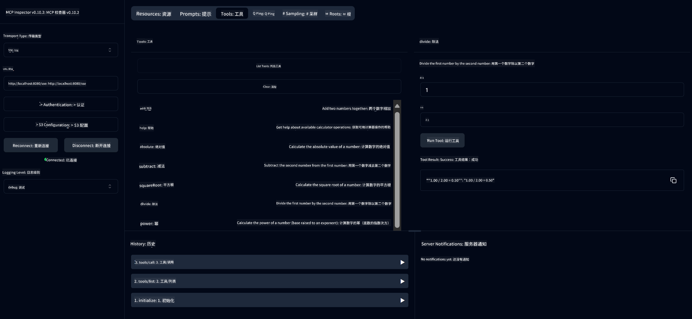

<!--
CO_OP_TRANSLATOR_METADATA:
{
  "original_hash": "13231e9951b68efd9df8c56bd5cdb27e",
  "translation_date": "2025-05-16T15:03:57+00:00",
  "source_file": "03-GettingStarted/samples/java/calculator/README.md",
  "language_code": "zh"
}
-->
# 基础计算器 MCP 服务

该服务通过使用 Spring Boot 和 WebFlux 传输的模型上下文协议（MCP）提供基础计算器操作。它设计为初学者学习 MCP 实现的简单示例。

更多信息请参阅 [MCP Server Boot Starter](https://docs.spring.io/spring-ai/reference/api/mcp/mcp-server-boot-starter-docs.html) 参考文档。

## 概述

该服务展示了：
- 支持 SSE（服务器推送事件）
- 使用 Spring AI 的 `@Tool` 注解自动注册工具
- 基础计算器功能：
  - 加法、减法、乘法、除法
  - 幂运算和平方根
  - 取模（余数）和绝对值
  - 提供操作说明的帮助功能

## 功能特点

该计算器服务提供以下功能：

1. **基础算术运算**：
   - 两数相加
   - 一个数减去另一个数
   - 两数相乘
   - 一个数除以另一个数（包含除零检查）

2. **高级运算**：
   - 幂运算（底数的指数次方）
   - 平方根计算（包含负数检查）
   - 取模（余数）计算
   - 绝对值计算

3. **帮助系统**：
   - 内置帮助函数，解释所有可用操作

## 使用服务

该服务通过 MCP 协议暴露以下 API 端点：

- `add(a, b)`：将两个数字相加
- `subtract(a, b)`：从第一个数字中减去第二个数字
- `multiply(a, b)`：将两个数字相乘
- `divide(a, b)`：将第一个数字除以第二个数字（包含除零检查）
- `power(base, exponent)`：计算数字的幂
- `squareRoot(number)`：计算平方根（包含负数检查）
- `modulus(a, b)`：计算除法余数
- `absolute(number)`：计算绝对值
- `help()`：获取可用操作的信息

## 测试客户端

一个简单的测试客户端包含在 `com.microsoft.mcp.sample.client` 包中。`SampleCalculatorClient` 类展示了计算器服务的可用操作。

## 使用 LangChain4j 客户端

项目中包含一个 LangChain4j 示例客户端（位于 `com.microsoft.mcp.sample.client.LangChain4jClient`），展示如何将计算器服务与 LangChain4j 和 GitHub 模型集成：

### 前提条件

1. **GitHub Token 设置**：

   要使用 GitHub 的 AI 模型（如 phi-4），需要 GitHub 个人访问令牌：

   a. 进入你的 GitHub 账户设置：https://github.com/settings/tokens

   b. 点击“生成新令牌” → “生成新令牌（经典）”

   c. 给令牌取一个描述性名称

   d. 选择以下权限范围：
      - `repo`（完全控制私有仓库）
      - `read:org`（读取组织和团队成员资格，读取组织项目）
      - `gist`（创建 gist）
      - `user:email`（访问用户邮箱地址（只读））

   e. 点击“生成令牌”，并复制新的令牌

   f. 将其设置为环境变量：

      Windows 系统下：
      ```
      set GITHUB_TOKEN=your-github-token
      ```

      macOS/Linux 系统下：
      ```bash
      export GITHUB_TOKEN=your-github-token
      ```

   g. 若需持久化设置，请通过系统设置将其添加到环境变量中

2. 将 LangChain4j GitHub 依赖添加到项目（已包含在 pom.xml 中）：
   ```xml
   <dependency>
       <groupId>dev.langchain4j</groupId>
       <artifactId>langchain4j-github</artifactId>
       <version>${langchain4j.version}</version>
   </dependency>
   ```

3. 确保计算器服务器运行在 `localhost:8080`

### 运行 LangChain4j 客户端

该示例演示了：
- 通过 SSE 传输连接计算器 MCP 服务器
- 使用 LangChain4j 创建一个利用计算器操作的聊天机器人
- 集成 GitHub AI 模型（当前使用 phi-4 模型）

客户端发送以下示例查询以展示功能：
1. 计算两个数字的和
2. 计算一个数字的平方根
3. 获取有关可用计算器操作的帮助信息

运行示例并查看控制台输出，观察 AI 模型如何使用计算器工具回答查询。

### GitHub 模型配置

LangChain4j 客户端配置为使用 GitHub 的 phi-4 模型，配置如下：

```java
ChatLanguageModel model = GitHubChatModel.builder()
    .apiKey(System.getenv("GITHUB_TOKEN"))
    .timeout(Duration.ofSeconds(60))
    .modelName("phi-4")
    .logRequests(true)
    .logResponses(true)
    .build();
```

若需使用其他 GitHub 模型，只需将 `modelName` 参数更改为支持的模型（例如 "claude-3-haiku-20240307"、"llama-3-70b-8192" 等）。

## 依赖项

项目需要以下关键依赖：

```xml
<!-- For MCP Server -->
<dependency>
    <groupId>org.springframework.ai</groupId>
    <artifactId>spring-ai-starter-mcp-server-webflux</artifactId>
</dependency>

<!-- For LangChain4j integration -->
<dependency>
    <groupId>dev.langchain4j</groupId>
    <artifactId>langchain4j-mcp</artifactId>
    <version>${langchain4j.version}</version>
</dependency>

<!-- For GitHub models support -->
<dependency>
    <groupId>dev.langchain4j</groupId>
    <artifactId>langchain4j-github</artifactId>
    <version>${langchain4j.version}</version>
</dependency>
```

## 构建项目

使用 Maven 构建项目：
```bash
./mvnw clean install -DskipTests
```

## 运行服务器

### 使用 Java

```bash
java -jar target/calculator-server-0.0.1-SNAPSHOT.jar
```

### 使用 MCP Inspector

MCP Inspector 是一个便于与 MCP 服务交互的工具。使用该计算器服务时：

1. **安装并运行 MCP Inspector**，在新终端窗口中执行：
   ```bash
   npx @modelcontextprotocol/inspector
   ```

2. **通过应用显示的 URL 访问 Web UI**（通常是 http://localhost:6274）

3. **配置连接**：
   - 传输类型选择 “SSE”
   - URL 设置为正在运行服务器的 SSE 端点：`http://localhost:8080/sse`
   - 点击“连接”

4. **使用工具**：
   - 点击“列出工具”查看可用的计算器操作
   - 选择一个工具，点击“运行工具”执行操作



### 使用 Docker

项目包含用于容器化部署的 Dockerfile：

1. **构建 Docker 镜像**：
   ```bash
   docker build -t calculator-mcp-service .
   ```

2. **运行 Docker 容器**：
   ```bash
   docker run -p 8080:8080 calculator-mcp-service
   ```

此操作将：
- 构建一个包含 Maven 3.9.9 和 Eclipse Temurin 24 JDK 的多阶段 Docker 镜像
- 创建一个优化后的容器镜像
- 开放服务端口 8080
- 在容器内启动 MCP 计算器服务

容器运行后，可通过 `http://localhost:8080` 访问该服务。

## 故障排除

### GitHub Token 常见问题

1. **令牌权限问题**：若遇到 403 Forbidden 错误，请检查令牌是否具备前述权限。

2. **找不到令牌**：若出现 “No API key found” 错误，确认 GITHUB_TOKEN 环境变量已正确设置。

3. **速率限制**：GitHub API 有访问频率限制，若遇到 429 错误，请稍等几分钟后重试。

4. **令牌过期**：GitHub 令牌可能会过期，若一段时间后出现认证错误，请重新生成令牌并更新环境变量。

如需更多帮助，请参考 [LangChain4j 文档](https://github.com/langchain4j/langchain4j) 或 [GitHub API 文档](https://docs.github.com/en/rest)。

**免责声明**：  
本文件由AI翻译服务[Co-op Translator](https://github.com/Azure/co-op-translator)翻译。虽然我们努力确保准确性，但请注意，自动翻译可能包含错误或不准确之处。原始文件的母语版本应被视为权威来源。对于重要信息，建议采用专业人工翻译。我们不对因使用本翻译而产生的任何误解或误释承担责任。