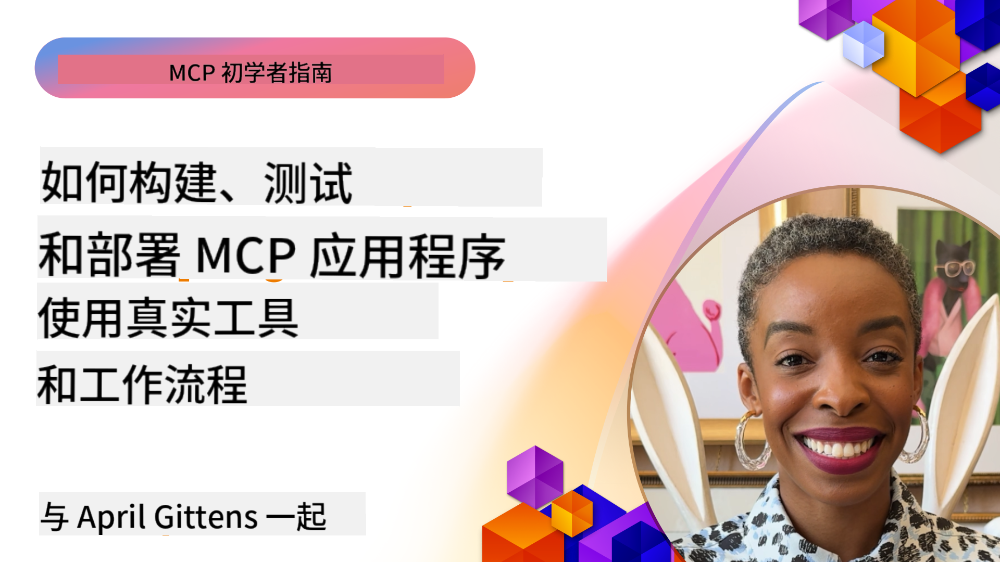
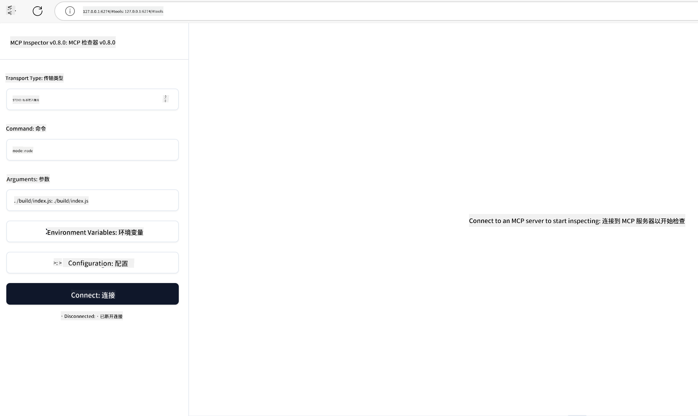

<!--
CO_OP_TRANSLATOR_METADATA:
{
  "original_hash": "8a20383b884e55ca6289bab35796448c",
  "translation_date": "2025-07-28T23:20:42+00:00",
  "source_file": "04-PracticalImplementation/README.md",
  "language_code": "zh"
}
-->
# 实践应用

[](https://youtu.be/vCN9-mKBDfQ)

_（点击上方图片观看本课视频）_

实践应用是让模型上下文协议（MCP）真正发挥作用的地方。虽然理解 MCP 的理论和架构很重要，但其真正的价值在于将这些概念应用于构建、测试和部署能够解决实际问题的解决方案。本章将弥合概念知识与实际开发之间的差距，指导您如何将基于 MCP 的应用变为现实。

无论您是在开发智能助手、将 AI 集成到业务工作流中，还是构建用于数据处理的自定义工具，MCP 都提供了一个灵活的基础。其与语言无关的设计以及针对主流编程语言的官方 SDK，使得 MCP 对各种开发者都易于使用。通过利用这些 SDK，您可以快速原型化、迭代并在不同平台和环境中扩展您的解决方案。

在接下来的章节中，您将看到实践示例、示例代码和部署策略，展示如何在 C#、Java、TypeScript、JavaScript 和 Python 中实现 MCP。您还将学习如何调试和测试 MCP 服务器、管理 API，以及使用 Azure 将解决方案部署到云端。这些实践资源旨在加速您的学习，帮助您自信地构建健壮的、可投入生产的 MCP 应用。

## 概述

本课重点介绍 MCP 在多种编程语言中的实践应用。我们将探讨如何使用 MCP SDK 在 C#、Java、TypeScript、JavaScript 和 Python 中构建健壮的应用，调试和测试 MCP 服务器，并创建可重用的资源、提示和工具。

## 学习目标

通过本课学习，您将能够：

- 使用官方 SDK 在多种编程语言中实现 MCP 解决方案
- 系统地调试和测试 MCP 服务器
- 创建和使用服务器功能（资源、提示和工具）
- 为复杂任务设计有效的 MCP 工作流
- 优化 MCP 实现以提高性能和可靠性

## 官方 SDK 资源

模型上下文协议为多种语言提供了官方 SDK：

- [C# SDK](https://github.com/modelcontextprotocol/csharp-sdk)
- [Java SDK](https://github.com/modelcontextprotocol/java-sdk) 
- [TypeScript SDK](https://github.com/modelcontextprotocol/typescript-sdk)
- [Python SDK](https://github.com/modelcontextprotocol/python-sdk)
- [Kotlin SDK](https://github.com/modelcontextprotocol/kotlin-sdk)

## 使用 MCP SDK

本节提供了在多种编程语言中实现 MCP 的实践示例。您可以在 `samples` 目录中找到按语言组织的示例代码。

### 可用示例

该代码库包含以下语言的[示例实现](../../../04-PracticalImplementation/samples)：

- [C#](./samples/csharp/README.md)
- [Java](./samples/java/containerapp/README.md)
- [TypeScript](./samples/typescript/README.md)
- [JavaScript](./samples/javascript/README.md)
- [Python](./samples/python/README.md)

每个示例都展示了该语言和生态系统中 MCP 的关键概念和实现模式。

## 核心服务器功能

MCP 服务器可以实现以下功能的任意组合：

### 资源

资源为用户或 AI 模型提供上下文和数据：

- 文档库
- 知识库
- 结构化数据源
- 文件系统

### 提示

提示是为用户设计的模板化消息和工作流：

- 预定义的对话模板
- 引导式交互模式
- 专门化的对话结构

### 工具

工具是供 AI 模型执行的功能：

- 数据处理工具
- 外部 API 集成
- 计算能力
- 搜索功能

## 示例实现：C# 实现

官方 C# SDK 仓库包含多个示例实现，展示了 MCP 的不同方面：

- **基础 MCP 客户端**：展示如何创建 MCP 客户端并调用工具的简单示例
- **基础 MCP 服务器**：具有基本工具注册的最小服务器实现
- **高级 MCP 服务器**：功能齐全的服务器，包含工具注册、身份验证和错误处理
- **ASP.NET 集成**：展示与 ASP.NET Core 集成的示例
- **工具实现模式**：展示不同复杂度工具实现的各种模式

C# MCP SDK 目前处于预览阶段，API 可能会发生变化。我们将随着 SDK 的发展不断更新此博客。

### 关键功能

- [C# MCP Nuget ModelContextProtocol](https://www.nuget.org/packages/ModelContextProtocol)
- 构建您的[第一个 MCP 服务器](https://devblogs.microsoft.com/dotnet/build-a-model-context-protocol-mcp-server-in-csharp/)。

有关完整的 C# 实现示例，请访问[官方 C# SDK 示例仓库](https://github.com/modelcontextprotocol/csharp-sdk)。

## 示例实现：Java 实现

Java SDK 提供了具有企业级功能的强大 MCP 实现选项。

### 关键功能

- 与 Spring 框架集成
- 强类型安全
- 支持响应式编程
- 全面的错误处理

有关完整的 Java 实现示例，请参阅 `samples` 目录中的 [Java 示例](samples/java/containerapp/README.md)。

## 示例实现：JavaScript 实现

JavaScript SDK 提供了一种轻量级且灵活的 MCP 实现方法。

### 关键功能

- 支持 Node.js 和浏览器
- 基于 Promise 的 API
- 易于与 Express 和其他框架集成
- 支持 WebSocket 流式传输

有关完整的 JavaScript 实现示例，请参阅 `samples` 目录中的 [JavaScript 示例](samples/javascript/README.md)。

## 示例实现：Python 实现

Python SDK 提供了一种符合 Python 风格的 MCP 实现方法，并与优秀的机器学习框架集成。

### 关键功能

- 使用 asyncio 支持异步/等待
- 与 FastAPI 集成
- 简单的工具注册
- 与流行的机器学习库的原生集成

有关完整的 Python 实现示例，请参阅 `samples` 目录中的 [Python 示例](samples/python/README.md)。

## API 管理

Azure API 管理是保护 MCP 服务器的绝佳解决方案。其核心思想是将 Azure API 管理实例置于 MCP 服务器之前，并让其处理您可能需要的功能，例如：

- 速率限制
- 令牌管理
- 监控
- 负载均衡
- 安全性

### Azure 示例

以下是一个 Azure 示例，展示了如何[创建 MCP 服务器并使用 Azure API 管理保护它](https://github.com/Azure-Samples/remote-mcp-apim-functions-python)。

请参阅下图了解授权流程：


在上述图中，发生了以下情况：

- 使用 Microsoft Entra 进行身份验证/授权。
- Azure API 管理充当网关，并使用策略来引导和管理流量。
- Azure Monitor 记录所有请求以供进一步分析。

#### 授权流程

让我们更详细地了解授权流程：


#### MCP 授权规范

了解更多关于 [MCP 授权规范](https://modelcontextprotocol.io/specification/2025-03-26/basic/authorization#2-10-third-party-authorization-flow) 的信息。

## 将远程 MCP 服务器部署到 Azure

让我们尝试部署前面提到的示例：

1. 克隆代码库

    ```bash
    git clone https://github.com/Azure-Samples/remote-mcp-apim-functions-python.git
    cd remote-mcp-apim-functions-python
    ```

1. 注册 `Microsoft.App` 资源提供程序。

   - 如果您使用 Azure CLI，请运行 `az provider register --namespace Microsoft.App --wait`。
   - 如果您使用 Azure PowerShell，请运行 `Register-AzResourceProvider -ProviderNamespace Microsoft.App`。然后稍后运行 `(Get-AzResourceProvider -ProviderNamespace Microsoft.App).RegistrationState` 检查注册是否完成。

1. 运行此 [azd](https://aka.ms/azd) 命令以配置 API 管理服务、函数应用（包含代码）以及所有其他所需的 Azure 资源：

    ```shell
    azd up
    ```

    此命令应在 Azure 上部署所有云资源。

### 使用 MCP Inspector 测试您的服务器

1. 在**新终端窗口**中，安装并运行 MCP Inspector：

    ```shell
    npx @modelcontextprotocol/inspector
    ```

    您应该会看到类似以下的界面：

    

1. 按住 CTRL 点击应用显示的 URL（例如 [http://127.0.0.1:6274/#resources](http://127.0.0.1:6274/#resources)）加载 MCP Inspector Web 应用。
1. 将传输类型设置为 `SSE`。
1. 将 URL 设置为 `azd up` 后显示的运行中 API 管理 SSE 端点，并**连接**：

    ```shell
    https://<apim-servicename-from-azd-output>.azure-api.net/mcp/sse
    ```

1. **列出工具**。点击一个工具并**运行工具**。

如果所有步骤都成功，您现在应该已连接到 MCP 服务器，并能够调用工具。

## Azure 的 MCP 服务器

[Remote-mcp-functions](https://github.com/Azure-Samples/remote-mcp-functions-dotnet)：这组代码库是使用 Azure Functions 构建和部署自定义远程 MCP（模型上下文协议）服务器的快速入门模板，支持 Python、C# .NET 或 Node/TypeScript。

这些示例提供了一个完整的解决方案，允许开发者：

- 本地构建和运行：在本地机器上开发和调试 MCP 服务器
- 部署到 Azure：通过简单的 `azd up` 命令轻松部署到云端
- 从客户端连接：从各种客户端（包括 VS Code 的 Copilot 代理模式和 MCP Inspector 工具）连接到 MCP 服务器

### 关键功能

- 安全设计：MCP 服务器通过密钥和 HTTPS 进行保护
- 身份验证选项：支持使用内置身份验证和/或 API 管理的 OAuth
- 网络隔离：支持使用 Azure 虚拟网络（VNET）进行网络隔离
- 无服务器架构：利用 Azure Functions 实现可扩展的事件驱动执行
- 本地开发：全面支持本地开发和调试
- 简单部署：简化的 Azure 部署流程

代码库包含所有必要的配置文件、源代码和基础设施定义，帮助您快速开始生产就绪的 MCP 服务器实现。

- [Azure Remote MCP Functions Python](https://github.com/Azure-Samples/remote-mcp-functions-python) - 使用 Azure Functions 和 Python 实现 MCP 的示例
- [Azure Remote MCP Functions .NET](https://github.com/Azure-Samples/remote-mcp-functions-dotnet) - 使用 Azure Functions 和 C# .NET 实现 MCP 的示例
- [Azure Remote MCP Functions Node/Typescript](https://github.com/Azure-Samples/remote-mcp-functions-typescript) - 使用 Azure Functions 和 Node/TypeScript 实现 MCP 的示例

## 关键要点

- MCP SDK 提供了实现健壮 MCP 解决方案的语言特定工具
- 调试和测试过程对于可靠的 MCP 应用至关重要
- 可重用的提示模板可实现一致的 AI 交互
- 精心设计的工作流可以使用多个工具协调复杂任务
- 实现 MCP 解决方案需要考虑安全性、性能和错误处理

## 练习

设计一个解决您领域内实际问题的 MCP 工作流：

1. 确定 3-4 个有助于解决此问题的工具
2. 创建一个工作流图，展示这些工具如何交互
3. 使用您偏好的语言实现其中一个工具的基础版本
4. 创建一个提示模板，帮助模型有效使用您的工具

## 其他资源

---

下一步：[高级主题](../05-AdvancedTopics/README.md)

**免责声明**：  
本文档使用AI翻译服务[Co-op Translator](https://github.com/Azure/co-op-translator)进行翻译。尽管我们努力确保翻译的准确性，但请注意，自动翻译可能包含错误或不准确之处。原始语言的文档应被视为权威来源。对于关键信息，建议使用专业人工翻译。我们对因使用此翻译而产生的任何误解或误读不承担责任。