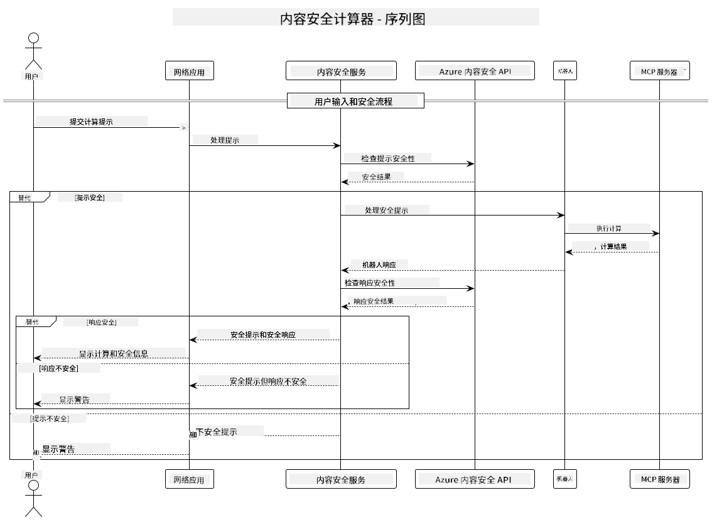

<!--
CO_OP_TRANSLATOR_METADATA:
{
  "original_hash": "e5ea5e7582f70008ea9bec3b3820f20a",
  "translation_date": "2025-05-16T15:39:04+00:00",
  "source_file": "04-PracticalImplementation/samples/java/containerapp/README.md",
  "language_code": "zh"
}
-->
## 系统架构

本项目展示了一个在将用户输入传递给计算器服务之前，使用内容安全检查的网页应用，通信通过 Model Context Protocol (MCP) 实现。



### 工作原理

1. **用户输入**：用户在网页界面输入计算请求
2. **内容安全筛查（输入）**：使用 Azure Content Safety API 对请求内容进行分析
3. **安全决策（输入）**：
   - 如果内容安全（所有类别的严重性均小于 2），则继续传递给计算器
   - 如果内容被标记为潜在有害，则停止处理并返回警告
4. **计算器集成**：安全内容由 LangChain4j 处理，并与 MCP 计算器服务器通信
5. **内容安全筛查（输出）**：对机器人回复内容使用 Azure Content Safety API 进行分析
6. **安全决策（输出）**：
   - 如果机器人回复安全，则显示给用户
   - 如果机器人回复被标记为潜在有害，则用警告替代
7. **响应**：结果（如果安全）显示给用户，同时展示两次安全分析结果

## 使用 Model Context Protocol (MCP) 调用计算器服务

本项目演示了如何使用 Model Context Protocol (MCP) 从 LangChain4j 调用计算器 MCP 服务。实现中使用本地运行在 8080 端口的 MCP 服务器来提供计算功能。

### 配置 Azure Content Safety 服务

在使用内容安全功能前，需要创建 Azure Content Safety 服务资源：

1. 登录 [Azure 门户](https://portal.azure.com)
2. 点击“创建资源”，搜索“Content Safety”
3. 选择“Content Safety”，点击“创建”
4. 输入资源的唯一名称
5. 选择订阅和资源组（或新建资源组）
6. 选择支持的区域（详情请查看 [区域可用性](https://azure.microsoft.com/en-us/global-infrastructure/services/?products=cognitive-services)）
7. 选择合适的定价层
8. 点击“创建”部署资源
9. 部署完成后，点击“转到资源”
10. 在左侧栏“资源管理”下选择“密钥和端点”
11. 复制其中一个密钥和端点 URL，供下一步使用

### 配置环境变量

为 GitHub 模型认证设置 `GITHUB_TOKEN` 环境变量：
```sh
export GITHUB_TOKEN=<your_github_token>
```

为内容安全功能设置：
```sh
export CONTENT_SAFETY_ENDPOINT=<your_content_safety_endpoint>
export CONTENT_SAFETY_KEY=<your_content_safety_key>
```

这些环境变量用于应用程序认证 Azure Content Safety 服务。如果未设置，应用将使用占位符值进行演示，但内容安全功能将无法正常工作。

### 启动计算器 MCP 服务器

在运行客户端之前，需要在本地 8080 端口以 SSE 模式启动计算器 MCP 服务器。

## 项目描述

本项目演示了如何将 Model Context Protocol (MCP) 与 LangChain4j 集成以调用计算器服务。主要功能包括：

- 使用 MCP 连接计算器服务，执行基础数学运算
- 对用户输入和机器人回复进行双层内容安全检测
- 通过 LangChain4j 集成 GitHub 的 gpt-4.1-nano 模型
- 使用 Server-Sent Events (SSE) 作为 MCP 传输方式

## 内容安全集成

项目包含全面的内容安全功能，确保用户输入和系统回复均无有害内容：

1. **输入筛查**：所有用户请求在处理前，都会针对仇恨言论、暴力、自残和性内容等有害类别进行分析。

2. **输出筛查**：即使使用可能不受限制的模型，系统也会对所有生成的回复进行相同的内容安全过滤后再展示给用户。

这种双层防护确保无论使用何种 AI 模型，系统都能保持安全，防止有害输入和潜在问题的 AI 输出。

## 网页客户端

应用包含一个用户友好的网页界面，方便用户与内容安全计算器系统交互：

### 网页界面功能

- 简洁直观的计算请求输入表单
- 输入和输出的双层内容安全验证
- 对请求和回复安全状态的实时反馈
- 颜色编码的安全指标，便于理解
- 干净响应式设计，适配多种设备
- 提供示例安全请求引导用户

### 使用网页客户端

1. 启动应用：
   ```sh
   mvn spring-boot:run
   ```

2. 在浏览器中打开 `http://localhost:8087`

3. 在文本区域输入计算请求（例如，“计算 24.5 和 17.3 的和”）

4. 点击“提交”处理请求

5. 查看结果，包括：
   - 请求内容的安全分析
   - 计算结果（如果请求安全）
   - 机器人回复的安全分析
   - 如果输入或输出被标记，显示相应安全警告

网页客户端自动处理内容安全的双重验证，确保所有交互安全且合适，无论使用何种 AI 模型。

**免责声明**：  
本文件由AI翻译服务[Co-op Translator](https://github.com/Azure/co-op-translator)进行翻译。尽管我们力求准确，但请注意自动翻译可能存在错误或不准确之处。原始文件的原文版本应被视为权威来源。对于重要信息，建议使用专业人工翻译。我们不对因使用本翻译而产生的任何误解或误释承担责任。