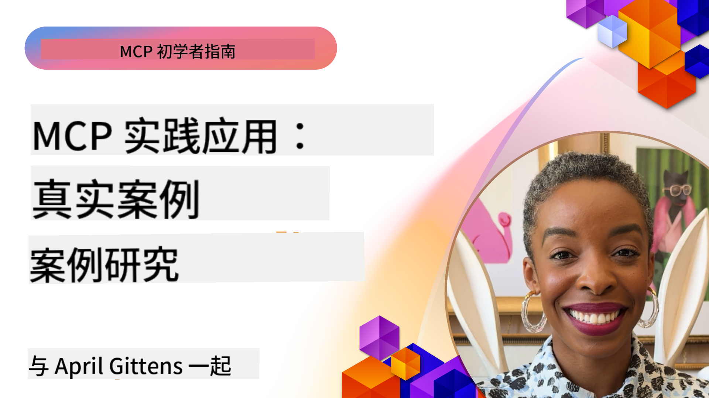

<!--
CO_OP_TRANSLATOR_METADATA:
{
  "original_hash": "61a160248efabe92b09d7b08293d17db",
  "translation_date": "2025-07-28T23:25:29+00:00",
  "source_file": "09-CaseStudy/README.md",
  "language_code": "zh"
}
-->
# MCP 实践：真实案例研究

_（点击上方图片观看本课视频）_

模型上下文协议（MCP）正在改变 AI 应用与数据、工具和服务的交互方式。本节将展示一些真实案例，说明 MCP 在各种企业场景中的实际应用。

## 概述

本节展示了 MCP 实现的具体示例，重点介绍了组织如何利用该协议解决复杂的业务挑战。通过研究这些案例，您将深入了解 MCP 在实际场景中的多功能性、可扩展性和实际效益。

## 关键学习目标

通过研究这些案例，您将能够：

- 理解 MCP 如何应用于解决特定业务问题
- 学习不同的集成模式和架构方法
- 了解在企业环境中实施 MCP 的最佳实践
- 掌握在实际应用中遇到的挑战及其解决方案
- 发现将类似模式应用于您自身项目的机会

## 精选案例研究

### 1. [Azure AI 旅行代理 – 参考实现](./travelagentsample.md)

本案例研究探讨了微软的综合参考解决方案，展示了如何使用 MCP、Azure OpenAI 和 Azure AI Search 构建一个多代理、AI 驱动的旅行规划应用。项目亮点包括：

- 通过 MCP 实现多代理协调
- 使用 Azure AI Search 进行企业数据集成
- 利用 Azure 服务构建安全、可扩展的架构
- 使用可复用的 MCP 组件扩展工具
- 由 Azure OpenAI 提供支持的对话式用户体验

架构和实现细节为构建以 MCP 为协调层的复杂多代理系统提供了宝贵的见解。

### 2. [从 YouTube 数据更新 Azure DevOps 项目](./UpdateADOItemsFromYT.md)

本案例研究展示了 MCP 在自动化工作流中的实际应用。它说明了如何使用 MCP 工具：

- 从在线平台（如 YouTube）提取数据
- 更新 Azure DevOps 系统中的工作项
- 创建可重复的自动化工作流
- 跨不同系统集成数据

此示例表明，即使是相对简单的 MCP 实现，也能通过自动化日常任务和提高系统间数据一致性带来显著的效率提升。

### 3. [使用 MCP 实现实时文档检索](./docs-mcp/README.md)

本案例研究指导您如何将 Python 控制台客户端连接到 MCP 服务器，以检索和记录实时、上下文相关的 Microsoft 文档。您将学习如何：

- 使用 Python 客户端和官方 MCP SDK 连接 MCP 服务器
- 使用流式 HTTP 客户端高效地实时获取数据
- 调用服务器上的文档工具并将响应直接记录到控制台
- 将最新的 Microsoft 文档集成到您的工作流中，无需离开终端

本章包括一个动手练习、一个最小可运行代码示例，以及深入学习的额外资源链接。通过研究完整的操作指南和代码，您将了解 MCP 如何在基于控制台的环境中改变文档访问和开发者生产力。

### 4. [使用 MCP 构建交互式学习计划生成器 Web 应用](./docs-mcp/README.md)

本案例研究展示了如何使用 Chainlit 和 MCP 构建一个交互式 Web 应用，为任何主题生成个性化学习计划。用户可以指定主题（如“AI-900 认证”）和学习时长（如 8 周），应用将提供逐周的推荐内容。Chainlit 提供了对话式聊天界面，使体验更具互动性和适应性。

- 由 Chainlit 提供支持的对话式 Web 应用
- 用户驱动的主题和时长提示
- 使用 MCP 提供逐周内容推荐
- 聊天界面中的实时、适应性响应

该项目展示了如何将对话式 AI 和 MCP 结合起来，创建现代 Web 环境中的动态、用户驱动的教育工具。

### 5. [在 VS Code 中使用 MCP 服务器实现内嵌文档](./docs-mcp/README.md)

本案例研究展示了如何将 Microsoft Learn 文档直接引入 VS Code 环境，无需切换浏览器标签页！您将了解如何：

- 使用 MCP 面板或命令面板在 VS Code 内即时搜索和阅读文档
- 引用文档并将链接直接插入 README 或课程 Markdown 文件
- 将 GitHub Copilot 和 MCP 结合使用，实现无缝的 AI 驱动文档和代码工作流
- 使用实时反馈和 Microsoft 提供的准确性验证和增强文档
- 将 MCP 集成到 GitHub 工作流中，实现持续文档验证

实现内容包括：

- 示例 `.vscode/mcp.json` 配置，便于快速设置
- 基于截图的内嵌体验操作指南
- 结合 Copilot 和 MCP 的生产力提升技巧

此场景非常适合课程作者、文档撰写者和开发者，他们希望在编辑器中专注于文档、Copilot 和验证工具的工作——这一切都由 MCP 提供支持。

### 6. [创建 APIM MCP 服务器](./apimsample.md)

本案例研究提供了如何使用 Azure API Management（APIM）创建 MCP 服务器的分步指南。内容包括：

- 在 Azure API Management 中设置 MCP 服务器
- 将 API 操作公开为 MCP 工具
- 配置速率限制和安全策略
- 使用 Visual Studio Code 和 GitHub Copilot 测试 MCP 服务器

此示例说明了如何利用 Azure 的功能创建一个强大的 MCP 服务器，用于各种应用，增强 AI 系统与企业 API 的集成。

## 结论

这些案例研究突出了模型上下文协议在实际场景中的多样性和实用性。从复杂的多代理系统到针对性的自动化工作流，MCP 提供了一种标准化的方式，将 AI 系统与所需的工具和数据连接起来，从而创造价值。

通过研究这些实现，您可以获得关于架构模式、实施策略和最佳实践的见解，并将其应用于您自己的 MCP 项目。这些示例表明，MCP 不仅是一个理论框架，更是解决实际业务挑战的实用方案。

## 其他资源

- [Azure AI 旅行代理 GitHub 仓库](https://github.com/Azure-Samples/azure-ai-travel-agents)
- [Azure DevOps MCP 工具](https://github.com/microsoft/azure-devops-mcp)
- [Playwright MCP 工具](https://github.com/microsoft/playwright-mcp)
- [Microsoft Docs MCP 服务器](https://github.com/MicrosoftDocs/mcp)
- [MCP 社区示例](https://github.com/microsoft/mcp)

下一步：实践实验 [优化 AI 工作流：使用 AI 工具包构建 MCP 服务器](../10-StreamliningAIWorkflowsBuildingAnMCPServerWithAIToolkit/README.md)

**免责声明**：  
本文档使用AI翻译服务[Co-op Translator](https://github.com/Azure/co-op-translator)进行翻译。虽然我们努力确保翻译的准确性，但请注意，自动翻译可能包含错误或不准确之处。原始语言的文档应被视为权威来源。对于重要信息，建议使用专业人工翻译。我们不对因使用此翻译而产生的任何误解或误读承担责任。